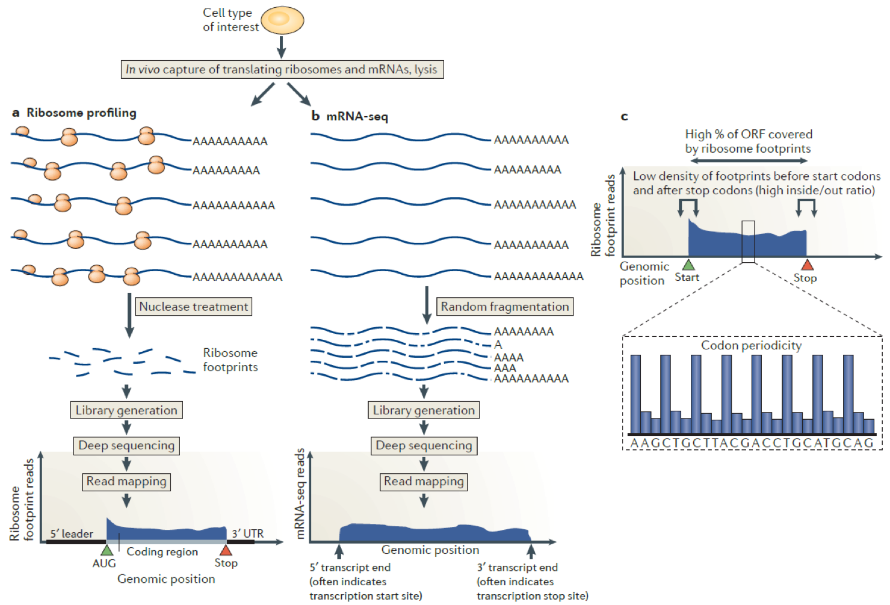

# Ribo-seq : Raw data process pipeline
[Back home](../README.md)


## Ribo-seq : Raw data process pipeline



## Ribo-seq : Raw data process pipeline

* Step1 : cutadapt ( RPF : [25,35] , RNA: [17, ] )
* Step2 : beforeQC
* Step3 : filter
* Step4 : contam (remove ribosome sequence)
* Step5 : afterQC (overrepresent reads)
* Step6 : Tophat + readsNumCal_intron_v3.py
* Step7 : STAR + periodicity
* Step8 : readLengthDistribution
* Step9 : report


## Step1 : cutadapt ( RPF : [25,35] , RNA: [17, ] )

```sh
RPF : cutadaptRPF.sh      –m 25 –M 35
RNA : cutadaptRNA.sh    -m 17 (19)
```
**cutadaptRPF.sh**
```sh
#!/bin/zsh

export PATH=$PATH:/Share/home/tiangeng/software/cap-miRNA/bin
rpf=(RW3 RC3 RC15 RW15)
adapt=CTGTAGGCACCATCAAT

for i in ${rpf[@]}
do
        cutadapt -m 25 -M 35 --match-read-wildcards -a $adapt -o ${i}_trimmed.fastq ../rawdata/${i}_R1.fastq > ${i}_trimmed.log
done
```

|command |mean |
|:-|:-|
|-m |Discard trimmed reads that are shorter than LENGTH.Reads that are too short even before adapter removal are also discarded. In colorspace, an initial primer is not counted (default: 0). |
|-M |Discard trimmed reads that are longer than LENGTH. Reads that are too long even before adapter removal are also discarded. In colorspace, an initial primer is not counted (default: no limit). |
|--match-read-wildcards |Allow IUPAC wildcards in reads (default: False). |
|-a |Sequence of an adapter that was ligated to the 3' end. The adapter itself and anything that follows is trimmed. If the adapter sequence ends with the '$' character, the adapter is anchored to the end of the read and only found if it is a suffix of the read. |

**cutadapt_totalRNA.sh**
```sh
#!/bin/zsh

export PATH=$PATH:/Share/home/tiangeng/software/cap-miRNA/bin
rpf=(TC15  TC3  TW15  TW3)
adapt=CTGTAGGCACCATCAAT

for i in ${rpf[@]}
do
        cutadapt -m 17 --match-read-wildcards -a $adapt -o ${i}_trimmed.fastq ../rawdata/${i}_R1.fastq > ${i}_trimmed.log
done
```

## Step2 : beforeQC

```sh
#!/bin/bash

rpf=(RC15 RC3 RW15 RW3  TC15 TC3 TW15 TW3)
for i in ${rpf[@]}
do
        /Share/home/tiangeng/software/FastQC/fastqc ../cutadapt/${i}_trimmed.fastq -o ./
done
```

## Step3 : filter
```sh
#!/bin/bash

rpf=(RC15  RC3  RW15  RW3 TC15  TC3  TW15  TW3)
for i in ${rpf[@]}
do
        /Share/app/fastx_toolkit0.14/bin/fastq_quality_filter -Q33 -v -q 25 -p 75 -i ../cutadapt/${i}_trimmed.fastq -o ${i}_trimmedQfilter.fastq > ${i}_Qfilter.log
done
```

|command | mean|
|:- |:- |
|[-h]|         = This helpful help screen.| 
|[-q N]|        = Minimum quality score to keep.| 
|[-p N]|        = Minimum percent of bases that must have [-q] quality.| 
|[-z] |         = Compress output with GZIP.| 
|[-i INFILE]|   = FASTA/Q input file. default is STDIN.| 
|[-o OUTFILE]|  = FASTA/Q output file. default is STDOUT.| 
|[-v]|          = Verbose - report number of sequences. If [-o] is specified,  report will be printed to STDOUT. If [-o] is not specified (and output goes to STDOUT), report will be printed to STDERR.| 

##  Step4 : contam (remove ribosome sequence)
```sh
#!/bin/bash

bowtieindex=/Share/home/tiangeng/Database/Reference_genome/Mus-musculus_rRNA_bowtie-index/musRibosomal
name=(RC15 RC3 RW15 RW3  TC15 TC3 TW15 TW3)

for i in ${name[@]}
do
         bowtie -n 0 -norc --best -l 15 -p 8 --un=nocontam_${i}.fastq $bowtieindex -q ../filter/${i}_trimmedQfilter.fastq ${i}.alin > ${i}.err
done
```

|command | mean|
|:- |:- |
|-n/--seedmms <int>| max mismatches in seed (can be 0-3, default: -n 2)|
|--nofw/--norc|do not align to forward/reverse-complement reference strand|
|--best|hits guaranteed best stratum; ties broken by quality|
|-l/--seedlen <int>| seed length for -n (default: 28)|
|-p/--threads <int>| number of alignment threads to launch (default: 1)|
|--un <fname>|write unaligned reads/pairs to file(s) <fname>|
|-q|query input files are FASTQ .fq/.fastq (default)|
