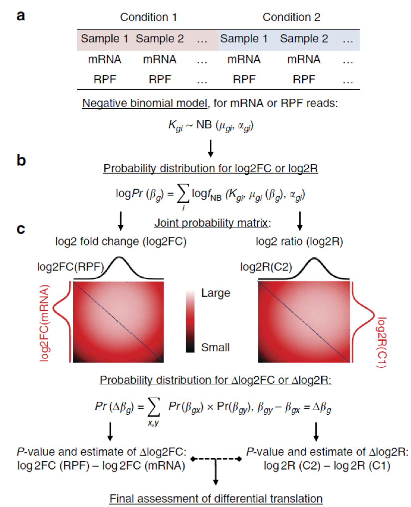

# Ribo-seq : Differential translations ( [Xtail](https://github.com/xryanglab/xtail) )
[Back home](../README.md)

## Workflow


TE (Translation Efficiency) = RPF / RNA

logTE = log (TE treat / TE control) 

          = log( (RPF2/RNA2)  / (RPF1/RNA1) )               

          = log( (RPF2/RPF1)   / (RNA2/RNA1) )

## Step:

* Step1 :  combined remove Ribosome RNA fastq files
* Step2 :  STAR mapping
* Step3 :  calculate counts
* Step4 :  run Xtail

## Step3 :  calculate counts   
RNA:  exon  ( mRNA_count.py  or HTSeq)  
```sh
mkdir /Share/home/tiangeng/project_result/Riboseq/project_190620_TMH-XNN/counter

```
**rna_counter.sh**
```sh
#!/bin/bash
export PATH=/Share/home/tiangeng/anaconda2/bin:$PATH
name=(TC15 TC3 TW15 TW3)
gtf=/Share/home/tiangeng/Database/Reference_genome/Mus_musculus_Ensembl_GRCm38_star_genome-index/Mus_musculus.GRCm38.95.gtf
data_p=/Share/home/tiangeng/project_result/Riboseq/project_190620_TMH-XNN/STAR
for i in ${name[@]}
do 
echo -e "htseq-count -q -f bam -s reverse $data_p/${i}_STAR/${i}Aligned.sortedByCoord.out.bam ${gtf} > ${i}.count";
htseq-count -q -f bam -s reverse $data_p/${i}_STAR/${i}Aligned.sortedByCoord.out.bam ${gtf} > ${i}.count;
done;
#htseq-count [options] <alignment_files> <gff_file>
```

**ribo_counter.sh**
```sh
export PATH=/Share/home/tiangeng/anaconda2/bin:$PATH
gtf=/Share/home/tiangeng/Database/Reference_genome/Mus_musculus_Ensembl_GRCm38_star_genome-index/Mus_musculus.GRCm38.95.gtf
data_p=/Share/home/tiangeng/project_result/Riboseq/project_190620_TMH-XNN/STAR
name=(RW3 RC3 RC15 RW15)
for i in ${name[@]}
do 
echo -e "python RPF_count_CDS.py  $data_p/${i}_STAR/${i}Aligned.sortedByCoord.out.bam ${gtf} > ${i}.count";
python RPF_count_CDS.py  $data_p/${i}_STAR/${i}Aligned.sortedByCoord.out.bam ${gtf} > ${i}.count;
done;
```

**merge_counter.sh**
```sh
name=(TC3 TW3 TC15 TW15 RC3 RW3 RC15 RW15)
head='gene'
for i in ${name[@]};
do
 head+=" ${i}";
done
echo -e $head >merge.counter;

begin1=${name[0]};
begin2=${name[1]};
name2=("${name[@]:2}");
join ${begin1}.count ${begin2}.count >merge.tmp
commander='join';
for i in ${name2[@]};
do 
echo ${i}.count;
join merge.tmp ${i}.count >>merge.tmp2;
mv merge.tmp2 merge.tmp
done

cat merge.counter merge.tmp > merge2.tmp;
rm merge.tmp
mv merge2.tmp merge.counter
sed -i 's/ \+/\t/g' merge.counter

grep -v '^__' merge.counter > merge.counter2
mv merge.counter2 merge.counter 

```

RPF:  CDS, exclude first15 codons last5 codons  ( RPF_count_CDS.py or excludeStartStopModifHTSeq.py)  

[GitHub Site](https://github.com/zhengtaoxiao/RPF-count-CDS)  
[RPF_count_CDS.py](RPF_count_CDS.py)  
[RPF_count_CDS_nonStranded.py](RPF_count_CDS_nonStranded.py)  

## Step4 :  run Xtail  (refer to xtail.pdf )

[Xtail](https://github.com/xryanglab/xtail)   
[Xtail releases](https://github.com/xryanglab/xtail/releases)

Attention : test.results <- xtail(mrna,rpf,condition,bins=1000)  

bins=1000 for example , should change to bins=10000  

[Xtail image](https://cloud.docker.com/u/gangxu/repository/docker/gangxu/xtail)
```sh
docker pull thomaschln/r-devtools:latest
```

```R
library("devtools")
install_github("xryanglab/xtail")
```
```sh

docker commit 50e7695a4f81 xug15/xtail:latest
docker push gangxu/xtail:tagname
```

I fixed this problem using docker.
1. Download [docker and install](https://www.docker.com/get-started).
2. Get xtail image from docker hub.
```sh
docker pull gangxu/xtail:latest
```
3. Run this image
```sh
docker run --name xtail --restart unless-stopped -v /Users/xugang/Documents/c-pycharm/git/sequencing_center/data:/home -dt gangxu/xtail:latest
```
4. Get into the xtail and using it.
```sh
docker exec -it xtail bash
R
library(xtail)
```
5. exit container
```sh
# quit from R
q()
#quite container
exit;
```
6. Stop container
```sh
docker stop xtail
```
7. If you need using it agin:
```sh
docker start xtail
```
```sh
library(DESeq2)
library(xtail)
data(xtaildata)
mrna=xtaildata$mrna
rpf=xtaildata$rpf
head(mrna,5)
condition=c("control","control","treat","treat")
test.results=xtail(mrna,rpf,condition,bins=1000,threads=2)
summary(test.results)

test.tab=resultsTable(test.results);
head(test.tab,5)

write.table(test.tab,"/home/test_results.txt",quote=F,sep="\t");

# Visualization
pdf('testFC.pdf',width=6,height=4,paper='special')
plotFCs(test.results)
dev.off()

pdf('testRs.pdf',width=6,height=4,paper='special')
plotRs(test.results)
dev.off()

pdf('testvolcano.pdf',width=6,height=4,paper='special')
volcanoPlot(test.results)
dev.off()
```

```R
library(xtail)

xnnd=read.table('/home/merge.counter',header=T,row.name=1)
mrna=xnnd[,c(2,4,1,3)]
rpf=xnnd[,c(6,8,5,7)]
condition=c("control","control","treat","treat")
test.results=xtail(mrna,rpf,condition,bins=1000,threads=2)
summary(test.results)

#
test.tab=resultsTable(test.results);
head(test.tab,5)

write.table(test.tab,"/home/xnn_results.txt",quote=F,sep="\t");

# Visualization
pdf('xnnFC.pdf',width=6,height=4,paper='special')
plotFCs(test.results)
dev.off()

pdf('xnnRs.pdf',width=6,height=4,paper='special')
plotRs(test.results)
dev.off()

pdf('xnnvolcano.pdf',width=6,height=4,paper='special')
volcanoPlot(test.results)
dev.off()

```


