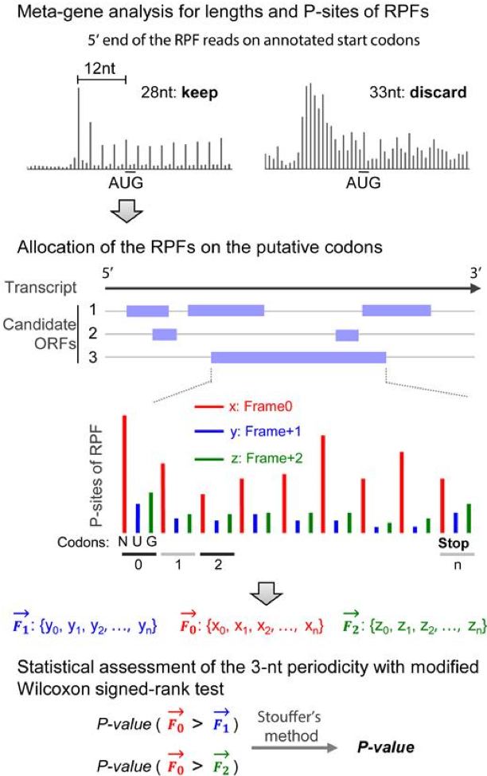
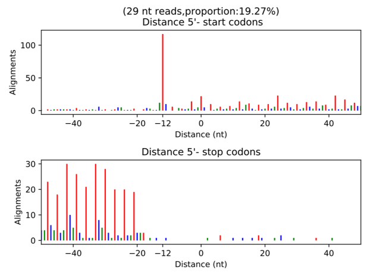
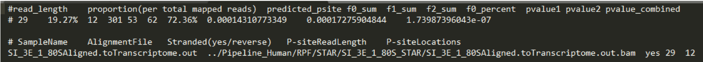
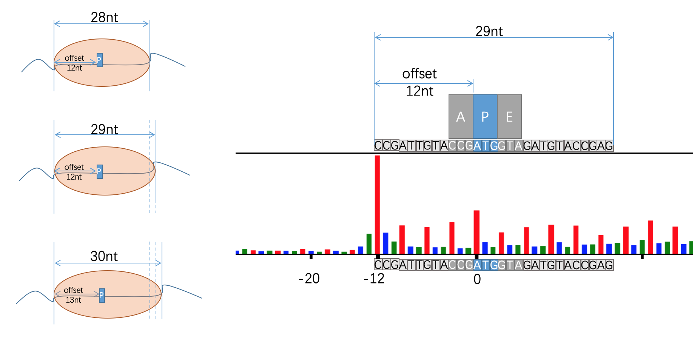
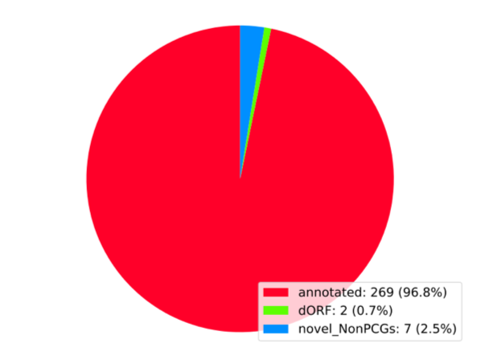
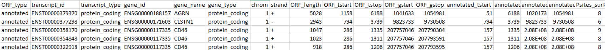

# Ribo-seq : De novo annotation [(RiboCode)](https://github.com/xryanglab/RiboCode)
[Back home](../README.md)

## Workflow


### Data:
STAR mapping (**Aligned.toTranscriptome.out.bam**)
RPF with 3nt periodicity

### Key words:
P-sites and Offset

## Step:
STAR mapping DONE!

* Step 1 :  Install/Upgrade RiboCode
* Step 2 :  Prepare transcripts annotation
* Step 3 :  Select RPF length and detect P-site offset
* Step 4 :  Detect translated ORFs


## Step 1 :  Install/Upgrade RiboCode
```sh
	pip install --upgrade RiboCode
		------------------------------------
		ssh -p 2200 miniserver@166.111.152.118
		# password: yanglab62783319
		cd ~/Ribo-seq_Pipeline/RiboCode
		------------------------------------
		/workdata2/Programs/anaconda3/bin/RiboCode
```
## Step 2 :  Prepare transcripts annotation
```sh
	prepare_transcripts -g <gencode.v19.annotation.gtf> -f <hg19_genome.fa> -o <RiboCode_annot>
		|1| transcripts_cds.txt
		|2| transcripts.pickle
		|3| transcripts_sequence.fa
```

##  Step 3 :  Select RPF length and detect P-site offset
```sh
	metaplots -a <RiboCode_annot> -r <HEK293Aligned.toTranscriptome.out.bam>
```

**Metaplots**



**Config File**



## RiboCode: Key words



##  Step 4 :  Detect translated ORFs

```sh
RiboCode -a <RiboCode_annot> -c <config.txt> -l no -o <RiboCode_ORFs_result>
```

**pie plot**


**Detected ORFs Files**

<RiboCode_ORFs_result>.txt
<RiboCode_ORFs_result>_collapsed.txt



## code

****
```sh

```


