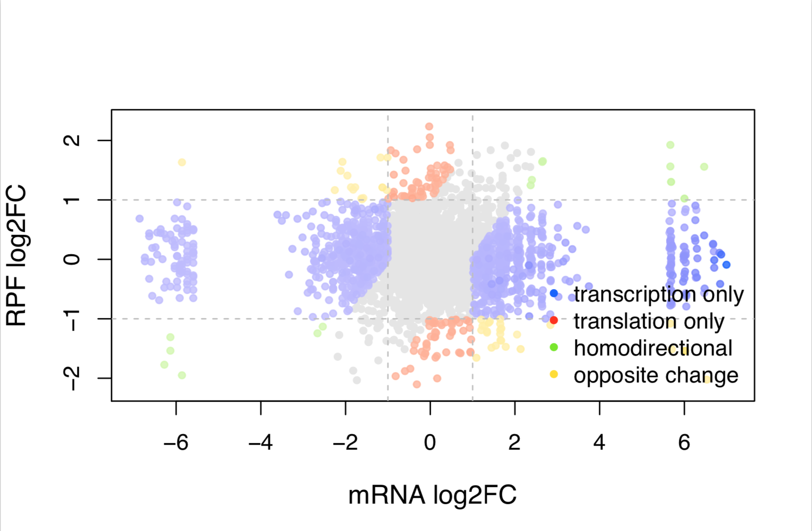

# 童明汉 Xtail Results:

> project_190620_TMH-XNN #(第三批)

|实验组|对照组|测序|
|:-|:-|:-|
|ck0|WT|-|
|3号 ko 小鼠 |3号 WT 小鼠 |total RNA|
|15号 ko 小鼠 |15号 WT 小鼠 |RPF|

## 
[xnn_results.txt](../image/190620-XNN/xnn_results.txt)  

  
[FC](../image/190620-XNN/xnnFC.pdf)  

  
[Rs](../image/190620-XNN/xnnRs.pdf)  

  
[Volcano](../image/190620-XNN/xnnvolcano.pdf)  

