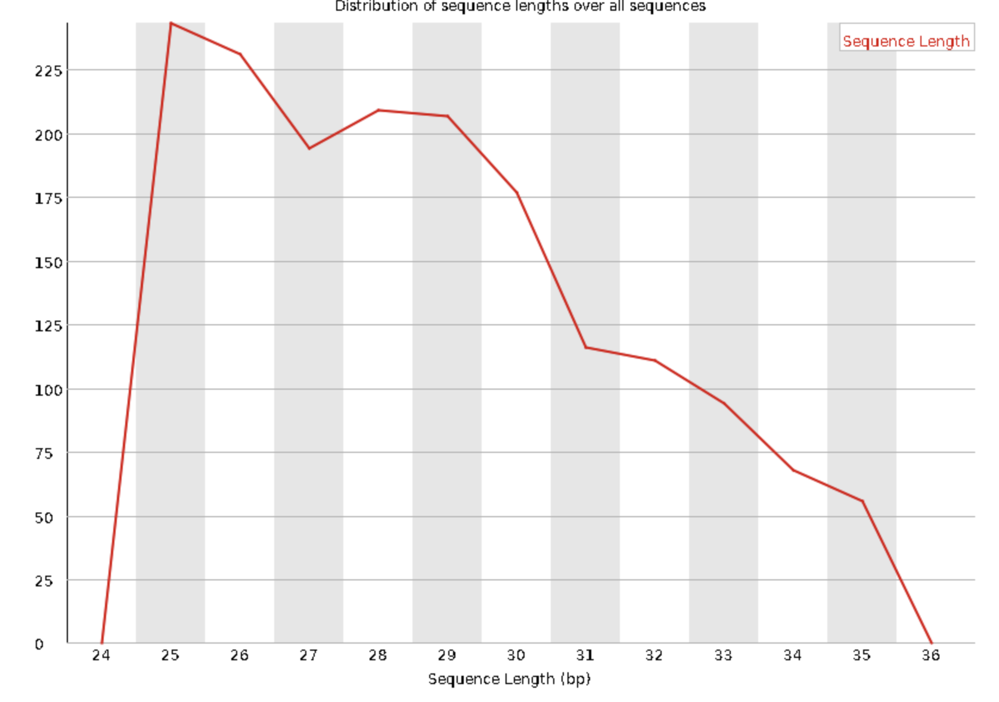

# Quality Control

## 总结
* 细胞 CHO-1 去完接头后，RPF建库长度分布异常。
* 细胞 CHO-2 去完接头后，RPF建库长度分布异常。
* 植物 col-dmso 去完接头后，RPF建库长度分布正常，主峰为31nt。
* 植物 col-sl 去完接头后，RPF建库长度分布正常，主峰为31nt。
* 植物突变体 d14-dmso 去完接头后，RPF建库长度分布正常，主峰为31nt。
* 植物突变体 d14-sl 去完接头后，RPF建库长度分布正常，主峰为31nt。
* FLY-B 去完接头后，RPF建库长度分布出现双峰，主峰为28nt。
* FLY-WT 去完接头后，RPF建库长度分布出现双峰，主峰为28nt。

## 结论

* 在同一批次下，植物建库长度分布全部正常，而细胞 CHO 长度分布异常, 果蝇的眼睛的长度分布出现双峰。
* 植物的建库方法成熟，建议可以大规模测序。
* 细胞建库有问题，建议重新提供样品建库。
* 果蝇的眼睛建库出现双峰，建议重新提供样品建库。

## CHO-1-R_FKDL202558030-1a-29
=== Summary ===
|Name |Percentage |
|-|-|
|Total reads processed:|                 143,342|
|Reads with adapters:|                    43,952 (30.7%)|
|Reads that were too short:|              39,459 (27.5%)|
|Reads that were too long:|              102,177 (71.3%)|
|Reads written (passing filters):|       1,706 (1.2%)|

### Read length distribution

## CHO-2-R_FKDL202558030-1a-30
=== Summary ===
|Name |Percentage |
|-|-|
|Total reads processed:|                 136,314|
|Reads with adapters:|                   102,996 (75.6%)|
|Reads that were too short:|             100,967 (74.1%)|
|Reads that were too long:|               34,348 (25.2%)|
|Reads written (passing filters):|           999 (0.7%)|
### Read length distribution

## COL-O-DMSO-R_FKDL202558030-1a-33
=== Summary ===
|Name |Percentage |
|-|-|
|Total reads processed:|                 278,740|
|Reads with adapters:|                   242,586 (87.0%)|
|Reads that were too short:|             238,741 (85.7%)|
|Reads that were too long:|               37,298 (13.4%)|
|Reads written (passing filters):|         2,701 (1.0%)|
### Read length distribution

## COL-O-SL-R_FKDL202558030-1a-34
=== Summary ===
|Name |Percentage |
|-|-|
|Total reads processed:|                 238,150|
|Reads with adapters:|                   162,247 (68.1%)|
|Reads that were too short:|             153,838 (64.6%)|
|Reads that were too long:|               78,431 (32.9%)|
|Reads written (passing filters):|         5,881 (2.5%)|
### Read length distribution

## D14-DMSO-R_FKDL202558030-1a-35
=== Summary ===
|Name |Percentage |
|-|-|
|Total reads processed:|                 337,480|
|Reads with adapters:|                   220,978 (65.5%)|
|Reads that were too short:|             198,600 (58.8%)|
|Reads that were too long:|              121,251 (35.9%)|
|Reads written (passing filters):|        17,629 (5.2%)|
### Read length distribution

## D14-SL-R_FKDL202558030-1a-36
=== Summary ===
|Name |Percentage |
|-|-|
|Total reads processed:|                  91,677|
|Reads with adapters:|                    28,611 (31.2%)|
|Reads that were too short:|              24,861 (27.1%)|
|Reads that were too long:|               64,907 (70.8%)|
|Reads written (passing filters):|         1,909 (2.1%)|
### Read length distribution

## FLY-B-R_FKDL202558030-1a-31
=== Summary ===
|Name |Percentage |
|-|-|
|Total reads processed:|                 291,994|
|Reads with adapters:|                   220,983 (75.7%)|
|Reads that were too short:|             216,291 (74.1%)|
|Reads that were too long:|               73,176 (25.1%)|
|Reads written (passing filters):|         2,527 (0.9%)|
### Read length distribution

## FLY-WT-R_FKDL202558030-1a-32
=== Summary ===
|Name |Percentage |
|-|-|
|Total reads processed:|                 468,578|
|Reads with adapters:|                   370,766 (79.1%)|
|Reads that were too short:|             363,265 (77.5%)|
|Reads that were too long:|              100,948 (21.5%)|
|Reads written (passing filters):|        4,365 (0.9%)||
### Read length distribution

