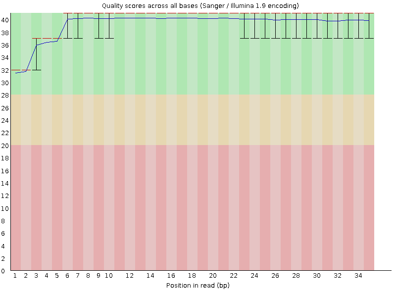
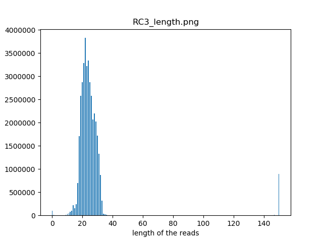
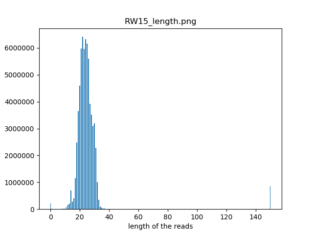
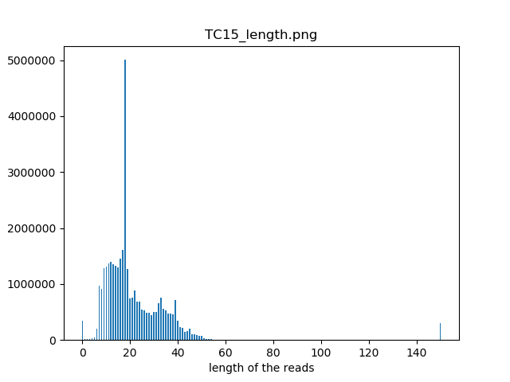
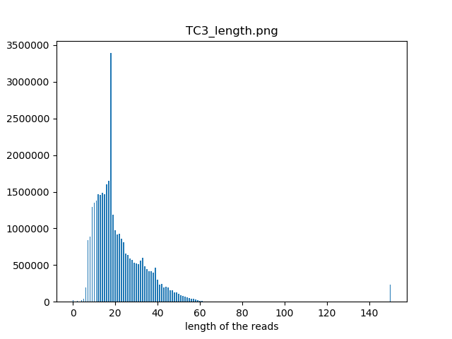
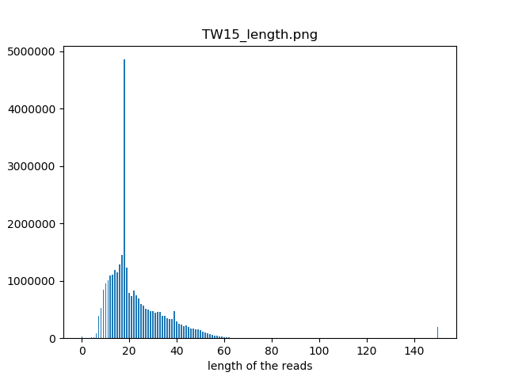
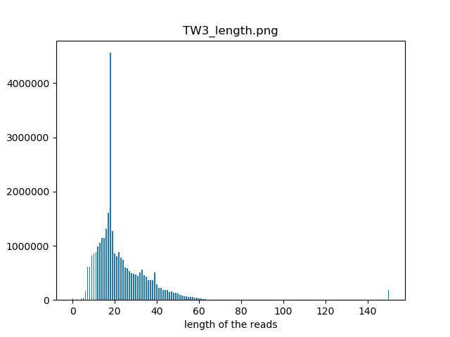
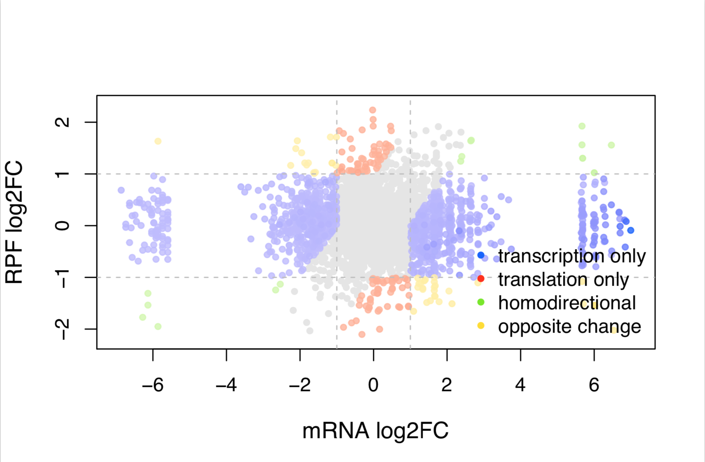
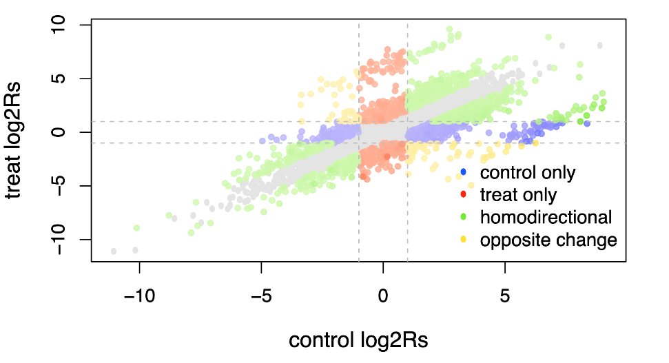
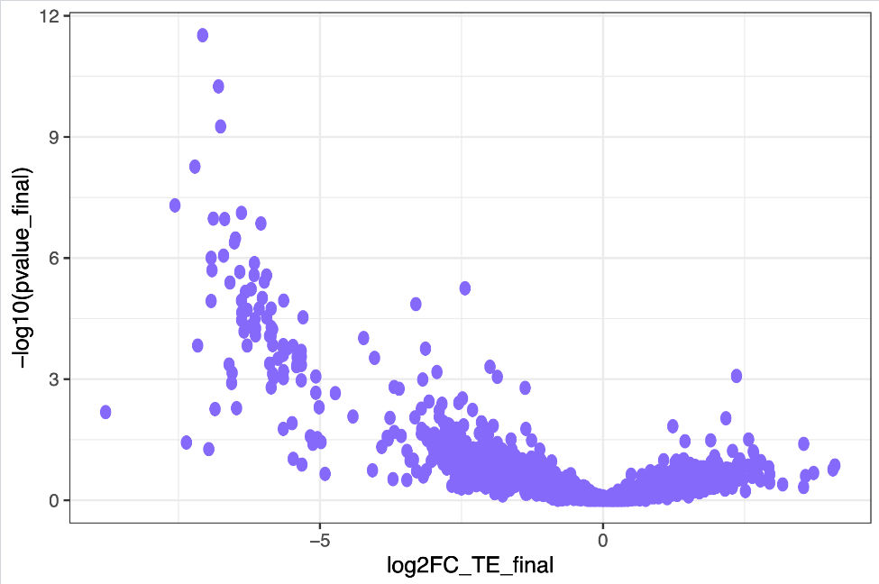

# 童明汉 Results:

> project_190620_TMH-XNN #(第三批)

## 实验设计

|实验组|对照组|
|:-|:-|
|ck0|WT|
|3号 ko 小鼠 |3号 WT 小鼠 |
|15号 ko 小鼠 |15号 WT 小鼠 |

每个都 total sequencing, Ribo-seq 数据。

## Raw data process pipeline (Ding Jiyu Finished)
**Qquality**
  

## rRNA 
* rRNA 含量都在30-45%之间，此项结果合格。

| Iterm       | RC15              | RC3              | RW15              | RW3               | TC15              | TC3               | TW15              | TW3               | 
|-------------|-------------------|------------------|-------------------|-------------------|-------------------|-------------------|-------------------|-------------------| 
| Total reads | 29117568          | 15945845         | 29117568          | 26538239          | 21647172          | 21085495          | 20839854          | 21286104          | 
| rRNA        | 12868091 (44.19%) | 6231774 (39.08%) | 12868091 (44.19%) | 11132644 (41.95%) | 5195548 (24.00%)  | 7424015 (35.21%)  | 6839769 (32.82%)  | 6633799 (31.16%)  | 
| non rRNA    | 16249477 (55.81%) | 9714071 (60.92%) | 16249477 (55.81%) | 15405595 (58.05%) | 16451624 (76.00%) | 13661480 (64.79%) | 14000085 (67.18%) | 14652305 (68.84%) | 

## Read length distribution

* Ribo-seq library length 分布以30nt为均值的正态分布，结果合格。对照的转录组建库长度分布主要分布在30nt,结果合格。

RC15 
  
RC3
  
RW15 
 
RW3 
  
TC15
  
TC3
  
TW15
  
TW3
  

## read to RNA DNA and Intron (Using Tophat and readsNumCal_intron_v3)

* read 大部分都比对到RNA中，结果合理。

| Iterm                                | RC15     | RC3      | RW15     | RW3      | TC15     | TC3      | TW15     | TW3      | 
|--------------------------------------|----------|----------|----------|----------|----------|----------|----------|----------| 
| unique mapped reads of RNA           |  2781456 |  2052673 |  3081580 |  3376747 |  3404711 |  3176944 |  3445547 |  3377738 | 
| unique mapped reads of Intron        |  1459873 |  1136971 |  1735785 |  1886293 |  477659  |  569024  |  359882  |  522544  | 
| unique mapped ambiguous reads of RNA |  327081  |  196881  |  492936  |  564206  |  299193  |  183668  |  308807  |  307879  | 
| unique mapped reads of DNA           |  612731  |  381812  |  679016  |  536901  |  3750711 |  2842941 |  3290770 |  3258154 | 

## Differentail translatons (Xtail) Results: (Xu Gang Finished)

### File list

|File name|Note|
|--------- |----|
|[xnn_results.txt](./result_190620_XNN/xnn_results.txt)    |The results of fist pipline are named with suffix ” v1”, which are generated by comparing mRNA and RPF log2 fold changes: The element log2FC_TE_v1 represents the log2 fold change of TE; The pvalue_v1 represent statistical significance. The sencond pipline are named with suffix ” v2”, which are derived by comparing log2 ratios between two conditions: log2FC_TE_v2, and pvalue_v2 are log2 ratio of TE, and pvalues. Finally, the more conserved results (with larger-Pvalue) was select as the final assessment of differential translation, which are named with suffix ” final”. The pvalue.adjust is the estimated false discovery rate corresponding to the pvalue_final.|
|[xnnmerge.counter](./result_190620_XNN/xnnmerge.counter)|Each condition reads count.|
|[xnnFC.pdf](./result_190620_XNN/xnnFC.pdf) |Figure 1: Scatter plot of log2 fold changes|
|[xnnfc_results.txt](./result_190620_XNN/xnnfc_results.txt) |Figure 1: result records.|
|[xnnRs.pdf](./result_190620_XNN/xnnRs.pdf)                 |Figure 2: Scatter plot of log2 RPF-to-mRNA ratios|
|[xnnrs_results.txt](./result_190620_XNN/xnnrs_results.txt) |Figure 2: result records.|
|[xnnvolcano.pdf](./result_190620_XNN/xnnvolcano.pdf)       |It can also be useful to evaluate the fold changes cutoff and p values thresholds by looking at the volcano plot.|

-----------
* blue: for genes whoes mRNA_log2FC larger than log2FC.cutoff (transcriptional level).
* red: for genes whoes RPF_log2FC larger than log2FC.cutoff (translational level).
* green: for genes changing homodirectionally at both level.
* yellow: for genes changing antidirectionally at two levels.

   
* Figure 1: Scatter plot of log2 fold changes

Those genes in which the difference of mRNA_log2FC and RPF_log2FC did not exceed more than log2FC.cutoff are excluded. The points will be color-coded with the pvalue_final obtained with xtail (more significant p values having darker color). By default the log2FC.cutoff is 1.

-------------------

* blue: for genes whoes log2R larger in first condition than second condition.

* red: for genes whoes log2R larger in second condition than the first condition.

* green: for genes whoes log2R changing homodirectionally in two condition.

* yellow: for genes whoes log2R changing antidirectionally in two conditon.

* Figure 2: Scatter plot of log2 RPF-to-mRNA ratios

Those genes in which the difference of log2R in two conditions did not exceed more than log2R.cutoff are excluded. The points will be color-coded with the pvalue_final obtained with xtail (more significant p values having darker color). By default the log2R.cutoff is 1.

  
[Volcano](../image/190620-XNN/xnnvolcano.pdf)  

