# 鲁伯埙 Results:

> 

## 实验设计

## Raw data process pipeline 
### **Quality**

7-7-R

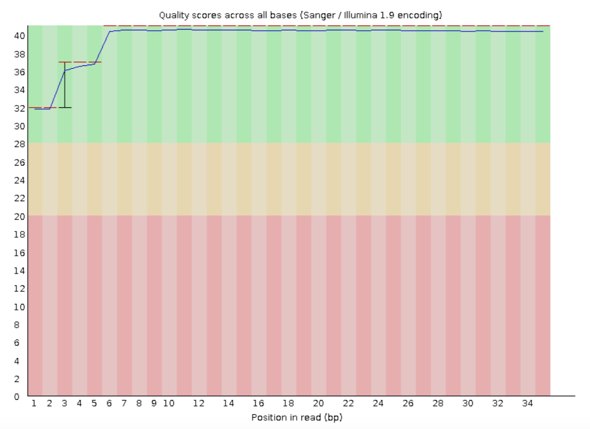   

7-7-T

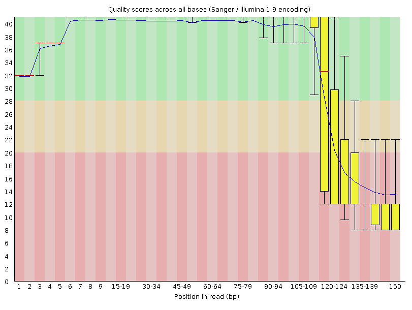   

7-111-R

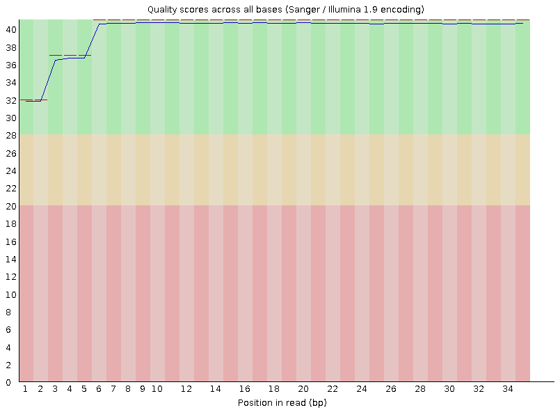   

7-111-T

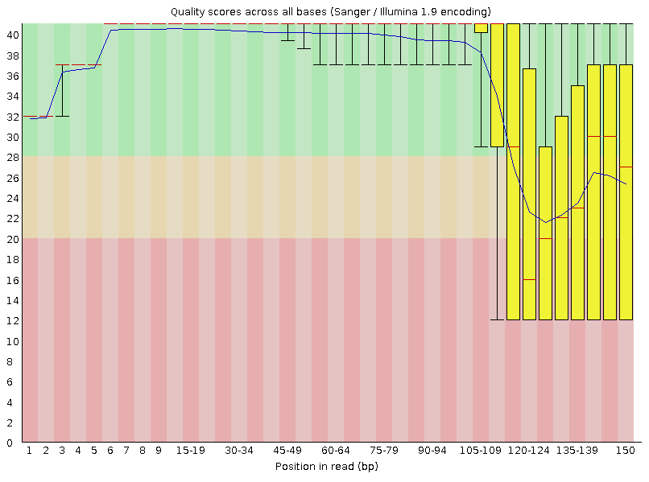  

### **rRNA**
| Iterm    | 7-111-R            | 7-7-R              | 7-111-T            | 7-7-T              |
|----------|--------------------|--------------------|--------------------|--------------------|
| Total    |  33421015          |  17057680          |  36125969          |  37219183          |
| rRNA     |  9679013 (28.96%)  |  3451860 (20.24%)  |  2389272 (6.61%)   |  376013 (1.01%)    |
| non rRNA |  23742002 (71.04%) |  13605820 (79.76%) |  33736697 (93.39%) |  36843170 (98.99%) |

### Read length distribution
7-7-R

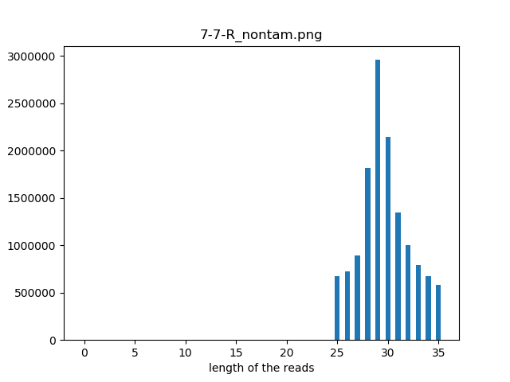   

7-7-T

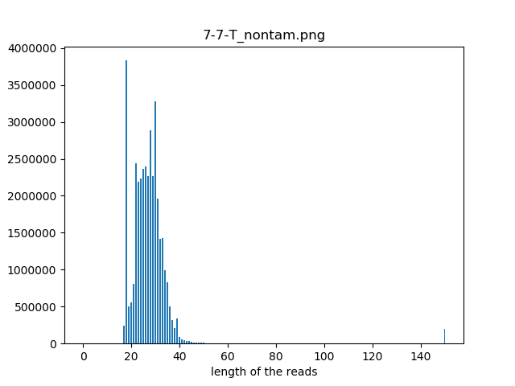   

7-111-R

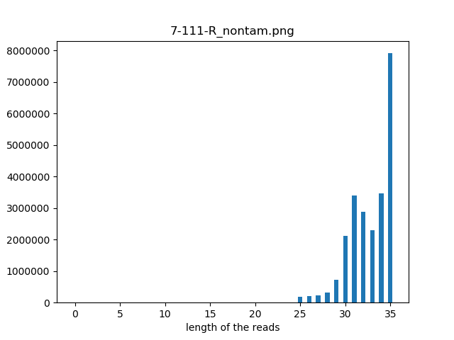   

7-111-T

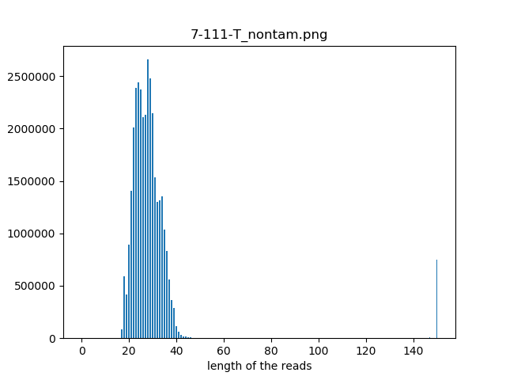 

### read to RNA DNA and Intron (Using Tophat and readsNumCal_intron_v3)
| Iterm                                | 7-111-R   | 7-7-R    | 7-111-T  | 7-7-T    |
|--------------------------------------|-----------|----------|----------|----------|
| unique mapped reads of RNA           |  10548663 |  4743168 |  5635056 |  5271249 |
| unique mapped reads of DNA           |  5064442  |  456997  |  3928551 |  6091270 |
| unique mapped reads of Intron        |  207337   |  73397   |  450475  |  527807  |
| unique mapped ambiguous reads of RNA |  191480   |  287350  |  364688  |  418920  |

## Differentail translations (Xtail) Results: 

**File list**
* [lbx_results.txt](result_190626_lbx/lbx_results.txt)
* [lbx.merge.counter](result_190626_lbx/lbx.merge.counter)
* [lbxfc_results.txt](result_190626_lbx/lbxfc_results.txt)
* [lbxFC.pdf](result_190626_lbx/lbxFC.pdf)
* [lbxrs_results.txt](result_190626_lbx/lbxrs_results.txt)
* [lbxRs.pdf](result_190626_lbx/lbxRs.pdf)
* [lbxvolcano.pdf](result_190626_lbx/lbxvolcano.pdf)

|File name|Note|
|--------- |----|
|[lbx_results.txt](result_190626_lbx/lbx_results.txt)    |The results of fist pipline are named with suffix ” v1”, which are generated by comparing mRNA and RPF log2 fold changes: The element log2FC_TE_v1 represents the log2 fold change of TE; The pvalue_v1 represent statistical significance. The sencond pipline are named with suffix ” v2”, which are derived by comparing log2 ratios between two conditions: log2FC_TE_v2, and pvalue_v2 are log2 ratio of TE, and pvalues. Finally, the more conserved results (with larger-Pvalue) was select as the final assessment of differential translation, which are named with suffix ” final”. The pvalue.adjust is the estimated false discovery rate corresponding to the pvalue_final.|
|[lbx.merge.counter](result_190626_lbx/lbx.merge.counter)|Each condition reads count.|
|[lbxFC.pdf](result_190626_lbx/lbxFC.pdf)                |Figure 1: Scatter plot of log2 fold changes|
|[lbxfc_results.txt](result_190626_lbx/lbxfc_results.txt)|Figure 1: result records.|
|[lbxRs.pdf](result_190626_lbx/lbxRs.pdf)                |Figure 2: Scatter plot of log2 RPF-to-mRNA ratios|
|[lbxrs_results.txt](result_190626_lbx/lbxrs_results.txt)|Figure 2: result records.|
|[lbxvolcano.pdf](result_190626_lbx/lbxvolcano.pdf)      |It can also be useful to evaluate the fold changes cutoff and p values thresholds by looking at the volcano plot.|

-----------
* blue: for genes whoes mRNA_log2FC larger than log2FC.cutoff (transcriptional level).
* red: for genes whoes RPF_log2FC larger than log2FC.cutoff (translational level).
* green: for genes changing homodirectionally at both level.
* yellow: for genes changing antidirectionally at two levels.

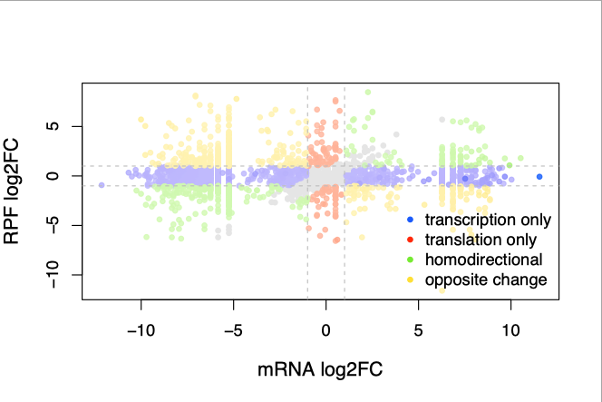 
* Figure 1: Scatter plot of log2 fold changes

Those genes in which the difference of mRNA_log2FC and RPF_log2FC did not exceed more than log2FC.cutoff are excluded. The points will be color-coded with the pvalue_final obtained with xtail (more significant p values having darker color). By default the log2FC.cutoff is 1.

-------------------

* blue: for genes whoes log2R larger in first condition than second condition.

* red: for genes whoes log2R larger in second condition than the first condition.

* green: for genes whoes log2R changing homodirectionally in two condition.

* yellow: for genes whoes log2R changing antidirectionally in two conditon.

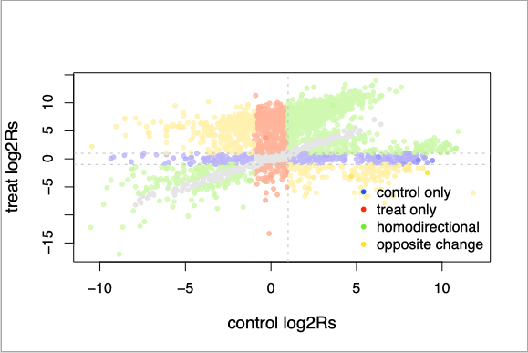 

* Figure 2: Scatter plot of log2 RPF-to-mRNA ratios

Those genes in which the difference of log2R in two conditions did not exceed more than log2R.cutoff are excluded. The points will be color-coded with the pvalue_final obtained with xtail (more significant p values having darker color). By default the log2R.cutoff is 1.

## Ribo code
**File list**  

|File name|Note|
|---------|----|
|[RiboCode_ORFs_result.txt](result_190626_lbx/RiboCode_ORFs_result.txt)           |contains the information of predicted ORFs in each transcript.  |
|[RiboCode_ORFs_result_collapsed.txt](result_190626_lbx/RiboCode_ORFs_result_collapsed.txt)  | combines the ORFs with the same stop codon in different transcript isoforms: the one harboring the most upstream in-frame ATG is chosen. |

**Some column names of the result file:**

|                    Column                      |                       mean                                | 
|---------------------------------               |-------------------------------------------------------| 
| - ORF_ID                                 |  The identifier of ORFs that predicated.                                                                                    | 
| - ORF_type                               |  The type of ORF is annotated according the relative location to associated CDS. The following ORF categories are reported: | 
||  "annotated" (overlapping annotated CDS, have the same stop with annotated CDS)             |   
||  "uORF" (in upstream of annotated CDS, not overlapping annotated CDS)                       |   
||  "dORF" (in downstream of annotated CDS, not overlapping annotated CDS)                     |  
||  "Overlap_uORF" (in upstream of annotated CDS, overlapping annotated CDS)                   |  
||  "Overlap_dORF" (in downstream of annotated CDS, overlapping annotated CDS"                 | 
||  "Internal" (in internal of annotated CDS, but in a different frame relative annotated CDS) | 
||  "novel" (in non-coding genes or non-coding transcripts of coding genes).                   |  
| - ORF_tstart, ORF_tstop                  |  the beginning and end of ORF in RNA transcript (1-based coordinate)                                                        | 
| - ORF_gstart, ORF_gstop                  |  the beginning and end of ORF in genome (1-based coordinate)                                                                | 
| - pval_frame0_vs_frame1                  |  significance levels of P-site densities of frame0 greater than of frame1                                                   | 
| - pval_frame0_vs_frame2                  |  significance levels of P-site densities of frame0 greater than of frame2                                                   | 
| - pval_combined                          |  integrated P-value                                                                                                         | 

### 7-111-R
| #read_length | proportion(per total mapped reads) | predicted_psite | f0_sum | f1_sum | f2_sum | f0_percent | pvalue1                | pvalue2               | pvalue_combined        |
|--------------|------------------------------------|-----------------|--------|--------|--------|------------|------------------------|-----------------------|------------------------|
| # 30         | 23.45%                             | 12              | 54979  | 5055   | 8040   | 80.76%     | 0.00014652626009624466 | 0.0004229273113302267 | 4.3151740824280333e-07 |
| # 29         | 5.06%                              | 12              | 11074  | 3784   | 1779   | 66.56%     | 0.0002995597005840259  | 0.0003563133512190236 | 7.173383508666136e-07  |

   
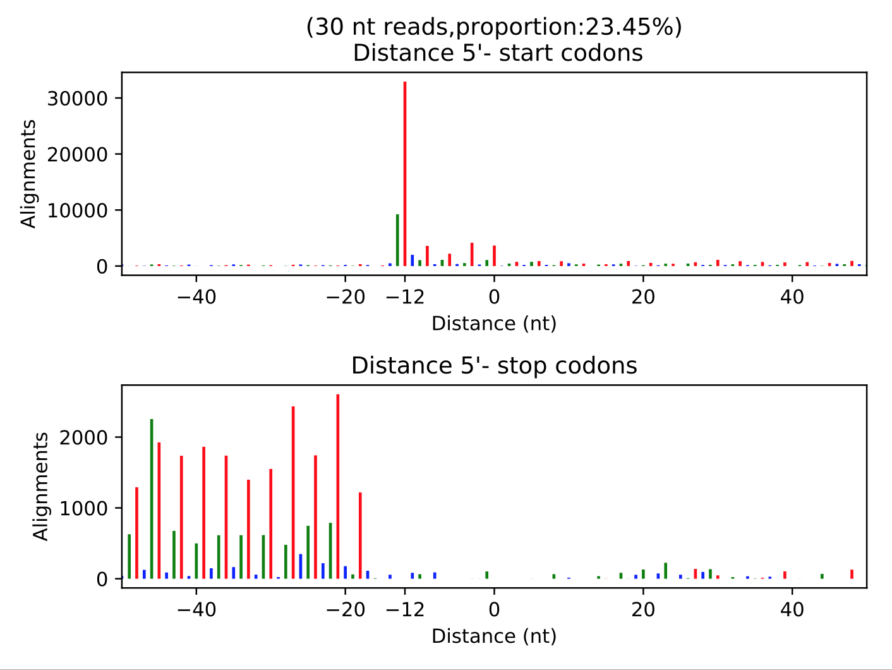     

### 7-7-R
|              |                                    |                 |        |        |        |            |                        |                        |                       | 
|--------------|------------------------------------|-----------------|--------|--------|--------|------------|------------------------|------------------------|-----------------------| 
| #read_length | proportion(per total mapped reads) | predicted_psite | f0_sum | f1_sum | f2_sum | f0_percent | pvalue1                | pvalue2                | pvalue_combined       | 
| # 28         | 22.95%                             | 12              | 51889  | 6952   | 1806   | 85.56%     | 0.00014652626009624466 | 0.00014652626009624466 | 1.516508550767744e-07 | 
| # 29         | 43.83%                             | 12              | 78951  | 3609   | 8621   | 86.59%     | 0.00014652626009624466 | 0.00014652626009624466 | 1.516508550767744e-07 | 

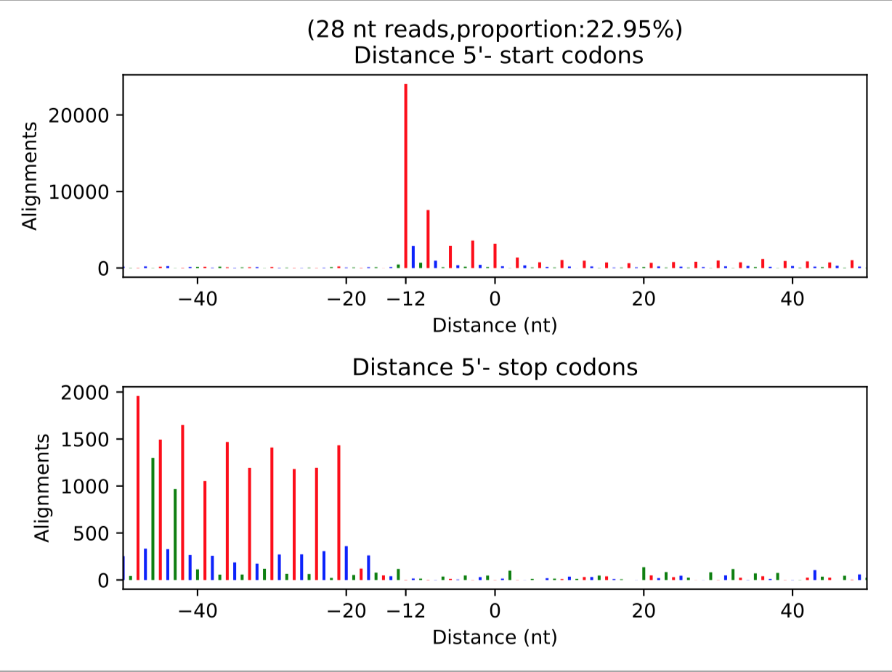   
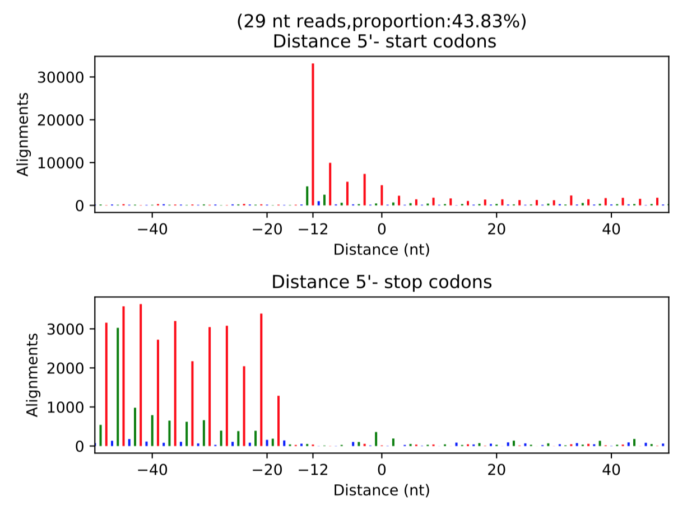     

### 
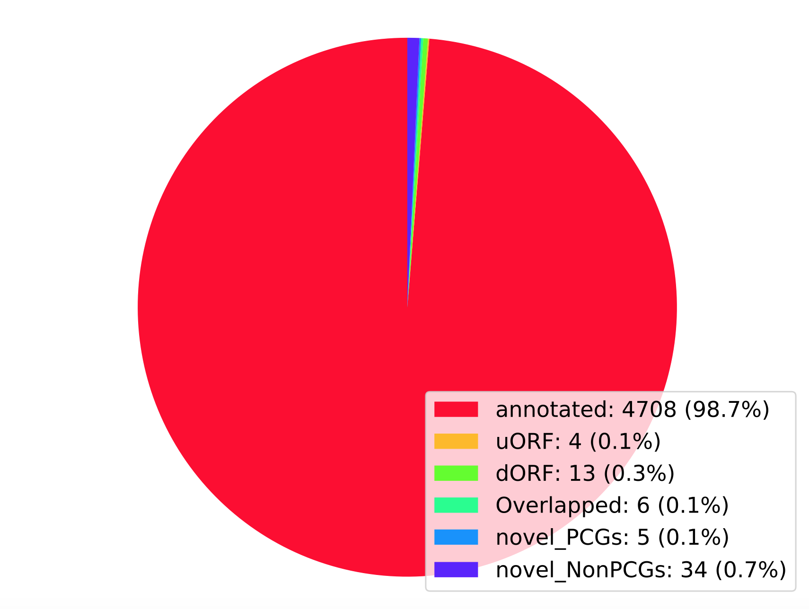    

预期是111的stalling增加，您看看是否有这个现象

**Htt**

    

