# Xie he results

## rRNA 

* rRNA 含量比较低，说明去除核糖体序列成功，结果合格。

|          |                     |                     |                     |                     |                     |                     |                     |                     |                     |                     |                     |                     |                     |                     |                     |                     |                     |                     |                     |                     | 
|----------|---------------------|---------------------|---------------------|---------------------|---------------------|---------------------|---------------------|---------------------|---------------------|---------------------|---------------------|---------------------|---------------------|---------------------|---------------------|---------------------|---------------------|---------------------|---------------------|---------------------| 
| Iterm    | ZXY-A-A10           | ZXY-A-A1            | ZXY-A-A2            | ZXY-A-A3            | ZXY-A-A4            | ZXY-A-A5            | ZXY-A-A6            | ZXY-A-A7            | ZXY-A-A8            | ZXY-A-A9            | ZXY-B-B10           | ZXY-B-B1            | ZXY-B-B2            | ZXY-B-B3            | ZXY-B-B4            | ZXY-B-B5            | ZXY-B-B6            | ZXY-B-B7            | ZXY-B-B8            | ZXY-B-B9            | 
| Total    |  21694234           |  21419344           |  23934838           |  18003406           |  23910795           |  27512685           |  17705610           |  17250106           |  21483030           |  20575945           |  22703417           |  17346358           |  11166564           |  17927603           |  18384691           |  20148645           |  17299327           |  18457501           |  22555282           |  22119600           | 
| rRNA     |  46 (0.00%)         |  154 (0.00%)        |  78 (0.00%)         |  32 (0.00%)         |  26 (0.00%)         |  68 (0.00%)         |  57 (0.00%)         |  46 (0.00%)         |  127 (0.00%)        |  698 (0.00%)        |  77 (0.00%)         |  65 (0.00%)         |  30 (0.00%)         |  53 (0.00%)         |  55 (0.00%)         |  71 (0.00%)         |  210 (0.00%)        |  143 (0.00%)        |  291 (0.00%)        |  128 (0.00%)        | 
| non rRNA |  21694188 (100.00%) |  21419190 (100.00%) |  23934760 (100.00%) |  18003374 (100.00%) |  23910769 (100.00%) |  27512617 (100.00%) |  17705553 (100.00%) |  17250060 (100.00%) |  21482903 (100.00%) |  20575247 (100.00%) |  22703340 (100.00%) |  17346293 (100.00%) |  11166534 (100.00%) |  17927550 (100.00%) |  18384636 (100.00%) |  20148574 (100.00%) |  17299117 (100.00%) |  18457358 (100.00%) |  22554991 (100.00%) |  22119472 (100.00%) | 

## mapping

* 各个样品大约有 60% 可以 Uniquely map到基因组中，结果合格。

|                                           |                 |                 |                 |                 |                 |                 |                 |                 |                 |                 |                 |                 |                 |                 |                 |                 |                 |                 |                 |                 | 
|-------------------------------------------|-----------------|-----------------|-----------------|-----------------|-----------------|-----------------|-----------------|-----------------|-----------------|-----------------|-----------------|-----------------|-----------------|-----------------|-----------------|-----------------|-----------------|-----------------|-----------------|-----------------| 
| Iterm                                     | ZXY-A-A10       | ZXY-A-A1        | ZXY-A-A2        | ZXY-A-A3        | ZXY-A-A4        | ZXY-A-A5        | ZXY-A-A6        | ZXY-A-A7        | ZXY-A-A8        | ZXY-A-A9        | ZXY-B-B10       | ZXY-B-B1        | ZXY-B-B2        | ZXY-B-B3        | ZXY-B-B4        | ZXY-B-B5        | ZXY-B-B6        | ZXY-B-B7        | ZXY-B-B8        | ZXY-B-B9        | 
| Started job on                            | Sep 20 11:02:03 | Sep 20 11:55:18 | Sep 20 12:28:18 | Sep 20 13:13:09 | Sep 20 13:53:23 | Sep 20 14:42:18 | Sep 20 15:36:39 | Sep 20 16:18:27 | Sep 20 16:56:21 | Sep 20 17:35:50 | Sep 20 11:11:44 | Sep 20 12:13:58 | Sep 20 12:54:23 | Sep 20 13:22:20 | Sep 20 14:03:26 | Sep 20 14:41:45 | Sep 20 15:22:45 | Sep 20 16:00:03 | Sep 20 16:42:30 | Sep 20 17:25:45 | 
| Started mapping on                        | Sep 20 11:16:30 | Sep 20 11:58:08 | Sep 20 12:31:53 | Sep 20 13:19:51 | Sep 20 14:00:36 | Sep 20 14:50:07 | Sep 20 15:45:33 | Sep 20 16:23:57 | Sep 20 17:01:17 | Sep 20 17:43:23 | Sep 20 11:38:10 | Sep 20 12:27:27 | Sep 20 13:00:23 | Sep 20 13:32:26 | Sep 20 14:12:19 | Sep 20 14:52:10 | Sep 20 15:33:12 | Sep 20 16:08:05 | Sep 20 16:51:59 | Sep 20 17:36:54 | 
| Finished on                               | Sep 20 11:55:13 | Sep 20 12:28:14 | Sep 20 13:13:05 | Sep 20 13:53:20 | Sep 20 14:42:13 | Sep 20 15:36:34 | Sep 20 16:18:24 | Sep 20 16:56:17 | Sep 20 17:35:45 | Sep 20 18:12:20 | Sep 20 12:13:54 | Sep 20 12:54:19 | Sep 20 13:22:15 | Sep 20 14:03:22 | Sep 20 14:41:41 | Sep 20 15:22:41 | Sep 20 15:59:59 | Sep 20 16:42:26 | Sep 20 17:25:41 | Sep 20 18:11:50 | 
| Mapping speed, Million of reads per hour  | 33.62           | 42.70           | 34.86           | 32.26           | 34.47           | 35.54           | 32.34           | 32.01           | 37.40           | 42.64           | 38.12           | 38.74           | 30.64           | 34.77           | 37.56           | 39.61           | 38.75           | 32.24           | 40.16           | 37.99           | 
|                                           |                 |                 |                 |                 |                 |                 |                 |                 |                 |                 |                 |                 |                 |                 |                 |                 |                 |                 |                 |                 | 
| Number of input reads                     | 21694188        | 21419190        | 23934760        | 18003374        | 23910769        | 27512617        | 17705553        | 17250060        | 21482903        | 20575247        | 22703340        | 17346293        | 11166534        | 17927550        | 18384636        | 20148574        | 17299117        | 18457358        | 22554991        | 22119472        | 
| Average input read length                 | 278             | 280             | 278             | 281             | 281             | 280             | 278             | 282             | 279             | 278             | 280             | 282             | 280             | 281             | 282             | 279             | 279             | 282             | 279             | 279             | 
| UNIQUE READS:                             |                 |                 |                 |                 |                 |                 |                 |                 |                 |                 |                 |                 |                 |                 |                 |                 |                 |                 |                 |                 | 
| Uniquely mapped reads number              | 14863934        | 13860070        | 16290470        | 12844959        | 17094270        | 17818900        | 11505269        | 12286930        | 14374294        | 12312495        | 14597937        | 12454774        | 7852230         | 12276274        | 12910944        | 13064465        | 10708396        | 13426503        | 13805668        | 14833742        | 
| Uniquely mapped reads %                   | 68.52%          | 64.71%          | 68.06%          | 71.35%          | 71.49%          | 64.77%          | 64.98%          | 71.23%          | 66.91%          | 59.84%          | 64.30%          | 71.80%          | 70.32%          | 68.48%          | 70.23%          | 64.84%          | 61.90%          | 72.74%          | 61.21%          | 67.06%          | 
| Average mapped length                     | 282.45          | 285.86          | 282.80          | 285.30          | 284.55          | 284.82          | 283.39          | 285.93          | 283.58          | 284.64          | 285.33          | 286.39          | 284.44          | 285.20          | 286.19          | 283.63          | 285.79          | 285.71          | 284.35          | 283.62          | 
| Number of splices: Total                  | 4829770         | 5258063         | 6280188         | 4091626         | 5239928         | 6850103         | 3684527         | 3981945         | 5205165         | 3941745         | 5298200         | 3828906         | 2729758         | 4585011         | 4516935         | 4280630         | 3281049         | 3913094         | 5971119         | 5536249         | 
| Number of splices: Annotated (sjdb)       | 4639004         | 5046446         | 6049205         | 3958159         | 5075628         | 6610700         | 3535150         | 3856856         | 4982348         | 3779864         | 5095439         | 3717227         | 2644445         | 4435962         | 4383961         | 4123422         | 3129091         | 3795669         | 5757613         | 5349040         | 
| Number of splices: GT/AG                  | 4754469         | 5180446         | 6190393         | 4027576         | 5159276         | 6742675         | 3626318         | 3924166         | 5120041         | 3866950         | 5214580         | 3775155         | 2689541         | 4518765         | 4450987         | 4210497         | 3216515         | 3855374         | 5884422         | 5457002         | 
| Number of splices: GC/AG                  | 38002           | 40673           | 47879           | 31725           | 40187           | 53408           | 28999           | 29789           | 41724           | 31912           | 42289           | 29569           | 21897           | 36360           | 35503           | 33739           | 26662           | 31159           | 48498           | 42751           | 
| Number of splices: AT/AC                  | 3505            | 3950            | 4021            | 3351            | 4303            | 5088            | 2555            | 3293            | 4129            | 2960            | 4134            | 3125            | 2148            | 3753            | 3587            | 3200            | 2477            | 3004            | 4986            | 4413            | 
| Number of splices: Non-canonical          | 33794           | 32994           | 37895           | 28974           | 36162           | 48932           | 26655           | 24697           | 39271           | 39923           | 37197           | 21057           | 16172           | 26133           | 26858           | 33194           | 35395           | 23557           | 33213           | 32083           | 
| Mismatch rate per base, %                 | 0.07%           | 0.08%           | 0.08%           | 0.08%           | 0.08%           | 0.08%           | 0.08%           | 0.08%           | 0.08%           | 0.08%           | 0.09%           | 0.09%           | 0.08%           | 0.08%           | 0.08%           | 0.08%           | 0.09%           | 0.08%           | 0.08%           | 0.08%           | 
| Deletion rate per base                    | 0.02%           | 0.01%           | 0.02%           | 0.02%           | 0.02%           | 0.01%           | 0.02%           | 0.01%           | 0.02%           | 0.01%           | 0.01%           | 0.01%           | 0.02%           | 0.02%           | 0.01%           | 0.02%           | 0.01%           | 0.02%           | 0.01%           | 0.01%           | 
| Deletion average length                   | 2.71            | 2.49            | 2.56            | 2.22            | 2.22            | 2.41            | 2.46            | 2.23            | 2.79            | 2.66            | 2.54            | 2.12            | 2.39            | 2.34            | 2.25            | 2.70            | 2.80            | 2.06            | 2.61            | 2.57            | 
| Insertion rate per base                   | 0.01%           | 0.01%           | 0.01%           | 0.02%           | 0.02%           | 0.01%           | 0.01%           | 0.02%           | 0.01%           | 0.01%           | 0.01%           | 0.02%           | 0.02%           | 0.02%           | 0.02%           | 0.01%           | 0.01%           | 0.02%           | 0.01%           | 0.01%           | 
| Insertion average length                  | 1.53            | 1.48            | 1.54            | 1.54            | 1.53            | 1.50            | 1.54            | 1.54            | 1.53            | 1.49            | 1.53            | 1.51            | 1.54            | 1.51            | 1.54            | 1.52            | 1.54            | 1.57            | 1.47            | 1.53            | 
| MULTI-MAPPING READS:                      |                 |                 |                 |                 |                 |                 |                 |                 |                 |                 |                 |                 |                 |                 |                 |                 |                 |                 |                 |                 | 
| Number of reads mapped to multiple loci   | 0               | 0               | 0               | 0               | 0               | 0               | 0               | 0               | 0               | 0               | 0               | 0               | 0               | 0               | 0               | 0               | 0               | 0               | 0               | 0               | 
| % of reads mapped to multiple loci        | 0.00%           | 0.00%           | 0.00%           | 0.00%           | 0.00%           | 0.00%           | 0.00%           | 0.00%           | 0.00%           | 0.00%           | 0.00%           | 0.00%           | 0.00%           | 0.00%           | 0.00%           | 0.00%           | 0.00%           | 0.00%           | 0.00%           | 0.00%           | 
| Number of reads mapped to too many loci   | 1462852         | 2035029         | 1559097         | 956261          | 1185171         | 2484142         | 1480231         | 867456          | 1725461         | 2745085         | 2032603         | 871048          | 627086          | 1110898         | 1140410         | 1808196         | 2154545         | 916410          | 2690578         | 1779077         | 
| % of reads mapped to too many loci        | 6.74%           | 9.50%           | 6.51%           | 5.31%           | 4.96%           | 9.03%           | 8.36%           | 5.03%           | 8.03%           | 13.34%          | 8.95%           | 5.02%           | 5.62%           | 6.20%           | 6.20%           | 8.97%           | 12.45%          | 4.97%           | 11.93%          | 8.04%           | 
| UNMAPPED READS:                           |                 |                 |                 |                 |                 |                 |                 |                 |                 |                 |                 |                 |                 |                 |                 |                 |                 |                 |                 |                 | 
| % of reads unmapped: too many mismatches  | 21.61%          | 23.41%          | 22.13%          | 20.55%          | 20.72%          | 23.44%          | 23.85%          | 20.92%          | 21.76%          | 23.95%          | 24.00%          | 20.99%          | 21.12%          | 22.42%          | 20.73%          | 23.24%          | 23.10%          | 19.91%          | 23.95%          | 21.97%          | 
| % of reads unmapped: too short            | 2.92%           | 2.12%           | 3.12%           | 2.65%           | 2.67%           | 2.52%           | 2.55%           | 2.67%           | 3.04%           | 2.33%           | 2.50%           | 2.03%           | 2.77%           | 2.73%           | 2.66%           | 2.69%           | 2.17%           | 2.24%           | 2.59%           | 2.75%           | 
| % of reads unmapped: other                | 0.21%           | 0.26%           | 0.18%           | 0.14%           | 0.17%           | 0.24%           | 0.26%           | 0.15%           | 0.25%           | 0.53%           | 0.25%           | 0.15%           | 0.18%           | 0.17%           | 0.17%           | 0.25%           | 0.38%           | 0.14%           | 0.32%           | 0.18%           | 
| CHIMERIC READS:                           |                 |                 |                 |                 |                 |                 |                 |                 |                 |                 |                 |                 |                 |                 |                 |                 |                 |                 |                 |                 | 
| Number of chimeric reads                  | 0               | 0               | 0               | 0               | 0               | 0               | 0               | 0               | 0               | 0               | 0               | 0               | 0               | 0               | 0               | 0               | 0               | 0               | 0               | 0               | 
| % of chimeric reads                       | 0.00%           | 0.00%           | 0.00%           | 0.00%           | 0.00%           | 0.00%           | 0.00%           | 0.00%           | 0.00%           | 0.00%           | 0.00%           | 0.00%           | 0.00%           | 0.00%           | 0.00%           | 0.00%           | 0.00%           | 0.00%           | 0.00%           | 0.00%           | 

## Duplication

* 数据有不同程度的 Duplication 的现象。这个是由于建库中 PCR 结果产生，结果在可以接受的区间中。去除后进行后续的统计。

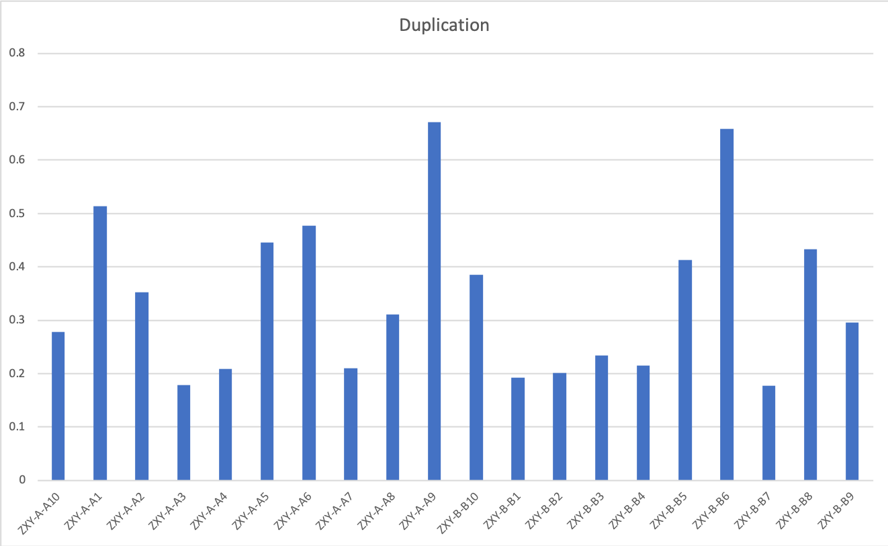

|                         |                         |                         |                         |                         |                         |                         |                         |                         |                         |                         |                         |                        |                         |                         |                         |                         |                         |                         |                         | 
|-------------------------|-------------------------|-------------------------|-------------------------|-------------------------|-------------------------|-------------------------|-------------------------|-------------------------|-------------------------|-------------------------|-------------------------|------------------------|-------------------------|-------------------------|-------------------------|-------------------------|-------------------------|-------------------------|-------------------------| 
| ZXY-A-A10               | ZXY-A-A1                | ZXY-A-A2                | ZXY-A-A3                | ZXY-A-A4                | ZXY-A-A5                | ZXY-A-A6                | ZXY-A-A7                | ZXY-A-A8                | ZXY-A-A9                | ZXY-B-B10               | ZXY-B-B1                | ZXY-B-B2               | ZXY-B-B3                | ZXY-B-B4                | ZXY-B-B5                | ZXY-B-B6                | ZXY-B-B7                | ZXY-B-B8                | ZXY-B-B9                | 
| 4104347/14742832=0.2784 | 7066720/13770159=0.5132 | 5707453/16183906=0.3527 | 2271864/12706384=0.1788 | 3525953/16921122=0.2084 | 7892879/17710717=0.4457 | 5449086/11427202=0.4769 | 2551803/12151189=0.2100 | 4426893/14246307=0.3107 | 8211603/12245619=0.6706 | 5579853/14499931=0.3848 | 2369836/12297761=0.1927 | 1565040/7767874=0.2015 | 2842459/12142706=0.2341 | 2750271/12779910=0.2152 | 5359846/12989743=0.4126 | 7012006/10647108=0.6586 | 2360529/13282768=0.1777 | 5933631/13718676=0.4325 | 4341527/14699295=0.2954 | 

## After remove duplicaton: DNA Intron and RNA

* read 大约有50%比对到 RNA 中，另有40%比对到intron区。结果合格。

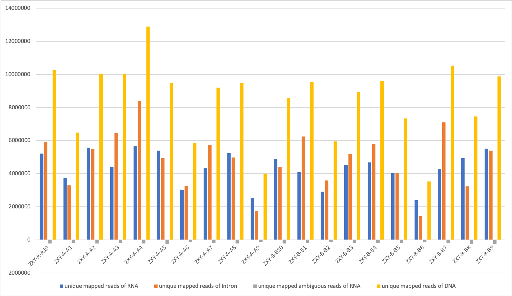

|                                      |           |          |           |           |           |          |          |          |          |          |           |          |          |          |          |          |          |           |          |          | 
|--------------------------------------|-----------|----------|-----------|-----------|-----------|----------|----------|----------|----------|----------|-----------|----------|----------|----------|----------|----------|----------|-----------|----------|----------| 
| iterm                                | ZXY-A-A10 | ZXY-A-A1 | ZXY-A-A2  | ZXY-A-A3  | ZXY-A-A4  | ZXY-A-A5 | ZXY-A-A6 | ZXY-A-A7 | ZXY-A-A8 | ZXY-A-A9 | ZXY-B-B10 | ZXY-B-B1 | ZXY-B-B2 | ZXY-B-B3 | ZXY-B-B4 | ZXY-B-B5 | ZXY-B-B6 | ZXY-B-B7  | ZXY-B-B8 | ZXY-B-B9 | 
| unique mapped reads of RNA           |  5212551  |  3739952 |  5563304  |  4419677  |  5646374  |  5391987 |  3022255 |  4311596 |  5234890 |  2530451 |  4889211  |  4077988 |  2905535 |  4512860 |  4674454 |  4023451 |  2394890 |  4278533  |  4926496 |  5507002 | 
| unique mapped reads of DNA           |  10260970 |  6484297 |  10039727 |  10038495 |  12881093 |  9478154 |  5843900 |  9195892 |  9488109 |  3994646 |  8576771  |  9560833 |  5941288 |  8921709 |  9602503 |  7326748 |  3535233 |  10525438 |  7457925 |  9879393 | 
| unique mapped reads of Intron        |  5920479  |  3288269 |  5495557  |  6449224  |  8384662  |  4957171 |  3257293 |  5724921 |  4973920 |  1715392 |  4409273  |  6251319 |  3578305 |  5195497 |  5782776 |  4049652 |  1416505 |  7088538  |  3227533 |  5391465 | 
| unique mapped ambiguous reads of RNA |  214405   |  181131  |  230762   |  188910   |  228414   |  245617  |  141981  |  177533  |  230701  |  133559  |  225230   |  179574  |  127925  |  199732  |  207265  |  175193  |  125837  |  182193   |  243468  |  240587  | 

## Gene counts
[merge count.txt](result_191008_xiehe/merge.counter)

## Differential expression gene

### Multidimensional scaling plot of distances between gene expression profiles

* Description

Plot samples on a two-dimensional scatterplot so that distances on the plot approximate the typical log2 fold changes between the samples.

* Details

This function is a variation on the usual multdimensional scaling (or principle coordinate) plot, in that a distance measure particularly appropriate for the microarray context is used. The distance between each pair of samples (columns) is the root-mean-square deviation (Euclidean distance) for the top top genes. Distances on the plot can be interpreted as leading log2-fold-change, meaning the typical (root-mean-square) log2-fold-change between the samples for the genes that distinguish those samples.

[mds.pdf](result_191008_xiehe/mds.pdf)

## Bacth effect

| Num |                         | 旧编号  | 日期         | tube | 新编号   | 浓度     |
|-----|-------------------------|------|------------|------|-------|--------| 
| 1   | 治疗前                     | A-46 | 2018.04.02 | 2    | A-A1  | 679    | 
| 2   | 治疗前                     | A-47 | 2018.04.02 | 2    | A-A2  | 368    | 
| 3   |                     治疗前 | A-48 | 2018.04.04 | 2    | A-A3  | 1022.1 | 
| 4   |                     治疗前 | A-49 | 2018.04.04 | 2    | A-A4  | 1555.1 | 
| 5   |                     治疗前 | A-50 | 2018.04.04 | 2    | A-A5  | 2291.8 | 
| 6   |                     治疗前 | A-51 | 2018.04.04 | 2    | A-A6  | 971.5  | 
| 7   |                     治疗前 | A-52 | 2018.04.23 | 2    | A-A7  | 1008.4 | 
| 8   |                     治疗前 | A-53 | 2018.04.27 | 2    | A-A8  | 607    | 
| 9   |                     治疗前 | A-54 | 2018.04.27 | 2    | A-A9  | 1585.4 | 
| 10  |                     治疗前 | A-55 | 2018.05.09 | 2    | A-A10 | 3243   | 
| 11  | 治疗后                     | B-24 | 2018.04.19 | 2    | B-B1  | 1345.2 | 
| 12  |                    治疗后  | B-25 | 2018.04.23 | 2    | B-B2  | 514.9  | 
| 13  |                    治疗后  | B-26 | 2018.04.23 | 2    | B-B3  | 785.8  | 
| 14  |                    治疗后  | B-27 | 2018.04.23 | 2    | B-B4  | 490.1  | 
| 15  |                    治疗后  | B-28 | 2018.04.23 | 2    | B-B5  | 1054.1 | 
| 16  |                    治疗后  | B-34 | 2018.05.07 | 2    | B-B6  | 977.1  | 
| 17  |                    治疗后  | B-40 | 2018.04.27 | 2    | B-B7  | 633.5  | 
| 18  |                    治疗后  | B-43 | 2018.05.07 | 2    | B-B8  | 580.8  | 
| 19  |                     治疗后 | B-47 | 2018.05.07 | 2    | B-B9  | 395    | 
| 20  |                     治疗后 | B-51 | 2018.05.09 | 2    | B-B10 | 695    | 

* Remove batch effect.

**mean-variance**

* Gene expression after normalization: [normal_gene_expression.csv](result_191008_xiehe/normal_gene_expression.csv).

### DE results
 

### Remove RNA concentration batch effect. [DE.remove_concen.csv](result_191008_xiehe/remove_concen.csv)
* Cutoff: P value <0.01  (352 gene.)

| logFC           | AveExpr      | t            | P.Value      | adj.P.Val   | B           |              | 
|-----------------|--------------|--------------|--------------|-------------|-------------|--------------| 
| ENSG00000215022 | 1.750547364  | 3.786295546  | 5.850940315  | 5.81E-06    | 0.139657962 | 3.69343999   | 
| ENSG00000183625 | 1.541298273  | 3.650082293  | 5.354657122  | 1.95E-05    | 0.159083489 | 2.677078658  | 
| ENSG00000262074 | 2.577004326  | 2.22851116   | 5.245612013  | 2.54E-05    | 0.159083489 | 2.210152716  | 
| ENSG00000222675 | 2.271230155  | -1.721682461 | 5.229309527  | 2.65E-05    | 0.159083489 | 0.494022762  | 
| ENSG00000107593 | 2.140646157  | -1.215973654 | 4.966211015  | 5.08E-05    | 0.243931034 | 0.362368835  | 
| ENSG00000169429 | 1.76564254   | 9.259948174  | 4.886900111  | 6.18E-05    | 0.247502938 | 1.809821607  | 
| ENSG00000212195 | 2.650983729  | 1.439197478  | 4.767119001  | 8.33E-05    | 0.285740315 | 1.045143709  | 
| ENSG00000229436 | -2.040532208 | 1.364829905  | -4.625295052 | 0.000118529 | 0.333461188 | 0.336269222  | 
| ENSG00000231890 | 1.583336541  | 2.956686637  | 4.604213967  | 0.000124923 | 0.333461188 | 1.03949527   | 

* logFC: log2 fold change of no drug/ treatment.   
* AveExpr: Average expression across all samples, in log2 CPM  
* t: logFC divided by its standard error  
* P.Value: Raw p-value (based on t) from test that logFC differs from 0  
* adj.P.Val: Benjamini-Hochberg false discovery rate adjusted p-value  
* B: log-odds that gene is DE (arguably less useful than the other columns)  

### Remove library time batch effect. [DE.remove_library.csv](result_191008_xiehe/remove_library_time.csv)
* Cutoff: P value <0.01  (660 gene.)

|      Gene       | logFC        | AveExpr      | t            | P.Value     | adj.P.Val   | B            |
|-----------------|--------------|--------------|--------------|-------------|-------------|--------------| 
| ENSG00000268658 | 3.264795882  | 3.203486521  | 6.625781916  | 2.40E-06    | 0.057689105 | 4.605847104  | 
| ENSG00000183625 | 1.882921794  | 3.650082293  | 5.543445395  | 2.37E-05    | 0.222008152 | 2.695294842  | 
| ENSG00000234832 | 2.316597584  | 1.222863803  | 5.471809681  | 2.77E-05    | 0.222008152 | 2.080780157  | 
| ENSG00000211667 | 3.897694521  | -1.481160419 | 5.241904698  | 4.60E-05    | 0.227957697 | 1.072682667  | 
| ENSG00000262074 | 3.330954371  | 2.22851116   | 5.197145147  | 5.08E-05    | 0.227957697 | 1.864904987  | 
| ENSG00000188266 | -2.610963195 | -0.383434906 | -5.024243058 | 7.46E-05    | 0.227957697 | 0.546088764  | 
| ENSG00000260078 | 1.785808498  | 3.951582035  | 5.020922045  | 7.52E-05    | 0.227957697 | 1.691549393  | 
| ENSG00000268240 | 3.001084065  | 4.46997216   | 4.970936565  | 8.41E-05    | 0.227957697 | 1.606186986  | 
| ENSG00000272831 | 2.988308612  | -1.296363176 | 4.948799689  | 8.84E-05    | 0.227957697 | 0.446656939  | 

* logFC: log2 fold change of no drug/ treatment.   
* AveExpr: Average expression across all samples, in log2 CPM  
* t: logFC divided by its standard error  
* P.Value: Raw p-value (based on t) from test that logFC differs from 0  
* adj.P.Val: Benjamini-Hochberg false discovery rate adjusted p-value  
* B: log-odds that gene is DE (arguably less useful than the other columns) 

### For example: (using cpm)
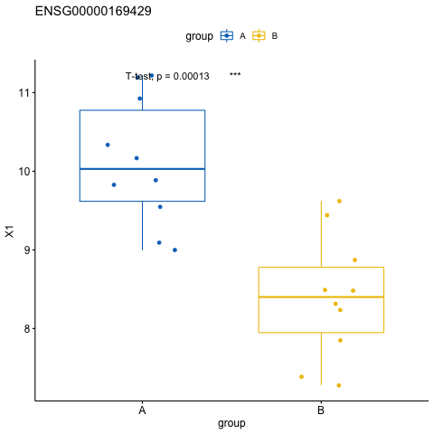
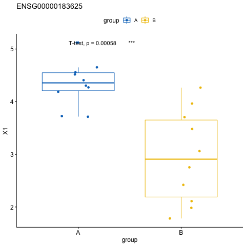
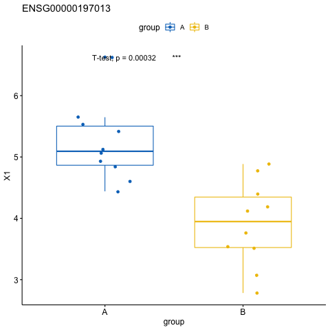
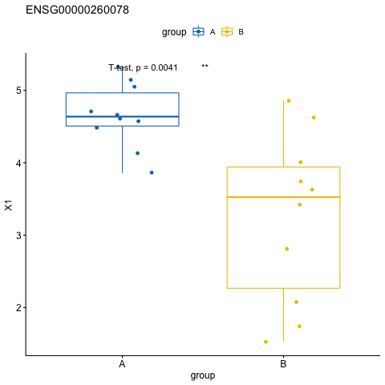
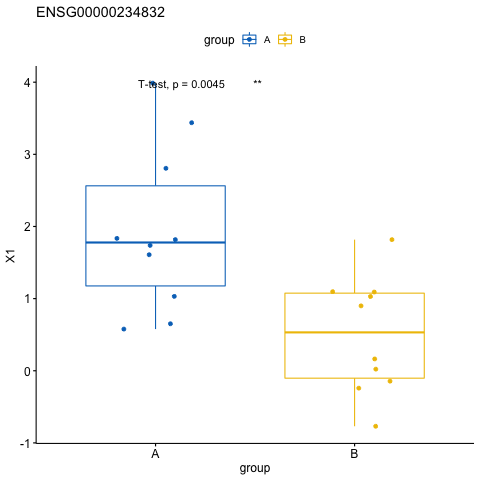

## KEGG
* Using the result from removed library time batch effect.  

### Using remove RNA concentration batch effect.
* Cutoff: P value <0.01  (352 gene.)
* DAVID recognize 179 gene, and those gene were processed.

* 其中展示非洲锥虫病，疟疾，自噬调节。相关基因都为处理有基因表达量下降。

|                   |                                  |       |             |             |                                                                                                      |            |          |           |                 |             |             |             | 
|-------------------|----------------------------------|-------|-------------|-------------|------------------------------------------------------------------------------------------------------|------------|----------|-----------|-----------------|-------------|-------------|-------------| 
| Term-ch           | Term                             | Count | %           | PValue      | Genes                                                                                                | List Total | Pop Hits | Pop Total | Fold Enrichment | Bonferroni  | Benjamini   | FDR         | 
| hsa05143：非洲锥虫病    | hsa05143:African trypanosomiasis | 4     | 2.234636872 | 0.002593678 | ENSG00000244734, ENSG00000188536, ENSG00000206172, ENSG00000131203                                   | 59         | 33       | 6879      | 14.13251156     | 0.320881759 | 0.320881759 | 3.050228676 | 
| hsa04068：FoxO信号通路 | hsa04068:FoxO signaling pathway  | 6     | 3.351955307 | 0.005217084 | ENSG00000170296, ENSG00000139112, ENSG00000034713, ENSG00000145632, ENSG00000121691, ENSG00000268173 | 59         | 134      | 6879      | 5.220591955     | 0.541309862 | 0.322733333 | 6.048494812 | 
| hsa05144：疟疾       | hsa05144:Malaria                 | 4     | 2.234636872 | 0.007963168 | ENSG00000244734, ENSG00000188536, ENSG00000206172, ENSG00000169429                                   | 59         | 49       | 6879      | 9.517813905     | 0.696162262 | 0.327724572 | 9.095765275 | 
| hsa04140：自噬调节     | hsa04140:Regulation of autophagy | 3     | 1.675977654 | 0.018510197 | ENSG00000170296, ENSG00000139112, ENSG00000034713                                                    | 59         | 25       | 6879      | 13.99118644     | 0.938200782 | 0.501407495 | 19.97696416 | 
| hsa00380：色氨酸代谢    | hsa00380:Tryptophan metabolism   | 3     | 1.675977654 | 0.044417247 | ENSG00000121691, ENSG00000002726, ENSG00000131203                                                    | 59         | 40       | 6879      | 8.744491525     | 0.998851907 | 0.741776703 | 41.83744549 | 
| hsa03013：RNA转运    | hsa03013:RNA transport           | 5     | 2.793296089 | 0.056424612 | ENSG00000265185, ENSG00000161960, ENSG00000262074, ENSG00000100664, ENSG00000173812                  | 59         | 172      | 6879      | 3.389337801     | 0.999825533 | 0.763615493 | 49.98049688 | 
| hsa04360：轴突指南     | hsa04360:Axon guidance           | 4     | 2.234636872 | 0.091271819 | ENSG00000169242, ENSG00000154134, ENSG00000172602, ENSG00000133216                                   | 59         | 127      | 6879      | 3.672227412     | 0.999999359 | 0.869611911 | 68.06937945 | 

### African trypanosomiasis (非洲锥虫病)
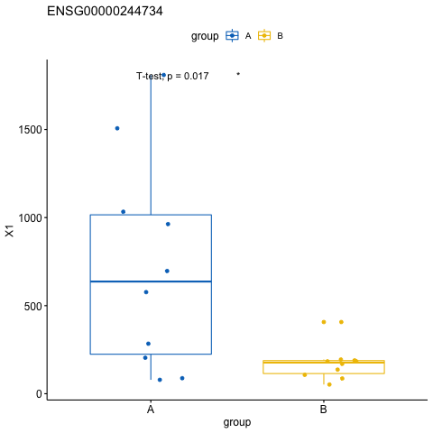
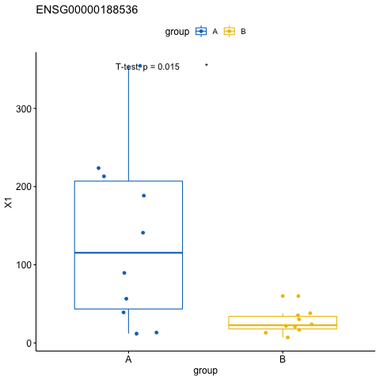
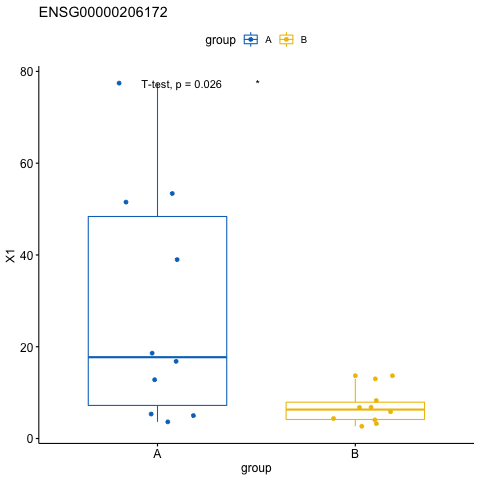
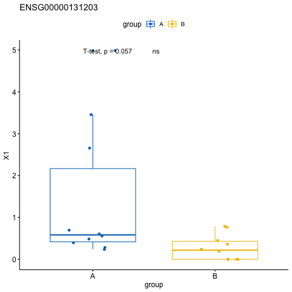

### Malaria （疟疾）
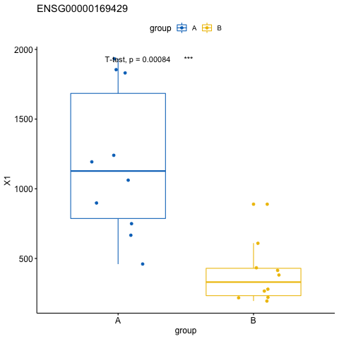

## Regulation of autophagy (自噬调节)
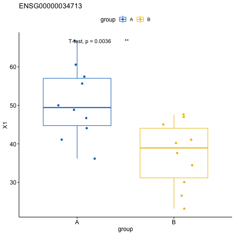
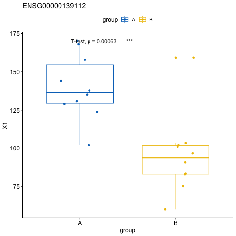
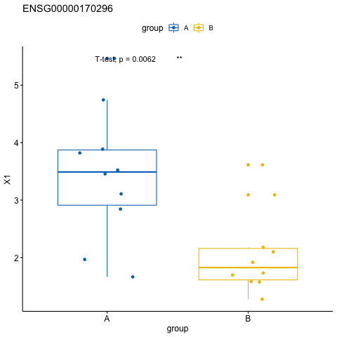

### Using remove library batch effect.
* Cutoff: P value <0.01  (660 gene.)
* DAVID recognize 423 gene, and those gene were processed.

|                            |                                                                     |       |             |             |                                                                                                                                                                                           |            |          |           |                 |             |             |             | 
|----------------------------|---------------------------------------------------------------------|-------|-------------|-------------|-------------------------------------------------------------------------------------------------------------------------------------------------------------------------------------------|------------|----------|-----------|-----------------|-------------|-------------|-------------| 
| Term-ch                    | Term                                                                | Count | %           | PValue      | Genes                                                                                                                                                                                     | List Total | Pop Hits | Pop Total | Fold Enrichment | Bonferroni  | Benjamini   | FDR         | 
| hsa04380：破骨细胞分化            | hsa04380:Osteoclast differentiation                                 | 11    | 2.600472813 | 4.89E-04    | ENSG00000100906, ENSG00000143226, ENSG00000102882, ENSG00000177606, ENSG00000116701, ENSG00000115594, ENSG00000131042, ENSG00000197943, ENSG00000067182, ENSG00000171223, ENSG00000165025 | 149        | 131      | 6879      | 3.876684256     | 0.104616304 | 0.104616304 | 0.623149884 | 
| hsa04668：TNF信号通路           | hsa04668:TNF signaling pathway                                      | 9     | 2.127659574 | 0.002052922 | ENSG00000100906, ENSG00000102882, ENSG00000177606, ENSG00000107175, ENSG00000073756, ENSG00000067182, ENSG00000171223, ENSG00000163739, ENSG00000078401                                   | 149        | 107      | 6879      | 3.883271655     | 0.371511279 | 0.207227194 | 2.593043653 | 
| hsa04064：NF-κB信号通路         | hsa04064:NF-kappa B signaling pathway                               | 8     | 1.891252955 | 0.002570227 | ENSG00000100906, ENSG00000125735, ENSG00000115594, ENSG00000073756, ENSG00000197943, ENSG00000067182, ENSG00000169429, ENSG00000165025                                                    | 149        | 87       | 6879      | 4.245313585     | 0.441007374 | 0.176237484 | 3.236600421 | 
| hsa05140：利什曼病              | hsa05140:Leishmaniasis                                              | 7     | 1.654846336 | 0.004064317 | ENSG00000196126, ENSG00000100906, ENSG00000143226, ENSG00000102882, ENSG00000177606, ENSG00000116701, ENSG00000073756                                                                     | 149        | 71       | 6879      | 4.551753474     | 0.601643283 | 0.205547317 | 5.073392837 | 
| hsa04921：催产素信号通路           | hsa04921:Oxytocin signaling pathway                                 | 10    | 2.364066194 | 0.004893634 | ENSG00000102882, ENSG00000132155, ENSG00000177606, ENSG00000073756, ENSG00000004660, ENSG00000165995, ENSG00000154229, ENSG00000183049, ENSG00000092841, ENSG00000116741                  | 149        | 150      | 6879      | 3.077852349     | 0.670004503 | 0.198872568 | 6.079006673 | 
| hsa05223：非小细胞肺癌            | hsa05223:Non-small cell lung cancer                                 | 6     | 1.418439716 | 0.00681435  | ENSG00000163235, ENSG00000102882, ENSG00000132155, ENSG00000197943, ENSG00000118689, ENSG00000154229                                                                                      | 149        | 56       | 6879      | 4.946548418     | 0.786755169 | 0.227058868 | 8.370439486 | 
| hsa05132：沙门氏菌感染            | hsa05132:Salmonella infection                                       | 7     | 1.654846336 | 0.008684455 | ENSG00000075785, ENSG00000102882, ENSG00000177606, ENSG00000177105, ENSG00000128591, ENSG00000163739, ENSG00000169429                                                                     | 149        | 83       | 6879      | 3.893668634     | 0.860718612 | 0.245430907 | 10.55187553 | 
| hsa04960：醛固酮调节钠的重吸收        | hsa04960:Aldosterone-regulated sodium reabsorption                  | 5     | 1.182033097 | 0.009431962 | ENSG00000137731, ENSG00000102882, ENSG00000154229, ENSG00000176387, ENSG00000118515                                                                                                       | 149        | 39       | 6879      | 5.918946825     | 0.882549667 | 0.234876076 | 11.410354   | 
| hsa04919：甲状腺激素信号通路         | hsa04919:Thyroid hormone signaling pathway                          | 8     | 1.891252955 | 0.011725968 | ENSG00000136111, ENSG00000137731, ENSG00000112394, ENSG00000102882, ENSG00000132155, ENSG00000197943, ENSG00000154229, ENSG00000161714                                                    | 149        | 115      | 6879      | 3.211672016     | 0.930451332 | 0.256355408 | 13.99773081 | 
| hsa05152：肺结核               | hsa05152:Tuberculosis                                               | 10    | 2.364066194 | 0.013846772 | ENSG00000196126, ENSG00000075785, ENSG00000239732, ENSG00000143226, ENSG00000102882, ENSG00000132155, ENSG00000174130, ENSG00000067182, ENSG00000117410, ENSG00000165025                  | 149        | 177      | 6879      | 2.608349448     | 0.957200909 | 0.270301499 | 16.32760865 | 
| hsa04662：B细胞受体信号通路         | hsa04662:B cell receptor signaling pathway                          | 6     | 1.418439716 | 0.01606443  | ENSG00000100906, ENSG00000102882, ENSG00000132155, ENSG00000177606, ENSG00000197943, ENSG00000165025                                                                                      | 149        | 69       | 6879      | 4.01459002      | 0.974268487 | 0.283036828 | 18.70155026 | 
| hsa05142：恰加斯病（美国锥虫病）       | hsa05142:Chagas disease (American trypanosomiasis)                  | 7     | 1.654846336 | 0.024243486 | ENSG00000100906, ENSG00000239732, ENSG00000102882, ENSG00000177606, ENSG00000174130, ENSG00000067182, ENSG00000169429                                                                     | 149        | 104      | 6879      | 3.107447083     | 0.996099055 | 0.370110817 | 26.93054444 | 
| hsa04068：FoxO信号通路          | hsa04068:FoxO signaling pathway                                     | 8     | 1.891252955 | 0.025135816 | ENSG00000102882, ENSG00000132155, ENSG00000170296, ENSG00000139112, ENSG00000118689, ENSG00000145632, ENSG00000121691, ENSG00000118515                                                    | 149        | 134      | 6879      | 2.756285686     | 0.996827731 | 0.357611595 | 27.78024282 | 
| hsa05150：金黄色葡萄球菌感染         | hsa05150:Staphylococcus aureus infection                            | 5     | 1.182033097 | 0.028343735 | ENSG00000196126, ENSG00000143226, ENSG00000197405, ENSG00000187474, ENSG00000171051                                                                                                       | 149        | 54       | 6879      | 4.274794929     | 0.998493878 | 0.371336025 | 30.76024524 | 
| hsa04726：5-羟色胺能突触          | hsa04726:Serotonergic synapse                                       | 7     | 1.654846336 | 0.032058425 | ENSG00000108839, ENSG00000102882, ENSG00000132155, ENSG00000161905, ENSG00000073756, ENSG00000079337, ENSG00000154229                                                                     | 149        | 111      | 6879      | 2.911481952     | 0.999366267 | 0.387940322 | 34.06919762 | 
| hsa05164：甲型流感              | hsa05164:Influenza A                                                | 9     | 2.127659574 | 0.033651717 | ENSG00000196126, ENSG00000100906, ENSG00000102882, ENSG00000132155, ENSG00000177606, ENSG00000173110, ENSG00000067182, ENSG00000154229, ENSG00000169429                                   | 149        | 174      | 6879      | 2.387988891     | 0.999563271 | 0.383386224 | 35.44327279 | 
| hsa04666：FcγR介导的吞噬作用       | hsa04666:Fc gamma R-mediated phagocytosis                           | 6     | 1.418439716 | 0.034240361 | ENSG00000143226, ENSG00000102882, ENSG00000132155, ENSG00000197943, ENSG00000154229, ENSG00000165025                                                                                      | 149        | 84       | 6879      | 3.297698945     | 0.999619455 | 0.370714989 | 35.94421404 | 
| hsa04060：细胞因子与细胞因子受体的相互作用  | hsa04060:Cytokine-cytokine receptor interaction                     | 11    | 2.600472813 | 0.036287009 | ENSG00000119535, ENSG00000115590, ENSG00000183625, ENSG00000124875, ENSG00000114739, ENSG00000125735, ENSG00000115594, ENSG00000067182, ENSG00000163739, ENSG00000169429, ENSG00000126353 | 149        | 243      | 6879      | 2.089899743     | 0.999764396 | 0.371283843 | 37.65817426 | 
| hsa05161：乙型肝炎              | hsa05161:Hepatitis B                                                | 8     | 1.891252955 | 0.036453673 | ENSG00000100906, ENSG00000215301, ENSG00000102882, ENSG00000132155, ENSG00000177606, ENSG00000107175, ENSG00000154229, ENSG00000169429                                                    | 149        | 145      | 6879      | 2.547188151     | 0.999773427 | 0.357062397 | 37.79586749 | 
| hsa04670：白细胞跨内皮迁移          | hsa04670:Leukocyte transendothelial migration                       | 7     | 1.654846336 | 0.037186604 | ENSG00000197822, ENSG00000261371, ENSG00000116701, ENSG00000197943, ENSG00000079337, ENSG00000154229, ENSG00000180209                                                                     | 149        | 115      | 6879      | 2.810213014     | 0.999809226 | 0.348332585 | 38.39807751 | 
| hsa04012：ErbB信号通路          | hsa04012:ErbB signaling pathway                                     | 6     | 1.418439716 | 0.038964017 | ENSG00000163235, ENSG00000102882, ENSG00000132155, ENSG00000177606, ENSG00000197943, ENSG00000154229                                                                                      | 149        | 87       | 6879      | 3.183985189     | 0.999874351 | 0.348002783 | 39.83623401 | 
| hsa04640：造血细胞谱系            | hsa04640:Hematopoietic cell lineage                                 | 6     | 1.418439716 | 0.038964017 | ENSG00000196126, ENSG00000119535, ENSG00000115590, ENSG00000115594, ENSG00000172116, ENSG00000161638                                                                                      | 149        | 87       | 6879      | 3.183985189     | 0.999874351 | 0.348002783 | 39.83623401 | 
| hsa05215：前列腺癌              | hsa05215:Prostate cancer                                            | 6     | 1.418439716 | 0.040622772 | ENSG00000163235, ENSG00000100906, ENSG00000102882, ENSG00000132155, ENSG00000138795, ENSG00000107175                                                                                      | 149        | 88       | 6879      | 3.147803539     | 0.999914963 | 0.346896404 | 41.15039809 | 
| hsa04370：VEGF信号通路          | hsa04370:VEGF signaling pathway                                     | 5     | 1.182033097 | 0.041729617 | ENSG00000102882, ENSG00000132155, ENSG00000073756, ENSG00000197943, ENSG00000154229                                                                                                       | 149        | 61       | 6879      | 3.784244691     | 0.999934491 | 0.342190529 | 42.01253173 | 
| hsa00590：花生四烯酸代谢           | hsa00590:Arachidonic acid metabolism                                | 5     | 1.182033097 | 0.041729617 | ENSG00000108839, ENSG00000186529, ENSG00000161905, ENSG00000073756, ENSG00000059377                                                                                                       | 149        | 61       | 6879      | 3.784244691     | 0.999934491 | 0.342190529 | 42.01253173 | 
| hsa04145：吞噬                | hsa04145:Phagosome                                                  | 8     | 1.891252955 | 0.042561699 | ENSG00000196126, ENSG00000075785, ENSG00000143226, ENSG00000116701, ENSG00000174130, ENSG00000161638, ENSG00000127824, ENSG00000117410                                                    | 149        | 150      | 6879      | 2.462281879     | 0.999946168 | 0.33606331  | 42.65296696 | 
| hsa05168：单纯疱疹感染            | hsa05168:Herpes simplex infection                                   | 9     | 2.127659574 | 0.043309936 | ENSG00000196126, ENSG00000100906, ENSG00000239732, ENSG00000177606, ENSG00000197780, ENSG00000125735, ENSG00000085514, ENSG00000263465, ENSG00000067182                                   | 149        | 183      | 6879      | 2.270546815     | 0.999954887 | 0.329849691 | 43.2232942  | 
| hsa04062：趋化因子信号通路          | hsa04062:Chemokine signaling pathway                                | 9     | 2.127659574 | 0.046899637 | ENSG00000100906, ENSG00000183625, ENSG00000102882, ENSG00000124875, ENSG00000132155, ENSG00000118689, ENSG00000163739, ENSG00000169429, ENSG00000126353                                   | 149        | 186      | 6879      | 2.233925092     | 0.99998071  | 0.34133195  | 45.88746859 | 
| hsa05131：志贺氏菌病             | hsa05131:Shigellosis                                                | 5     | 1.182033097 | 0.048393019 | ENSG00000100906, ENSG00000102882, ENSG00000177105, ENSG00000161638, ENSG00000169429                                                                                                       | 149        | 64       | 6879      | 3.606858221     | 0.999986466 | 0.339789703 | 46.9614794  | 
| hsa05214：神经胶质瘤             | hsa05214:Glioma                                                     | 5     | 1.182033097 | 0.05073763  | ENSG00000163235, ENSG00000102882, ENSG00000132155, ENSG00000197943, ENSG00000154229                                                                                                       | 149        | 65       | 6879      | 3.551368095     | 0.99999225  | 0.343136918 | 48.60810007 | 
| hsa05120：幽门螺杆菌感染中的上皮细胞信号传导 | hsa05120:Epithelial cell signaling in Helicobacter pylori infection | 5     | 1.182033097 | 0.055611157 | ENSG00000100906, ENSG00000177606, ENSG00000197943, ENSG00000117410, ENSG00000169429                                                                                                       | 149        | 67       | 6879      | 3.445357107     | 0.999997578 | 0.359752363 | 51.88106842 | 
| hsa05412：致心律失常性右室心肌病（ARVC） | hsa05412:Arrhythmogenic right ventricular cardiomyopathy (ARVC)     | 5     | 1.182033097 | 0.055611157 | ENSG00000138795, ENSG00000134755, ENSG00000161638, ENSG00000165995, ENSG00000170558                                                                                                       | 149        | 67       | 6879      | 3.445357107     | 0.999997578 | 0.359752363 | 51.88106842 | 
| hsa04664：FcεRI信号通路         | hsa04664:Fc epsilon RI signaling pathway                            | 5     | 1.182033097 | 0.058139626 | ENSG00000102882, ENSG00000132155, ENSG00000197943, ENSG00000154229, ENSG00000165025                                                                                                       | 149        | 68       | 6879      | 3.394690091     | 0.999998679 | 0.363157813 | 53.50238276 | 
| hsa04024：cAMP信号通路          | hsa04024:cAMP signaling pathway                                     | 9     | 2.127659574 | 0.063185591 | ENSG00000100906, ENSG00000137731, ENSG00000120318, ENSG00000102882, ENSG00000132155, ENSG00000177606, ENSG00000107175, ENSG00000128271, ENSG00000079337                                   | 149        | 198      | 6879      | 2.098535692     | 0.999999608 | 0.378637094 | 56.58848682 | 
| hsa04916：黑色素生成             | hsa04916:Melanogenesis                                              | 6     | 1.418439716 | 0.063861403 | ENSG00000102882, ENSG00000132155, ENSG00000138795, ENSG00000107175, ENSG00000154229, ENSG00000078401                                                                                      | 149        | 100      | 6879      | 2.770067114     | 0.999999667 | 0.372534544 | 56.98715889 | 
| hsa04510：粘着斑               | hsa04510:Focal adhesion                                             | 9     | 2.127659574 | 0.075798076 | ENSG00000102882, ENSG00000132155, ENSG00000177606, ENSG00000110799, ENSG00000128591, ENSG00000081052, ENSG00000161638, ENSG00000154229, ENSG00000180209                                   | 149        | 206      | 6879      | 2.017039161     | 0.999999982 | 0.417152529 | 63.49549363 | 
| hsa05133：百日咳               | hsa05133:Pertussis                                                  | 5     | 1.182033097 | 0.077520145 | ENSG00000102882, ENSG00000124875, ENSG00000177606, ENSG00000161638, ENSG00000169429                                                                                                       | 149        | 75       | 6879      | 3.077852349     | 0.999999988 | 0.41512051  | 64.35559886 | 
| hsa05146：阿米巴病              | hsa05146:Amoebiasis                                                 | 6     | 1.418439716 | 0.077791075 | ENSG00000075785, ENSG00000115590, ENSG00000115594, ENSG00000081052, ENSG00000154229, ENSG00000169429                                                                                      | 149        | 106      | 6879      | 2.613270862     | 0.999999989 | 0.407214049 | 64.48920406 | 
| hsa04620：Toll样受体信号通路       | hsa04620:Toll-like receptor signaling pathway                       | 6     | 1.418439716 | 0.077791075 | ENSG00000100906, ENSG00000239732, ENSG00000102882, ENSG00000177606, ENSG00000174130, ENSG00000169429                                                                                      | 149        | 106      | 6879      | 2.613270862     | 0.999999989 | 0.407214049 | 64.48920406 | 
| hsa04931：胰岛素抵抗             | hsa04931:Insulin resistance                                         | 6     | 1.418439716 | 0.082771527 | ENSG00000136111, ENSG00000100504, ENSG00000100906, ENSG00000173281, ENSG00000107175, ENSG00000067182                                                                                      | 149        | 108      | 6879      | 2.564876957     | 0.999999997 | 0.418643868 | 66.86447156 | 
| hsa04514：细胞粘附分子（CAMs）      | hsa04514:Cell adhesion molecules (CAMs)                             | 7     | 1.654846336 | 0.085230846 | ENSG00000197822, ENSG00000196126, ENSG00000158887, ENSG00000091129, ENSG00000261371, ENSG00000172116, ENSG00000170558                                                                     | 149        | 142      | 6879      | 2.275876737     | 0.999999998 | 0.419654619 | 67.98253305 | 
| hsa04010：MAPK信号通路          | hsa04010:MAPK signaling pathway                                     | 10    | 2.364066194 | 0.094612375 | ENSG00000102882, ENSG00000138166, ENSG00000132155, ENSG00000177606, ENSG00000173110, ENSG00000128591, ENSG00000115594, ENSG00000165995, ENSG00000067182, ENSG00000154229                  | 149        | 253      | 6879      | 1.824813646     | 1           | 0.446294048 | 71.93588832 | 

## GO

### Using remove RNA concentration batch effect.
* Cutoff: P value <0.01  (352 gene.)
* DAVID recognize 179 gene, and those gene were processed.

|                  |                                                                                                             |       |                    |                       |                                                                                                                                                                                                                                              |            |          |           |                    |                     |                     |                     | 
|------------------|-------------------------------------------------------------------------------------------------------------|-------|--------------------|-----------------------|----------------------------------------------------------------------------------------------------------------------------------------------------------------------------------------------------------------------------------------------|------------|----------|-----------|--------------------|---------------------|---------------------|---------------------| 
| Category         | Term                                                                                                        | Count | %                  | PValue                | Genes                                                                                                                                                                                                                                        | List Total | Pop Hits | Pop Total | Fold Enrichment    | Bonferroni          | Benjamini           | FDR                 | 
| GOTERM_BP_DIRECT | GO:0042744~hydrogen peroxide catabolic process                                                              | 4     | 2.2346368715083798 | 3.193452399788189E-4  | ENSG00000244734, ENSG00000188536, ENSG00000121691, ENSG00000206172                                                                                                                                                                           | 115        | 20       | 16792     | 29.203478260869566 | 0.23188920775423294 | 0.23188920775423294 | 0.49112424890189743 | 
| GOTERM_BP_DIRECT | GO:0010942~positive regulation of cell death                                                                | 4     | 2.2346368715083798 | 9.790677551546792E-4  | ENSG00000175567, ENSG00000244734, ENSG00000188536, ENSG00000206172                                                                                                                                                                           | 115        | 29       | 16792     | 20.140329835082458 | 0.5547441041667691  | 0.332725022323457   | 1.4985837779971645  | 
| GOTERM_BP_DIRECT | GO:0097193~intrinsic apoptotic signaling pathway                                                            | 4     | 2.2346368715083798 | 0.001082499527238252  | ENSG00000215301, ENSG00000172115, ENSG00000213190, ENSG00000184047                                                                                                                                                                           | 115        | 30       | 16792     | 19.468985507246376 | 0.5912407449061532  | 0.2578542586575998  | 1.6556663641384417  | 
| GOTERM_BP_DIRECT | GO:0016236~macroautophagy                                                                                   | 5     | 2.793296089385475  | 0.0017749431786834903 | ENSG00000170296, ENSG00000139112, ENSG00000034713, ENSG00000170315, ENSG00000140941                                                                                                                                                          | 115        | 76       | 16792     | 9.606407322654462  | 0.7694772521078217  | 0.3070874186722896  | 2.701267251322259   | 
| GOTERM_BP_DIRECT | GO:0015701~bicarbonate transport                                                                            | 4     | 2.2346368715083798 | 0.0032960460943357093 | ENSG00000244734, ENSG00000004939, ENSG00000188536, ENSG00000206172                                                                                                                                                                           | 115        | 44       | 16792     | 13.274308300395258 | 0.9345867705880313  | 0.42039367232284164 | 4.961765790580808   | 
| GOTERM_BP_DIRECT | GO:0006995~cellular response to nitrogen starvation                                                         | 3     | 1.675977653631285  | 0.003393608405963642  | ENSG00000139112, ENSG00000034713, ENSG00000140941                                                                                                                                                                                            | 115        | 13       | 16792     | 33.69632107023411  | 0.9396677008863327  | 0.37373475258865596 | 5.105063129705744   | 
| GOTERM_BP_DIRECT | GO:0015671~oxygen transport                                                                                 | 3     | 1.675977653631285  | 0.004528018393604264  | ENSG00000244734, ENSG00000188536, ENSG00000206172                                                                                                                                                                                            | 115        | 15       | 16792     | 29.203478260869563 | 0.9764501672427909  | 0.41463489106476104 | 6.75649357793402    | 
| GOTERM_BP_DIRECT | GO:0042542~response to hydrogen peroxide                                                                    | 4     | 2.2346368715083798 | 0.0050077572330548175 | ENSG00000244734, ENSG00000188536, ENSG00000121691, ENSG00000206172                                                                                                                                                                           | 115        | 51       | 16792     | 11.45234441602728  | 0.9841850446297614  | 0.4044976271305094  | 7.4467601568533714  | 
| GOTERM_BP_DIRECT | GO:0070207~protein homotrimerization                                                                        | 3     | 1.675977653631285  | 0.009658149499380363  | ENSG00000132965, ENSG00000107593, ENSG00000136603                                                                                                                                                                                            | 115        | 22       | 16792     | 19.911462450592886 | 0.9996699960476647  | 0.5896364355491436  | 13.894716358536463  | 
| GOTERM_BP_DIRECT | GO:0098609~cell-cell adhesion                                                                               | 7     | 3.910614525139665  | 0.0104583532263148    | ENSG00000215301, ENSG00000184292, ENSG00000107438, ENSG00000163993, ENSG00000108829, ENSG00000124942, ENSG00000100664                                                                                                                        | 115        | 271      | 16792     | 3.7716669340606446 | 0.9998307426085317  | 0.5803813672747322  | 14.960939534107887  | 
| GOTERM_BP_DIRECT | GO:0098869~cellular oxidant detoxification                                                                  | 4     | 2.2346368715083798 | 0.011996138691067837  | ENSG00000244734, ENSG00000188536, ENSG00000121691, ENSG00000206172                                                                                                                                                                           | 115        | 70       | 16792     | 8.34385093167702   | 0.9999531577004391  | 0.5959625186398414  | 16.97537181601465   | 
| GOTERM_BP_DIRECT | GO:0006914~autophagy                                                                                        | 5     | 2.793296089385475  | 0.012844436668990714  | ENSG00000206418, ENSG00000170296, ENSG00000139112, ENSG00000034713, ENSG00000140941                                                                                                                                                          | 115        | 133      | 16792     | 5.489375612945406  | 0.9999769588860208  | 0.5892836838407733  | 18.067419208380077  | 
| GOTERM_BP_DIRECT | GO:0045944~positive regulation of transcription from RNA polymerase II promoter                             | 14    | 7.82122905027933   | 0.015620045160431568  | ENSG00000185022, ENSG00000215301, ENSG00000178573, ENSG00000104972, ENSG00000168374, ENSG00000197019, ENSG00000122882, ENSG00000114315, ENSG00000181418, ENSG00000268173, ENSG00000170315, ENSG00000126603, ENSG00000163660, ENSG00000078401 | 115        | 981      | 16792     | 2.0838363692771353 | 0.9999977486605443  | 0.6322333165495722  | 21.547426191416097  | 
| GOTERM_BP_DIRECT | GO:0030185~nitric oxide transport                                                                           | 2     | 1.1173184357541899 | 0.020230081440893992  | ENSG00000244734, ENSG00000078401                                                                                                                                                                                                             | 115        | 3        | 16792     | 97.34492753623189  | 0.9999999533869269  | 0.7005516109208022  | 27.023637352724506  | 
| GOTERM_BP_DIRECT | GO:0060675~ureteric bud morphogenesis                                                                       | 2     | 1.1173184357541899 | 0.020230081440893992  | ENSG00000184292, ENSG00000114315                                                                                                                                                                                                             | 115        | 3        | 16792     | 97.34492753623189  | 0.9999999533869269  | 0.7005516109208022  | 27.023637352724506  | 
| GOTERM_BP_DIRECT | GO:0006446~regulation of translational initiation                                                           | 3     | 1.675977653631285  | 0.0247684485257693    | ENSG00000161960, ENSG00000100664, ENSG00000173812                                                                                                                                                                                            | 115        | 36       | 16792     | 12.168115942028985 | 0.9999999989930773  | 0.7486958034093538  | 32.06383800057222   | 
| GOTERM_BP_DIRECT | GO:0010193~response to ozone                                                                                | 2     | 1.1173184357541899 | 0.026882876170046834  | ENSG00000121691, ENSG00000078401                                                                                                                                                                                                             | 115        | 4        | 16792     | 73.00869565217391  | 0.9999999998323572  | 0.7550801107749952  | 34.29917351218461   | 
| GOTERM_BP_DIRECT | GO:0060291~long-term synaptic potentiation                                                                  | 3     | 1.675977653631285  | 0.027397592209160722  | ENSG00000155886, ENSG00000220205, ENSG00000145632                                                                                                                                                                                            | 115        | 38       | 16792     | 11.527688787185355 | 0.9999999998917093  | 0.7407018133373939  | 34.83281403457963   | 
| GOTERM_BP_DIRECT | GO:0008625~extrinsic apoptotic signaling pathway via death domain receptors                                 | 3     | 1.675977653631285  | 0.027397592209160722  | ENSG00000215301, ENSG00000170296, ENSG00000184047                                                                                                                                                                                            | 115        | 38       | 16792     | 11.527688787185355 | 0.9999999998917093  | 0.7407018133373939  | 34.83281403457963   | 
| GOTERM_BP_DIRECT | GO:0000045~autophagosome assembly                                                                           | 3     | 1.675977653631285  | 0.03154110720877768   | ENSG00000139112, ENSG00000034713, ENSG00000140941                                                                                                                                                                                            | 115        | 41       | 16792     | 10.684199363732766 | 0.9999999999968153  | 0.7702363414965763  | 38.983381404858555  | 
| GOTERM_BP_DIRECT | GO:0071774~response to fibroblast growth factor                                                             | 2     | 1.1173184357541899 | 0.04005442454217537   | ENSG00000160888, ENSG00000041982                                                                                                                                                                                                             | 115        | 6        | 16792     | 48.672463768115946 | 0.9999999999999978  | 0.8308800730240958  | 46.74751319115864   | 
| GOTERM_BP_DIRECT | GO:0007519~skeletal muscle tissue development                                                               | 3     | 1.675977653631285  | 0.04695275896836083   | ENSG00000136603, ENSG00000180209, ENSG00000092841                                                                                                                                                                                            | 115        | 51       | 16792     | 8.58925831202046   | 1.0                 | 0.8627773205417519  | 52.35045313927259   | 
| GOTERM_BP_DIRECT | GO:0015031~protein transport                                                                                | 7     | 3.910614525139665  | 0.05247090144951645   | ENSG00000196814, ENSG00000206418, ENSG00000170296, ENSG00000220205, ENSG00000168374, ENSG00000034713, ENSG00000268173                                                                                                                        | 115        | 395      | 16792     | 2.5876499724821134 | 1.0                 | 0.8799651918828687  | 56.4302265676611    | 
| GOTERM_BP_DIRECT | GO:0007612~learning                                                                                         | 3     | 1.675977653631285  | 0.05726469445235887   | ENSG00000155886, ENSG00000168374, ENSG00000133216                                                                                                                                                                                            | 115        | 57       | 16792     | 7.68512585812357   | 1.0                 | 0.8907422280407885  | 59.706924037222834  | 
| GOTERM_BP_DIRECT | GO:0008635~activation of cysteine-type endopeptidase activity involved in apoptotic process by cytochrome c | 2     | 1.1173184357541899 | 0.059481096293342244  | ENSG00000172115, ENSG00000184047                                                                                                                                                                                                             | 115        | 9        | 16792     | 32.44830917874396  | 1.0                 | 0.8894530131620764  | 61.14266313910268   | 
| GOTERM_BP_DIRECT | GO:0032486~Rap protein signal transduction                                                                  | 2     | 1.1173184357541899 | 0.06586965346530411   | ENSG00000100359, ENSG00000145632                                                                                                                                                                                                             | 115        | 10       | 16792     | 29.203478260869566 | 1.0                 | 0.9041650022782389  | 65.01794726748706   | 
| GOTERM_BP_DIRECT | GO:0006977~DNA damage response, signal transduction by p53 class mediator resulting in cell cycle arrest    | 3     | 1.675977653631285  | 0.06639886086899754   | ENSG00000145632, ENSG00000170315, ENSG00000159388                                                                                                                                                                                            | 115        | 62       | 16792     | 7.065357643758765  | 1.0                 | 0.8966925213973096  | 65.32219094213039   | 
| GOTERM_BP_DIRECT | GO:0045806~negative regulation of endocytosis                                                               | 2     | 1.1173184357541899 | 0.07221519389074707   | ENSG00000104972, ENSG00000173548                                                                                                                                                                                                             | 115        | 11       | 16792     | 26.548616600790517 | 1.0                 | 0.9075675714165203  | 68.50694295891697   | 
| GOTERM_BP_DIRECT | GO:0033197~response to vitamin E                                                                            | 2     | 1.1173184357541899 | 0.07221519389074707   | ENSG00000112972, ENSG00000121691                                                                                                                                                                                                             | 115        | 11       | 16792     | 26.548616600790517 | 1.0                 | 0.9075675714165203  | 68.50694295891697   | 
| GOTERM_BP_DIRECT | GO:0030593~neutrophil chemotaxis                                                                            | 3     | 1.675977653631285  | 0.07402996978569182   | ENSG00000276070, ENSG00000169429, ENSG00000078401                                                                                                                                                                                            | 115        | 66       | 16792     | 6.6371541501976274 | 1.0                 | 0.9049146724713047  | 69.44322929964947   | 
| GOTERM_BP_DIRECT | GO:0051291~protein heterooligomerization                                                                    | 3     | 1.675977653631285  | 0.0759800333977387    | ENSG00000244734, ENSG00000188536, ENSG00000206172                                                                                                                                                                                            | 115        | 67       | 16792     | 6.538092147955872  | 1.0                 | 0.9028148310097004  | 70.4202635093302    | 
| GOTERM_BP_DIRECT | GO:0050678~regulation of epithelial cell proliferation                                                      | 2     | 1.1173184357541899 | 0.07851800468394407   | ENSG00000184292, ENSG00000114315                                                                                                                                                                                                             | 115        | 12       | 16792     | 24.336231884057973 | 1.0                 | 0.9026159940646626  | 71.6481357395882    | 
| GOTERM_BP_DIRECT | GO:0071347~cellular response to interleukin-1                                                               | 3     | 1.675977653631285  | 0.08394013869827677   | ENSG00000276070, ENSG00000169429, ENSG00000078401                                                                                                                                                                                            | 115        | 71       | 16792     | 6.169748928352726  | 1.0                 | 0.9105383742586038  | 74.11344912625523   | 
| GOTERM_BP_DIRECT | GO:0070098~chemokine-mediated signaling pathway                                                             | 3     | 1.675977653631285  | 0.08394013869827677   | ENSG00000183625, ENSG00000276070, ENSG00000169429                                                                                                                                                                                            | 115        | 71       | 16792     | 6.169748928352726  | 1.0                 | 0.9105383742586038  | 74.11344912625523   | 
| GOTERM_BP_DIRECT | GO:0060996~dendritic spine development                                                                      | 2     | 1.1173184357541899 | 0.08477837104248362   | ENSG00000168374, ENSG00000133216                                                                                                                                                                                                             | 115        | 13       | 16792     | 22.464214046822743 | 1.0                 | 0.9056240377628247  | 74.47617881831003   | 
| GOTERM_BP_DIRECT | GO:0070306~lens fiber cell differentiation                                                                  | 2     | 1.1173184357541899 | 0.08477837104248362   | ENSG00000178573, ENSG00000136603                                                                                                                                                                                                             | 115        | 13       | 16792     | 22.464214046822743 | 1.0                 | 0.9056240377628247  | 74.47617881831003   | 
| GOTERM_BP_DIRECT | GO:0032869~cellular response to insulin stimulus                                                            | 3     | 1.675977653631285  | 0.09632714070078213   | ENSG00000175567, ENSG00000220205, ENSG00000268173                                                                                                                                                                                            | 115        | 77       | 16792     | 5.688989271597967  | 1.0                 | 0.9267951076894462  | 79.01378990467431   | 
