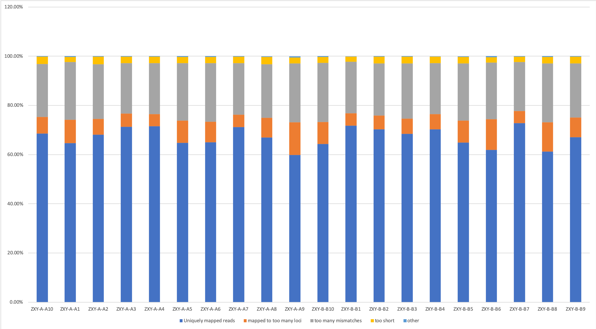

# Xie he results

## rRNA 

* rRNA 含量比较低（约0%），说明去除核糖体序列成功，结果合格。

|          |                     |                     |                     |                     |                     |                     |                     |                     |                     |                     |                     |                     |                     |                     |                     |                     |                     |                     |                     |                     | 
|----------|---------------------|---------------------|---------------------|---------------------|---------------------|---------------------|---------------------|---------------------|---------------------|---------------------|---------------------|---------------------|---------------------|---------------------|---------------------|---------------------|---------------------|---------------------|---------------------|---------------------| 
| Iterm    | ZXY-A-A10           | ZXY-A-A1            | ZXY-A-A2            | ZXY-A-A3            | ZXY-A-A4            | ZXY-A-A5            | ZXY-A-A6            | ZXY-A-A7            | ZXY-A-A8            | ZXY-A-A9            | ZXY-B-B10           | ZXY-B-B1            | ZXY-B-B2            | ZXY-B-B3            | ZXY-B-B4            | ZXY-B-B5            | ZXY-B-B6            | ZXY-B-B7            | ZXY-B-B8            | ZXY-B-B9            | 
| Total    |  21694234           |  21419344           |  23934838           |  18003406           |  23910795           |  27512685           |  17705610           |  17250106           |  21483030           |  20575945           |  22703417           |  17346358           |  11166564           |  17927603           |  18384691           |  20148645           |  17299327           |  18457501           |  22555282           |  22119600           | 
| rRNA     |  46 (0.00%)         |  154 (0.00%)        |  78 (0.00%)         |  32 (0.00%)         |  26 (0.00%)         |  68 (0.00%)         |  57 (0.00%)         |  46 (0.00%)         |  127 (0.00%)        |  698 (0.00%)        |  77 (0.00%)         |  65 (0.00%)         |  30 (0.00%)         |  53 (0.00%)         |  55 (0.00%)         |  71 (0.00%)         |  210 (0.00%)        |  143 (0.00%)        |  291 (0.00%)        |  128 (0.00%)        | 
| non rRNA |  21694188 (100.00%) |  21419190 (100.00%) |  23934760 (100.00%) |  18003374 (100.00%) |  23910769 (100.00%) |  27512617 (100.00%) |  17705553 (100.00%) |  17250060 (100.00%) |  21482903 (100.00%) |  20575247 (100.00%) |  22703340 (100.00%) |  17346293 (100.00%) |  11166534 (100.00%) |  17927550 (100.00%) |  18384636 (100.00%) |  20148574 (100.00%) |  17299117 (100.00%) |  18457358 (100.00%) |  22554991 (100.00%) |  22119472 (100.00%) | 

## mapping

* 各个样品大约有 60% 可以 Uniquely map到基因组中，结果合格。

|                                           |                 |                 |                 |                 |                 |                 |                 |                 |                 |                 |                 |                 |                 |                 |                 |                 |                 |                 |                 |                 | 
|-------------------------------------------|-----------------|-----------------|-----------------|-----------------|-----------------|-----------------|-----------------|-----------------|-----------------|-----------------|-----------------|-----------------|-----------------|-----------------|-----------------|-----------------|-----------------|-----------------|-----------------|-----------------| 
| Iterm                                     | ZXY-A-A10       | ZXY-A-A1        | ZXY-A-A2        | ZXY-A-A3        | ZXY-A-A4        | ZXY-A-A5        | ZXY-A-A6        | ZXY-A-A7        | ZXY-A-A8        | ZXY-A-A9        | ZXY-B-B10       | ZXY-B-B1        | ZXY-B-B2        | ZXY-B-B3        | ZXY-B-B4        | ZXY-B-B5        | ZXY-B-B6        | ZXY-B-B7        | ZXY-B-B8        | ZXY-B-B9        | 
| Started job on                            | Sep 20 11:02:03 | Sep 20 11:55:18 | Sep 20 12:28:18 | Sep 20 13:13:09 | Sep 20 13:53:23 | Sep 20 14:42:18 | Sep 20 15:36:39 | Sep 20 16:18:27 | Sep 20 16:56:21 | Sep 20 17:35:50 | Sep 20 11:11:44 | Sep 20 12:13:58 | Sep 20 12:54:23 | Sep 20 13:22:20 | Sep 20 14:03:26 | Sep 20 14:41:45 | Sep 20 15:22:45 | Sep 20 16:00:03 | Sep 20 16:42:30 | Sep 20 17:25:45 | 
| Started mapping on                        | Sep 20 11:16:30 | Sep 20 11:58:08 | Sep 20 12:31:53 | Sep 20 13:19:51 | Sep 20 14:00:36 | Sep 20 14:50:07 | Sep 20 15:45:33 | Sep 20 16:23:57 | Sep 20 17:01:17 | Sep 20 17:43:23 | Sep 20 11:38:10 | Sep 20 12:27:27 | Sep 20 13:00:23 | Sep 20 13:32:26 | Sep 20 14:12:19 | Sep 20 14:52:10 | Sep 20 15:33:12 | Sep 20 16:08:05 | Sep 20 16:51:59 | Sep 20 17:36:54 | 
| Finished on                               | Sep 20 11:55:13 | Sep 20 12:28:14 | Sep 20 13:13:05 | Sep 20 13:53:20 | Sep 20 14:42:13 | Sep 20 15:36:34 | Sep 20 16:18:24 | Sep 20 16:56:17 | Sep 20 17:35:45 | Sep 20 18:12:20 | Sep 20 12:13:54 | Sep 20 12:54:19 | Sep 20 13:22:15 | Sep 20 14:03:22 | Sep 20 14:41:41 | Sep 20 15:22:41 | Sep 20 15:59:59 | Sep 20 16:42:26 | Sep 20 17:25:41 | Sep 20 18:11:50 | 
| Mapping speed, Million of reads per hour  | 33.62           | 42.70           | 34.86           | 32.26           | 34.47           | 35.54           | 32.34           | 32.01           | 37.40           | 42.64           | 38.12           | 38.74           | 30.64           | 34.77           | 37.56           | 39.61           | 38.75           | 32.24           | 40.16           | 37.99           | 
|                                           |                 |                 |                 |                 |                 |                 |                 |                 |                 |                 |                 |                 |                 |                 |                 |                 |                 |                 |                 |                 | 
| Number of input reads                     | 21694188        | 21419190        | 23934760        | 18003374        | 23910769        | 27512617        | 17705553        | 17250060        | 21482903        | 20575247        | 22703340        | 17346293        | 11166534        | 17927550        | 18384636        | 20148574        | 17299117        | 18457358        | 22554991        | 22119472        | 
| Average input read length                 | 278             | 280             | 278             | 281             | 281             | 280             | 278             | 282             | 279             | 278             | 280             | 282             | 280             | 281             | 282             | 279             | 279             | 282             | 279             | 279             | 
| UNIQUE READS:                             |                 |                 |                 |                 |                 |                 |                 |                 |                 |                 |                 |                 |                 |                 |                 |                 |                 |                 |                 |                 | 
| Uniquely mapped reads number              | 14863934        | 13860070        | 16290470        | 12844959        | 17094270        | 17818900        | 11505269        | 12286930        | 14374294        | 12312495        | 14597937        | 12454774        | 7852230         | 12276274        | 12910944        | 13064465        | 10708396        | 13426503        | 13805668        | 14833742        | 
| Uniquely mapped reads %                   | 68.52%          | 64.71%          | 68.06%          | 71.35%          | 71.49%          | 64.77%          | 64.98%          | 71.23%          | 66.91%          | 59.84%          | 64.30%          | 71.80%          | 70.32%          | 68.48%          | 70.23%          | 64.84%          | 61.90%          | 72.74%          | 61.21%          | 67.06%          | 
| Average mapped length                     | 282.45          | 285.86          | 282.80          | 285.30          | 284.55          | 284.82          | 283.39          | 285.93          | 283.58          | 284.64          | 285.33          | 286.39          | 284.44          | 285.20          | 286.19          | 283.63          | 285.79          | 285.71          | 284.35          | 283.62          | 
| Number of splices: Total                  | 4829770         | 5258063         | 6280188         | 4091626         | 5239928         | 6850103         | 3684527         | 3981945         | 5205165         | 3941745         | 5298200         | 3828906         | 2729758         | 4585011         | 4516935         | 4280630         | 3281049         | 3913094         | 5971119         | 5536249         | 
| Number of splices: Annotated (sjdb)       | 4639004         | 5046446         | 6049205         | 3958159         | 5075628         | 6610700         | 3535150         | 3856856         | 4982348         | 3779864         | 5095439         | 3717227         | 2644445         | 4435962         | 4383961         | 4123422         | 3129091         | 3795669         | 5757613         | 5349040         | 
| Number of splices: GT/AG                  | 4754469         | 5180446         | 6190393         | 4027576         | 5159276         | 6742675         | 3626318         | 3924166         | 5120041         | 3866950         | 5214580         | 3775155         | 2689541         | 4518765         | 4450987         | 4210497         | 3216515         | 3855374         | 5884422         | 5457002         | 
| Number of splices: GC/AG                  | 38002           | 40673           | 47879           | 31725           | 40187           | 53408           | 28999           | 29789           | 41724           | 31912           | 42289           | 29569           | 21897           | 36360           | 35503           | 33739           | 26662           | 31159           | 48498           | 42751           | 
| Number of splices: AT/AC                  | 3505            | 3950            | 4021            | 3351            | 4303            | 5088            | 2555            | 3293            | 4129            | 2960            | 4134            | 3125            | 2148            | 3753            | 3587            | 3200            | 2477            | 3004            | 4986            | 4413            | 
| Number of splices: Non-canonical          | 33794           | 32994           | 37895           | 28974           | 36162           | 48932           | 26655           | 24697           | 39271           | 39923           | 37197           | 21057           | 16172           | 26133           | 26858           | 33194           | 35395           | 23557           | 33213           | 32083           | 
| Mismatch rate per base, %                 | 0.07%           | 0.08%           | 0.08%           | 0.08%           | 0.08%           | 0.08%           | 0.08%           | 0.08%           | 0.08%           | 0.08%           | 0.09%           | 0.09%           | 0.08%           | 0.08%           | 0.08%           | 0.08%           | 0.09%           | 0.08%           | 0.08%           | 0.08%           | 
| Deletion rate per base                    | 0.02%           | 0.01%           | 0.02%           | 0.02%           | 0.02%           | 0.01%           | 0.02%           | 0.01%           | 0.02%           | 0.01%           | 0.01%           | 0.01%           | 0.02%           | 0.02%           | 0.01%           | 0.02%           | 0.01%           | 0.02%           | 0.01%           | 0.01%           | 
| Deletion average length                   | 2.71            | 2.49            | 2.56            | 2.22            | 2.22            | 2.41            | 2.46            | 2.23            | 2.79            | 2.66            | 2.54            | 2.12            | 2.39            | 2.34            | 2.25            | 2.70            | 2.80            | 2.06            | 2.61            | 2.57            | 
| Insertion rate per base                   | 0.01%           | 0.01%           | 0.01%           | 0.02%           | 0.02%           | 0.01%           | 0.01%           | 0.02%           | 0.01%           | 0.01%           | 0.01%           | 0.02%           | 0.02%           | 0.02%           | 0.02%           | 0.01%           | 0.01%           | 0.02%           | 0.01%           | 0.01%           | 
| Insertion average length                  | 1.53            | 1.48            | 1.54            | 1.54            | 1.53            | 1.50            | 1.54            | 1.54            | 1.53            | 1.49            | 1.53            | 1.51            | 1.54            | 1.51            | 1.54            | 1.52            | 1.54            | 1.57            | 1.47            | 1.53            | 
| MULTI-MAPPING READS:                      |                 |                 |                 |                 |                 |                 |                 |                 |                 |                 |                 |                 |                 |                 |                 |                 |                 |                 |                 |                 | 
| Number of reads mapped to multiple loci   | 0               | 0               | 0               | 0               | 0               | 0               | 0               | 0               | 0               | 0               | 0               | 0               | 0               | 0               | 0               | 0               | 0               | 0               | 0               | 0               | 
| % of reads mapped to multiple loci        | 0.00%           | 0.00%           | 0.00%           | 0.00%           | 0.00%           | 0.00%           | 0.00%           | 0.00%           | 0.00%           | 0.00%           | 0.00%           | 0.00%           | 0.00%           | 0.00%           | 0.00%           | 0.00%           | 0.00%           | 0.00%           | 0.00%           | 0.00%           | 
| Number of reads mapped to too many loci   | 1462852         | 2035029         | 1559097         | 956261          | 1185171         | 2484142         | 1480231         | 867456          | 1725461         | 2745085         | 2032603         | 871048          | 627086          | 1110898         | 1140410         | 1808196         | 2154545         | 916410          | 2690578         | 1779077         | 
| % of reads mapped to too many loci        | 6.74%           | 9.50%           | 6.51%           | 5.31%           | 4.96%           | 9.03%           | 8.36%           | 5.03%           | 8.03%           | 13.34%          | 8.95%           | 5.02%           | 5.62%           | 6.20%           | 6.20%           | 8.97%           | 12.45%          | 4.97%           | 11.93%          | 8.04%           | 
| UNMAPPED READS:                           |                 |                 |                 |                 |                 |                 |                 |                 |                 |                 |                 |                 |                 |                 |                 |                 |                 |                 |                 |                 | 
| % of reads unmapped: too many mismatches  | 21.61%          | 23.41%          | 22.13%          | 20.55%          | 20.72%          | 23.44%          | 23.85%          | 20.92%          | 21.76%          | 23.95%          | 24.00%          | 20.99%          | 21.12%          | 22.42%          | 20.73%          | 23.24%          | 23.10%          | 19.91%          | 23.95%          | 21.97%          | 
| % of reads unmapped: too short            | 2.92%           | 2.12%           | 3.12%           | 2.65%           | 2.67%           | 2.52%           | 2.55%           | 2.67%           | 3.04%           | 2.33%           | 2.50%           | 2.03%           | 2.77%           | 2.73%           | 2.66%           | 2.69%           | 2.17%           | 2.24%           | 2.59%           | 2.75%           | 
| % of reads unmapped: other                | 0.21%           | 0.26%           | 0.18%           | 0.14%           | 0.17%           | 0.24%           | 0.26%           | 0.15%           | 0.25%           | 0.53%           | 0.25%           | 0.15%           | 0.18%           | 0.17%           | 0.17%           | 0.25%           | 0.38%           | 0.14%           | 0.32%           | 0.18%           | 
| CHIMERIC READS:                           |                 |                 |                 |                 |                 |                 |                 |                 |                 |                 |                 |                 |                 |                 |                 |                 |                 |                 |                 |                 | 
| Number of chimeric reads                  | 0               | 0               | 0               | 0               | 0               | 0               | 0               | 0               | 0               | 0               | 0               | 0               | 0               | 0               | 0               | 0               | 0               | 0               | 0               | 0               | 
| % of chimeric reads                       | 0.00%           | 0.00%           | 0.00%           | 0.00%           | 0.00%           | 0.00%           | 0.00%           | 0.00%           | 0.00%           | 0.00%           | 0.00%           | 0.00%           | 0.00%           | 0.00%           | 0.00%           | 0.00%           | 0.00%           | 0.00%           | 0.00%           | 0.00%           | 

## Duplication

* 数据有不同程度的 Duplication 的现象。这个是由于建库中 PCR 结果产生，结果在可以接受的区间中。去除后进行后续的统计。

|                         |                         |                         |                         |                         |                         |                         |                         |                         |                         |                         |                         |                        |                         |                         |                         |                         |                         |                         |                         | 
|-------------------------|-------------------------|-------------------------|-------------------------|-------------------------|-------------------------|-------------------------|-------------------------|-------------------------|-------------------------|-------------------------|-------------------------|------------------------|-------------------------|-------------------------|-------------------------|-------------------------|-------------------------|-------------------------|-------------------------| 
| ZXY-A-A10               | ZXY-A-A1                | ZXY-A-A2                | ZXY-A-A3                | ZXY-A-A4                | ZXY-A-A5                | ZXY-A-A6                | ZXY-A-A7                | ZXY-A-A8                | ZXY-A-A9                | ZXY-B-B10               | ZXY-B-B1                | ZXY-B-B2               | ZXY-B-B3                | ZXY-B-B4                | ZXY-B-B5                | ZXY-B-B6                | ZXY-B-B7                | ZXY-B-B8                | ZXY-B-B9                | 
| 4104347/14742832=0.2784 | 7066720/13770159=0.5132 | 5707453/16183906=0.3527 | 2271864/12706384=0.1788 | 3525953/16921122=0.2084 | 7892879/17710717=0.4457 | 5449086/11427202=0.4769 | 2551803/12151189=0.2100 | 4426893/14246307=0.3107 | 8211603/12245619=0.6706 | 5579853/14499931=0.3848 | 2369836/12297761=0.1927 | 1565040/7767874=0.2015 | 2842459/12142706=0.2341 | 2750271/12779910=0.2152 | 5359846/12989743=0.4126 | 7012006/10647108=0.6586 | 2360529/13282768=0.1777 | 5933631/13718676=0.4325 | 4341527/14699295=0.2954 | 

## After remove duplicaton: DNA Intron and RNA

* read 大约有50%比对到 RNA 和 intron区。结果合格。

|                                      |           |          |           |           |           |          |          |          |          |          |           |          |          |          |          |          |          |           |          |          | 
|--------------------------------------|-----------|----------|-----------|-----------|-----------|----------|----------|----------|----------|----------|-----------|----------|----------|----------|----------|----------|----------|-----------|----------|----------| 
| iterm                                | ZXY-A-A10 | ZXY-A-A1 | ZXY-A-A2  | ZXY-A-A3  | ZXY-A-A4  | ZXY-A-A5 | ZXY-A-A6 | ZXY-A-A7 | ZXY-A-A8 | ZXY-A-A9 | ZXY-B-B10 | ZXY-B-B1 | ZXY-B-B2 | ZXY-B-B3 | ZXY-B-B4 | ZXY-B-B5 | ZXY-B-B6 | ZXY-B-B7  | ZXY-B-B8 | ZXY-B-B9 | 
| unique mapped reads of RNA           |  5212551  |  3739952 |  5563304  |  4419677  |  5646374  |  5391987 |  3022255 |  4311596 |  5234890 |  2530451 |  4889211  |  4077988 |  2905535 |  4512860 |  4674454 |  4023451 |  2394890 |  4278533  |  4926496 |  5507002 | 
| unique mapped reads of DNA           |  10260970 |  6484297 |  10039727 |  10038495 |  12881093 |  9478154 |  5843900 |  9195892 |  9488109 |  3994646 |  8576771  |  9560833 |  5941288 |  8921709 |  9602503 |  7326748 |  3535233 |  10525438 |  7457925 |  9879393 | 
| unique mapped reads of Intron        |  5920479  |  3288269 |  5495557  |  6449224  |  8384662  |  4957171 |  3257293 |  5724921 |  4973920 |  1715392 |  4409273  |  6251319 |  3578305 |  5195497 |  5782776 |  4049652 |  1416505 |  7088538  |  3227533 |  5391465 | 
| unique mapped ambiguous reads of RNA |  214405   |  181131  |  230762   |  188910   |  228414   |  245617  |  141981  |  177533  |  230701  |  133559  |  225230   |  179574  |  127925  |  199732  |  207265  |  175193  |  125837  |  182193   |  243468  |  240587  | 

## Gene counts
[merge count.txt](result_191008_xiehe/merge.counter)

## Differential expression gene

### Multidimensional scaling plot of distances between gene expression profiles

* Description

Plot samples on a two-dimensional scatterplot so that distances on the plot approximate the typical log2 fold changes between the samples.

* Details

This function is a variation on the usual multdimensional scaling (or principle coordinate) plot, in that a distance measure particularly appropriate for the microarray context is used. The distance between each pair of samples (columns) is the root-mean-square deviation (Euclidean distance) for the top top genes. Distances on the plot can be interpreted as leading log2-fold-change, meaning the typical (root-mean-square) log2-fold-change between the samples for the genes that distinguish those samples.

[mds.pdf](result_191008_xiehe/mds.pdf)

## Bacth effect

| Num |                         | 旧编号  | 日期         | tube | 新编号   | 浓度     |
|-----|-------------------------|------|------------|------|-------|--------| 
| 1   | 治疗前                     | A-46 | 2018.04.02 | 2    | A-A1  | 679    | 
| 2   | 治疗前                     | A-47 | 2018.04.02 | 2    | A-A2  | 368    | 
| 3   |                     治疗前 | A-48 | 2018.04.04 | 2    | A-A3  | 1022.1 | 
| 4   |                     治疗前 | A-49 | 2018.04.04 | 2    | A-A4  | 1555.1 | 
| 5   |                     治疗前 | A-50 | 2018.04.04 | 2    | A-A5  | 2291.8 | 
| 6   |                     治疗前 | A-51 | 2018.04.04 | 2    | A-A6  | 971.5  | 
| 7   |                     治疗前 | A-52 | 2018.04.23 | 2    | A-A7  | 1008.4 | 
| 8   |                     治疗前 | A-53 | 2018.04.27 | 2    | A-A8  | 607    | 
| 9   |                     治疗前 | A-54 | 2018.04.27 | 2    | A-A9  | 1585.4 | 
| 10  |                     治疗前 | A-55 | 2018.05.09 | 2    | A-A10 | 3243   | 
| 11  | 治疗后                     | B-24 | 2018.04.19 | 2    | B-B1  | 1345.2 | 
| 12  |                    治疗后  | B-25 | 2018.04.23 | 2    | B-B2  | 514.9  | 
| 13  |                    治疗后  | B-26 | 2018.04.23 | 2    | B-B3  | 785.8  | 
| 14  |                    治疗后  | B-27 | 2018.04.23 | 2    | B-B4  | 490.1  | 
| 15  |                    治疗后  | B-28 | 2018.04.23 | 2    | B-B5  | 1054.1 | 
| 16  |                    治疗后  | B-34 | 2018.05.07 | 2    | B-B6  | 977.1  | 
| 17  |                    治疗后  | B-40 | 2018.04.27 | 2    | B-B7  | 633.5  | 
| 18  |                    治疗后  | B-43 | 2018.05.07 | 2    | B-B8  | 580.8  | 
| 19  |                     治疗后 | B-47 | 2018.05.07 | 2    | B-B9  | 395    | 
| 20  |                     治疗后 | B-51 | 2018.05.09 | 2    | B-B10 | 695    | 

* Remove batch effect.

**mean-variance**

* Gene expression after normalization: [normal_gene_expression.csv](result_191008_xiehe/normal_gene_expression.csv).

### DE results
 

### Remove RNA concentration batch effect. [DE.remove_concen.csv](result_191008_xiehe/remove_concen.csv)
* Cutoff: P value <0.01  (352 gene.)

| logFC           | AveExpr      | t            | P.Value      | adj.P.Val   | B           |              | 
|-----------------|--------------|--------------|--------------|-------------|-------------|--------------| 
| ENSG00000215022 | 1.750547364  | 3.786295546  | 5.850940315  | 5.81E-06    | 0.139657962 | 3.69343999   | 
| ENSG00000183625 | 1.541298273  | 3.650082293  | 5.354657122  | 1.95E-05    | 0.159083489 | 2.677078658  | 
| ENSG00000262074 | 2.577004326  | 2.22851116   | 5.245612013  | 2.54E-05    | 0.159083489 | 2.210152716  | 
| ENSG00000222675 | 2.271230155  | -1.721682461 | 5.229309527  | 2.65E-05    | 0.159083489 | 0.494022762  | 
| ENSG00000107593 | 2.140646157  | -1.215973654 | 4.966211015  | 5.08E-05    | 0.243931034 | 0.362368835  | 
| ENSG00000169429 | 1.76564254   | 9.259948174  | 4.886900111  | 6.18E-05    | 0.247502938 | 1.809821607  | 
| ENSG00000212195 | 2.650983729  | 1.439197478  | 4.767119001  | 8.33E-05    | 0.285740315 | 1.045143709  | 
| ENSG00000229436 | -2.040532208 | 1.364829905  | -4.625295052 | 0.000118529 | 0.333461188 | 0.336269222  | 
| ENSG00000231890 | 1.583336541  | 2.956686637  | 4.604213967  | 0.000124923 | 0.333461188 | 1.03949527   | 

* logFC: log2 fold change of no drug/ treatment.   
* AveExpr: Average expression across all samples, in log2 CPM  
* t: logFC divided by its standard error  
* P.Value: Raw p-value (based on t) from test that logFC differs from 0  
* adj.P.Val: Benjamini-Hochberg false discovery rate adjusted p-value  
* B: log-odds that gene is DE (arguably less useful than the other columns)  

### Remove library time batch effect. [DE.remove_library.csv](result_191008_xiehe/remove_library_time.csv)
* Cutoff: P value <0.01  (660 gene.)

|      Gene       | logFC        | AveExpr      | t            | P.Value     | adj.P.Val   | B            |
|-----------------|--------------|--------------|--------------|-------------|-------------|--------------| 
| ENSG00000268658 | 3.264795882  | 3.203486521  | 6.625781916  | 2.40E-06    | 0.057689105 | 4.605847104  | 
| ENSG00000183625 | 1.882921794  | 3.650082293  | 5.543445395  | 2.37E-05    | 0.222008152 | 2.695294842  | 
| ENSG00000234832 | 2.316597584  | 1.222863803  | 5.471809681  | 2.77E-05    | 0.222008152 | 2.080780157  | 
| ENSG00000211667 | 3.897694521  | -1.481160419 | 5.241904698  | 4.60E-05    | 0.227957697 | 1.072682667  | 
| ENSG00000262074 | 3.330954371  | 2.22851116   | 5.197145147  | 5.08E-05    | 0.227957697 | 1.864904987  | 
| ENSG00000188266 | -2.610963195 | -0.383434906 | -5.024243058 | 7.46E-05    | 0.227957697 | 0.546088764  | 
| ENSG00000260078 | 1.785808498  | 3.951582035  | 5.020922045  | 7.52E-05    | 0.227957697 | 1.691549393  | 
| ENSG00000268240 | 3.001084065  | 4.46997216   | 4.970936565  | 8.41E-05    | 0.227957697 | 1.606186986  | 
| ENSG00000272831 | 2.988308612  | -1.296363176 | 4.948799689  | 8.84E-05    | 0.227957697 | 0.446656939  | 

* logFC: log2 fold change of no drug/ treatment.   
* AveExpr: Average expression across all samples, in log2 CPM  
* t: logFC divided by its standard error  
* P.Value: Raw p-value (based on t) from test that logFC differs from 0  
* adj.P.Val: Benjamini-Hochberg false discovery rate adjusted p-value  
* B: log-odds that gene is DE (arguably less useful than the other columns) 

### For example: (using cpm)

## KEGG

### Using remove RNA concentration batch effect.
* Cutoff: P value <0.05  
* |log2(Fold change)| > 1 
* DAVID 

**Up regulated genes.**

| Category     | Term                                                                | Count | %           | PValue      | Genes                                                                                                                 | List Total | Pop Hits | Pop Total | Fold Enrichment | Bonferroni  | Benjamini   | FDR         | 
|--------------|---------------------------------------------------------------------|-------|-------------|-------------|-----------------------------------------------------------------------------------------------------------------------|------------|----------|-----------|-----------------|-------------|-------------|-------------|
| KEGG_PATHWAY | hsa05143:African trypanosomiasis                                    | 5     | 2.183406114 | 1.17E-04    | ENSG00000164251, ENSG00000244734, ENSG00000188536, ENSG00000206172, ENSG00000131203                                   | 55         | 33       | 6879      | 18.95041322     | 0.016973136 | 0.016973136 | 0.139266677 | 
| KEGG_PATHWAY | hsa04062:Chemokine signaling pathway                                | 7     | 3.056768559 | 0.003167114 | ENSG00000183625, ENSG00000163735, ENSG00000276070, ENSG00000081041, ENSG00000163739, ENSG00000268173, ENSG00000169429 | 55         | 186      | 6879      | 4.707038123     | 0.370690722 | 0.20670984  | 3.700150841 | 
| KEGG_PATHWAY | hsa05132:Salmonella infection                                       | 5     | 2.183406114 | 0.003941176 | ENSG00000177606, ENSG00000276070, ENSG00000081041, ENSG00000163739, ENSG00000169429                                   | 55         | 83       | 6879      | 7.534501643     | 0.438165859 | 0.174844038 | 4.585211    | 
| KEGG_PATHWAY | hsa05144:Malaria                                                    | 4     | 1.746724891 | 0.006529778 | ENSG00000244734, ENSG00000188536, ENSG00000206172, ENSG00000169429                                                    | 55         | 49       | 6879      | 10.21001855     | 0.61575456  | 0.212678374 | 7.49117678  | 
| KEGG_PATHWAY | hsa04668:TNF signaling pathway                                      | 5     | 2.183406114 | 0.009639167 | ENSG00000177606, ENSG00000081041, ENSG00000163739, ENSG00000268173, ENSG00000078401                                   | 55         | 107      | 6879      | 5.844519966     | 0.756866593 | 0.246351347 | 10.87452676 | 
| KEGG_PATHWAY | hsa04060:Cytokine-cytokine receptor interaction                     | 7     | 3.056768559 | 0.011418496 | ENSG00000183625, ENSG00000182393, ENSG00000163735, ENSG00000276070, ENSG00000081041, ENSG00000163739, ENSG00000169429 | 55         | 243      | 6879      | 3.60291807      | 0.81300836  | 0.243799375 | 12.75926302 | 
| KEGG_PATHWAY | hsa05323:Rheumatoid arthritis                                       | 4     | 1.746724891 | 0.031412058 | ENSG00000177606, ENSG00000163735, ENSG00000169429, ENSG00000185883                                                    | 55         | 88       | 6879      | 5.685123967     | 0.990531036 | 0.486074279 | 31.56920808 | 
| KEGG_PATHWAY | hsa04620:Toll-like receptor signaling pathway                       | 4     | 1.746724891 | 0.050083345 | ENSG00000177606, ENSG00000276070, ENSG00000268173, ENSG00000169429                                                    | 55         | 106      | 6879      | 4.719725557     | 0.999447817 | 0.608474169 | 45.70319633 | 
| KEGG_PATHWAY | hsa05134:Legionellosis                                              | 3     | 1.310043668 | 0.066798716 | ENSG00000081041, ENSG00000163739, ENSG00000169429                                                                     | 55         | 54       | 6879      | 6.948484848     | 0.999958657 | 0.674213494 | 56.03241218 | 
| KEGG_PATHWAY | hsa04621:NOD-like receptor signaling pathway                        | 3     | 1.310043668 | 0.071184645 | ENSG00000081041, ENSG00000163739, ENSG00000169429                                                                     | 55         | 56       | 6879      | 6.700324675     | 0.999979218 | 0.659772791 | 58.42665344 | 
| KEGG_PATHWAY | hsa04380:Osteoclast differentiation                                 | 4     | 1.746724891 | 0.083073864 | ENSG00000177606, ENSG00000162747, ENSG00000175592, ENSG00000268173                                                    | 55         | 131      | 6879      | 3.819014573     | 0.999996832 | 0.683718253 | 64.329146   | 
| KEGG_PATHWAY | hsa05120:Epithelial cell signaling in Helicobacter pylori infection | 3     | 1.310043668 | 0.096849888 | ENSG00000177606, ENSG00000169429, ENSG00000185883                                                                     | 55         | 67       | 6879      | 5.60027137      | 0.999999653 | 0.710435088 | 70.20308286 | 

**Down regulated genes.**

| Category     | Term                   | Count | %           | PValue      | Genes                                                              | List Total | Pop Hits | Pop Total | Fold Enrichment | Bonferroni | Benjamini  | FDR         | 
|--------------|------------------------|-------|-------------|-------------|--------------------------------------------------------------------|------------|----------|-----------|-----------------|------------|------------|-------------|
| KEGG_PATHWAY | hsa04360:Axon guidance | 4     | 5.797101449 | 0.006409728 | ENSG00000074527, ENSG00000099250, ENSG00000142627, ENSG00000133216 | 22         | 127      | 6879      | 9.848246242     | 0.25606119 | 0.25606119 | 5.896836231 | 

### Using remove library batch effect.
* Cutoff: P value <0.05  
* |log2(Fold change)| > 1 
* DAVID 

**Up regulated genes.**

| Category     | Term                                                                | Count | %           | PValue      | Genes                                                                                                                                                                                                                                                                                                                                                                                                                                   | List Total | Pop Hits | Pop Total | Fold Enrichment | Bonferroni  | Benjamini   | FDR         | 
|--------------|---------------------------------------------------------------------|-------|-------------|-------------|-----------------------------------------------------------------------------------------------------------------------------------------------------------------------------------------------------------------------------------------------------------------------------------------------------------------------------------------------------------------------------------------------------------------------------------------|------------|----------|-----------|-----------------|-------------|-------------|-------------| 
| KEGG_PATHWAY | hsa04380:Osteoclast differentiation                                 | 24    | 3.129074316 | 2.85E-09    | ENSG00000100906, ENSG00000101307, ENSG00000115008, ENSG00000239961, ENSG00000239998, ENSG00000158517, ENSG00000011600, ENSG00000175592, ENSG00000066336, ENSG00000171223, ENSG00000268173, ENSG00000187116, ENSG00000143226, ENSG00000177606, ENSG00000116701, ENSG00000115594, ENSG00000131042, ENSG00000184371, ENSG00000100365, ENSG00000198053, ENSG00000162747, ENSG00000077150, ENSG00000067182, ENSG00000125538                  | 286        | 131      | 6879      | 4.406555277     | 6.91E-07    | 6.91E-07    | 3.69E-06    | 
| KEGG_PATHWAY | hsa04060:Cytokine-cytokine receptor interaction                     | 25    | 3.259452412 | 6.12E-05    | ENSG00000275302, ENSG00000115008, ENSG00000180871, ENSG00000183625, ENSG00000049249, ENSG00000198223, ENSG00000099985, ENSG00000125735, ENSG00000054967, ENSG00000125657, ENSG00000163464, ENSG00000161955, ENSG00000163739, ENSG00000187266, ENSG00000119535, ENSG00000115590, ENSG00000124875, ENSG00000115594, ENSG00000184371, ENSG00000100368, ENSG00000067182, ENSG00000125538, ENSG00000081041, ENSG00000169429, ENSG00000091181 | 286        | 243      | 6879      | 2.474531641     | 0.014706832 | 0.007380653 | 0.079096624 | 
| KEGG_PATHWAY | hsa04640:Hematopoietic cell lineage                                 | 13    | 1.694915254 | 2.22E-04    | ENSG00000196549, ENSG00000187266, ENSG00000119535, ENSG00000115008, ENSG00000115590, ENSG00000198223, ENSG00000115594, ENSG00000184371, ENSG00000125538, ENSG00000170458, ENSG00000166825, ENSG00000091181, ENSG00000213949                                                                                                                                                                                                             | 286        | 87       | 6879      | 3.594043887     | 0.052370853 | 0.017770884 | 0.286874352 | 
| KEGG_PATHWAY | hsa04064:NF-kappa B signaling pathway                               | 13    | 1.694915254 | 2.22E-04    | ENSG00000100906, ENSG00000275302, ENSG00000090339, ENSG00000125735, ENSG00000115594, ENSG00000122861, ENSG00000073756, ENSG00000140379, ENSG00000077150, ENSG00000067182, ENSG00000125538, ENSG00000170458, ENSG00000169429                                                                                                                                                                                                             | 286        | 87       | 6879      | 3.594043887     | 0.052370853 | 0.017770884 | 0.286874352 | 
| KEGG_PATHWAY | hsa04668:TNF signaling pathway                                      | 14    | 1.825293351 | 4.41E-04    | ENSG00000100906, ENSG00000073756, ENSG00000172216, ENSG00000171223, ENSG00000163739, ENSG00000268173, ENSG00000177606, ENSG00000090339, ENSG00000107175, ENSG00000184371, ENSG00000125538, ENSG00000081041, ENSG00000067182, ENSG00000078401                                                                                                                                                                                            | 286        | 107      | 6879      | 3.147049212     | 0.101216659 | 0.026325596 | 0.568301483 | 
| KEGG_PATHWAY | hsa05140:Leishmaniasis                                              | 11    | 1.434159061 | 6.25E-04    | ENSG00000100906, ENSG00000115008, ENSG00000175130, ENSG00000143226, ENSG00000177606, ENSG00000116701, ENSG00000073756, ENSG00000158517, ENSG00000100365, ENSG00000162747, ENSG00000125538                                                                                                                                                                                                                                               | 286        | 71       | 6879      | 3.726435536     | 0.14031682  | 0.029785668 | 0.804214821 | 
| KEGG_PATHWAY | hsa00590:Arachidonic acid metabolism                                | 10    | 1.303780965 | 8.25E-04    | ENSG00000108839, ENSG00000186529, ENSG00000211445, ENSG00000161905, ENSG00000073756, ENSG00000163803, ENSG00000100031, ENSG00000099998, ENSG00000213316, ENSG00000059377                                                                                                                                                                                                                                                                | 286        | 61       | 6879      | 3.943024189     | 0.18103427  | 0.03273764  | 1.060937265 | 
| KEGG_PATHWAY | hsa05150:Staphylococcus aureus infection                            | 9     | 1.173402868 | 0.001555443 | ENSG00000143226, ENSG00000090339, ENSG00000197405, ENSG00000186431, ENSG00000171049, ENSG00000159403, ENSG00000162747, ENSG00000171860, ENSG00000171051                                                                                                                                                                                                                                                                                 | 286        | 54       | 6879      | 4.008741259     | 0.313885216 | 0.052393326 | 1.991789444 | 
| KEGG_PATHWAY | hsa05134:Legionellosis                                              | 9     | 1.173402868 | 0.001555443 | ENSG00000100906, ENSG00000173110, ENSG00000126803, ENSG00000077150, ENSG00000081041, ENSG00000125538, ENSG00000170458, ENSG00000163739, ENSG00000169429                                                                                                                                                                                                                                                                                 | 286        | 54       | 6879      | 4.008741259     | 0.313885216 | 0.052393326 | 1.991789444 | 
| KEGG_PATHWAY | hsa05323:Rheumatoid arthritis                                       | 11    | 1.434159061 | 0.003287809 | ENSG00000115008, ENSG00000124875, ENSG00000177606, ENSG00000090339, ENSG00000184371, ENSG00000125538, ENSG00000102755, ENSG00000161955, ENSG00000117410, ENSG00000169429, ENSG00000185883                                                                                                                                                                                                                                               | 286        | 88       | 6879      | 3.006555944     | 0.549303312 | 0.094818757 | 4.167009916 | 
| KEGG_PATHWAY | hsa05132:Salmonella infection                                       | 10    | 1.303780965 | 0.007074067 | ENSG00000115008, ENSG00000275302, ENSG00000177606, ENSG00000177105, ENSG00000128591, ENSG00000081041, ENSG00000125538, ENSG00000170458, ENSG00000163739, ENSG00000169429                                                                                                                                                                                                                                                                | 286        | 83       | 6879      | 2.897885247     | 0.820576817 | 0.173776359 | 8.766996938 | 
| KEGG_PATHWAY | hsa04610:Complement and coagulation cascades                        | 9     | 1.173402868 | 0.007321824 | ENSG00000110799, ENSG00000197405, ENSG00000011422, ENSG00000122861, ENSG00000167711, ENSG00000159403, ENSG00000171860, ENSG00000197249, ENSG00000178726                                                                                                                                                                                                                                                                                 | 286        | 69       | 6879      | 3.137275768     | 0.831091814 | 0.162923654 | 9.060780584 | 
| KEGG_PATHWAY | hsa05202:Transcriptional misregulation in cancer                    | 15    | 1.955671447 | 0.009204166 | ENSG00000122861, ENSG00000140379, ENSG00000113916, ENSG00000172216, ENSG00000066336, ENSG00000170458, ENSG00000119508, ENSG00000115590, ENSG00000144802, ENSG00000175197, ENSG00000102755, ENSG00000186350, ENSG00000169429, ENSG00000275714, ENSG00000245848                                                                                                                                                                           | 286        | 167      | 6879      | 2.160399481     | 0.893298741 | 0.184072113 | 11.26446889 | 
| KEGG_PATHWAY | hsa04620:Toll-like receptor signaling pathway                       | 11    | 1.434159061 | 0.012101001 | ENSG00000100906, ENSG00000275302, ENSG00000239732, ENSG00000177606, ENSG00000174130, ENSG00000101916, ENSG00000125538, ENSG00000170458, ENSG00000174125, ENSG00000268173, ENSG00000169429                                                                                                                                                                                                                                               | 286        | 106      | 6879      | 2.496008708     | 0.947466545 | 0.217706605 | 14.55976032 | 
| KEGG_PATHWAY | hsa05152:Tuberculosis                                               | 15    | 1.955671447 | 0.014856188 | ENSG00000115008, ENSG00000164047, ENSG00000174130, ENSG00000140678, ENSG00000172216, ENSG00000170458, ENSG00000239732, ENSG00000143226, ENSG00000162747, ENSG00000125538, ENSG00000117410, ENSG00000067182, ENSG00000174125, ENSG00000015475, ENSG00000185883                                                                                                                                                                           | 286        | 177      | 6879      | 2.038343013     | 0.973275391 | 0.243178988 | 17.58880339 | 
| KEGG_PATHWAY | hsa04010:MAPK signaling pathway                                     | 18    | 2.346805737 | 0.033046521 | ENSG00000171777, ENSG00000115008, ENSG00000173327, ENSG00000129682, ENSG00000170458, ENSG00000070388, ENSG00000099860, ENSG00000177606, ENSG00000173110, ENSG00000130222, ENSG00000115594, ENSG00000128591, ENSG00000175197, ENSG00000126803, ENSG00000077150, ENSG00000125538, ENSG00000067182, ENSG00000120129                                                                                                                        | 286        | 253      | 6879      | 1.711241328     | 0.999706133 | 0.440596694 | 35.22985343 | 
| KEGG_PATHWAY | hsa00770:Pantothenate and CoA biosynthesis                          | 4     | 0.521512386 | 0.036201175 | ENSG00000112303, ENSG00000112299, ENSG00000138621, ENSG00000100024                                                                                                                                                                                                                                                                                                                                                                      | 286        | 18       | 6879      | 5.344988345     | 0.999866738 | 0.448370948 | 37.90843134 | 
| KEGG_PATHWAY | hsa05143:African trypanosomiasis                                    | 5     | 0.651890482 | 0.045918563 | ENSG00000239732, ENSG00000164251, ENSG00000090339, ENSG00000125538, ENSG00000131203                                                                                                                                                                                                                                                                                                                                                     | 286        | 33       | 6879      | 3.644310235     | 0.999988527 | 0.508832217 | 45.53058136 | 
| KEGG_PATHWAY | hsa04145:Phagosome                                                  | 12    | 1.564537158 | 0.046465683 | ENSG00000143226, ENSG00000116701, ENSG00000186431, ENSG00000158517, ENSG00000174130, ENSG00000188229, ENSG00000159403, ENSG00000100365, ENSG00000162747, ENSG00000117410, ENSG00000170458, ENSG00000185883                                                                                                                                                                                                                              | 286        | 150      | 6879      | 1.924195804     | 0.999990014 | 0.49202008  | 45.93290753 | 
| KEGG_PATHWAY | hsa04670:Leukocyte transendothelial migration                       | 10    | 1.303780965 | 0.048499492 | ENSG00000197822, ENSG00000090339, ENSG00000125753, ENSG00000116701, ENSG00000158517, ENSG00000079337, ENSG00000100365, ENSG00000213937, ENSG00000180209, ENSG00000268173                                                                                                                                                                                                                                                                | 286        | 115      | 6879      | 2.091517178     | 0.999994044 | 0.487467591 | 47.40455687 | 
| KEGG_PATHWAY | hsa05020:Prion diseases                                             | 5     | 0.651890482 | 0.050410809 | ENSG00000115008, ENSG00000044574, ENSG00000125538, ENSG00000148400, ENSG00000120738                                                                                                                                                                                                                                                                                                                                                     | 286        | 34       | 6879      | 3.53712464      | 0.999996339 | 0.482540273 | 48.75379969 | 
| KEGG_PATHWAY | hsa04115:p53 signaling pathway                                      | 7     | 0.912646675 | 0.058082734 | ENSG00000099860, ENSG00000130222, ENSG00000175793, ENSG00000141682, ENSG00000085117, ENSG00000015475, ENSG00000157456                                                                                                                                                                                                                                                                                                                   | 286        | 67       | 6879      | 2.512942282     | 0.999999486 | 0.515209202 | 53.85456931 | 
| KEGG_PATHWAY | hsa05120:Epithelial cell signaling in Helicobacter pylori infection | 7     | 0.912646675 | 0.058082734 | ENSG00000100906, ENSG00000180871, ENSG00000177606, ENSG00000163464, ENSG00000117410, ENSG00000169429, ENSG00000185883                                                                                                                                                                                                                                                                                                                   | 286        | 67       | 6879      | 2.512942282     | 0.999999486 | 0.515209202 | 53.85456931 | 
| KEGG_PATHWAY | hsa00480:Glutathione metabolism                                     | 6     | 0.782268579 | 0.05870525  | ENSG00000065621, ENSG00000211445, ENSG00000100031, ENSG00000099998, ENSG00000166825, ENSG00000134184                                                                                                                                                                                                                                                                                                                                    | 286        | 51       | 6879      | 2.829699712     | 0.999999562 | 0.502011585 | 54.24718551 | 
| KEGG_PATHWAY | hsa04621:NOD-like receptor signaling pathway                        | 6     | 0.782268579 | 0.081053734 | ENSG00000100906, ENSG00000103313, ENSG00000081041, ENSG00000125538, ENSG00000163739, ENSG00000169429                                                                                                                                                                                                                                                                                                                                    | 286        | 56       | 6879      | 2.577047952     | 0.999999999 | 0.605368917 | 66.46145064 | 
| KEGG_PATHWAY | hsa04140:Regulation of autophagy                                    | 4     | 0.521512386 | 0.082697373 | ENSG00000168010, ENSG00000170296, ENSG00000139112, ENSG00000177169                                                                                                                                                                                                                                                                                                                                                                      | 286        | 25       | 6879      | 3.848391608     | 0.999999999 | 0.596756155 | 67.22854246 | 
| KEGG_PATHWAY | hsa04062:Chemokine signaling pathway                                | 13    | 1.694915254 | 0.084533988 | ENSG00000100906, ENSG00000275302, ENSG00000180871, ENSG00000183625, ENSG00000124875, ENSG00000158517, ENSG00000118689, ENSG00000101336, ENSG00000163464, ENSG00000081041, ENSG00000163739, ENSG00000268173, ENSG00000169429                                                                                                                                                                                                             | 286        | 186      | 6879      | 1.681085044     | 0.999999999 | 0.589582595 | 68.0665277  | 
| KEGG_PATHWAY | hsa05133:Pertussis                                                  | 7     | 0.912646675 | 0.089642115 | ENSG00000115008, ENSG00000124875, ENSG00000177606, ENSG00000159403, ENSG00000125538, ENSG00000170458, ENSG00000169429                                                                                                                                                                                                                                                                                                                   | 286        | 75       | 6879      | 2.244895105     | 1           | 0.597121871 | 70.29436632 | 
| KEGG_PATHWAY | hsa04932:Non-alcoholic fatty liver disease (NAFLD)                  | 11    | 1.434159061 | 0.095787034 | ENSG00000115008, ENSG00000177606, ENSG00000175197, ENSG00000173327, ENSG00000067182, ENSG00000125538, ENSG00000186350, ENSG00000268173, ENSG00000169429, ENSG00000015475, ENSG00000245848                                                                                                                                                                                                                                               | 286        | 151      | 6879      | 1.752165053     | 1           | 0.608274889 | 72.78411711 | 

**Down regulated genes.**

| Category     | Term                                                  | Count | %   | PValue      | Genes                                                                               | List Total | Pop Hits | Pop Total | Fold Enrichment | Bonferroni  | Benjamini   | FDR         | 
|--------------|-------------------------------------------------------|-------|-----|-------------|-------------------------------------------------------------------------------------|------------|----------|-----------|-----------------|-------------|-------------|-------------|
| KEGG_PATHWAY | hsa05150:Staphylococcus aureus infection              | 4     | 1.6 | 0.009453146 | ENSG00000196126, ENSG00000187474, ENSG00000198502, ENSG00000196735                  | 57         | 54       | 6879      | 8.93957115      | 0.727806245 | 0.727806245 | 10.56359373 | 
| KEGG_PATHWAY | hsa04612:Antigen processing and presentation          | 4     | 1.6 | 0.023638349 | ENSG00000196126, ENSG00000172116, ENSG00000198502, ENSG00000196735                  | 57         | 76       | 6879      | 6.351800554     | 0.96227166  | 0.805762157 | 24.51118513 | 
| KEGG_PATHWAY | hsa05310:Asthma                                       | 3     | 1.2 | 0.024474291 | ENSG00000196126, ENSG00000198502, ENSG00000196735                                   | 57         | 30       | 6879      | 12.06842105     | 0.966449072 | 0.677471439 | 25.26739342 | 
| KEGG_PATHWAY | hsa04514:Cell adhesion molecules (CAMs)               | 5     | 2   | 0.02792856  | ENSG00000196126, ENSG00000091129, ENSG00000172116, ENSG00000198502, ENSG00000196735 | 57         | 142      | 6879      | 4.249444033     | 0.979362782 | 0.620979423 | 28.31926991 | 
| KEGG_PATHWAY | hsa05332:Graft-versus-host disease                    | 3     | 1.2 | 0.029250172 | ENSG00000196126, ENSG00000198502, ENSG00000196735                                   | 57         | 33       | 6879      | 10.97129187     | 0.982872139 | 0.556656211 | 29.45644571 | 
| KEGG_PATHWAY | hsa04145:Phagosome                                    | 5     | 2   | 0.03324053  | ENSG00000196126, ENSG00000198502, ENSG00000196735, ENSG00000132432, ENSG00000183785 | 57         | 150      | 6879      | 4.022807018     | 0.990258505 | 0.537862794 | 32.7905312  | 
| KEGG_PATHWAY | hsa05330:Allograft rejection                          | 3     | 1.2 | 0.036142549 | ENSG00000196126, ENSG00000198502, ENSG00000196735                                   | 57         | 37       | 6879      | 9.785206259     | 0.993547102 | 0.513472011 | 35.12402221 | 
| KEGG_PATHWAY | hsa04940:Type I diabetes mellitus                     | 3     | 1.2 | 0.045539709 | ENSG00000196126, ENSG00000198502, ENSG00000196735                                   | 57         | 42       | 6879      | 8.620300752     | 0.998314117 | 0.549853955 | 42.18099616 | 
| KEGG_PATHWAY | hsa04672:Intestinal immune network for IgA production | 3     | 1.2 | 0.055729982 | ENSG00000196126, ENSG00000198502, ENSG00000196735                                   | 57         | 47       | 6879      | 7.70324748      | 0.999612582 | 0.58225734  | 49.03446012 | 
| KEGG_PATHWAY | hsa05320:Autoimmune thyroid disease                   | 3     | 1.2 | 0.066637193 | ENSG00000196126, ENSG00000198502, ENSG00000196735                                   | 57         | 52       | 6879      | 6.962550607     | 0.999921129 | 0.611230909 | 55.54009499 | 
| KEGG_PATHWAY | hsa05416:Viral myocarditis                            | 3     | 1.2 | 0.078189805 | ENSG00000196126, ENSG00000198502, ENSG00000196735                                   | 57         | 57       | 6879      | 6.351800554     | 0.999985682 | 0.637234448 | 61.59476416 | 
| KEGG_PATHWAY | hsa05321:Inflammatory bowel disease (IBD)             | 3     | 1.2 | 0.09532072  | ENSG00000196126, ENSG00000198502, ENSG00000196735                                   | 57         | 64       | 6879      | 5.657072368     | 0.999998904 | 0.681350055 | 69.19431565 | 

## GO

### Using remove RNA concentration batch effect.
* Cutoff: P value <0.05  
* |log2(Fold change)| > 1 
* DAVID 

**Up regulated genes.**

| Category         | Term                                                                                                                                             | Count | %           | PValue      | Genes                                                                                                                                                                                                                       | List Total | Pop Hits | Pop Total | Fold Enrichment | Bonferroni  | Benjamini   | FDR         | 
|------------------|--------------------------------------------------------------------------------------------------------------------------------------------------|-------|-------------|-------------|-----------------------------------------------------------------------------------------------------------------------------------------------------------------------------------------------------------------------------|------------|----------|-----------|-----------------|-------------|-------------|-------------|
| GOTERM_BP_DIRECT | GO:0070098~chemokine-mediated signaling pathway                                                                                                  | 6     | 2.620087336 | 1.72E-04    | ENSG00000183625, ENSG00000163735, ENSG00000276070, ENSG00000081041, ENSG00000163739, ENSG00000169429                                                                                                                        | 124        | 71       | 16792     | 11.44388914     | 0.131821152 | 0.131821152 | 0.264561361 | 
| GOTERM_BP_DIRECT | GO:0032496~response to lipopolysaccharide                                                                                                        | 8     | 3.493449782 | 2.05E-04    | ENSG00000177606, ENSG00000163735, ENSG00000081041, ENSG00000173334, ENSG00000163739, ENSG00000131203, ENSG00000178726, ENSG00000078401                                                                                      | 124        | 164      | 16792     | 6.605822187     | 0.155123701 | 0.080828472 | 0.31540191  | 
| GOTERM_BP_DIRECT | GO:0006935~chemotaxis                                                                                                                            | 7     | 3.056768559 | 2.76E-04    | ENSG00000183625, ENSG00000163735, ENSG00000175592, ENSG00000081041, ENSG00000163739, ENSG00000169429, ENSG00000140932                                                                                                       | 124        | 122      | 16792     | 7.769962983     | 0.203269933 | 0.072948767 | 0.424953758 | 
| GOTERM_BP_DIRECT | GO:0042542~response to hydrogen peroxide                                                                                                         | 5     | 2.183406114 | 5.25E-04    | ENSG00000177606, ENSG00000244734, ENSG00000188536, ENSG00000175592, ENSG00000206172                                                                                                                                         | 124        | 51       | 16792     | 13.27640734     | 0.350586422 | 0.102301827 | 0.805739197 | 
| GOTERM_BP_DIRECT | GO:0006954~inflammatory response                                                                                                                 | 10    | 4.366812227 | 0.001898019 | ENSG00000183625, ENSG00000164251, ENSG00000163735, ENSG00000128271, ENSG00000276070, ENSG00000173391, ENSG00000081041, ENSG00000163739, ENSG00000169429, ENSG00000229314                                                    | 124        | 379      | 16792     | 3.573070049     | 0.790211255 | 0.268260605 | 2.88421647  | 
| GOTERM_BP_DIRECT | GO:0007596~blood coagulation                                                                                                                     | 7     | 3.056768559 | 0.002352093 | ENSG00000185022, ENSG00000164251, ENSG00000244734, ENSG00000128271, ENSG00000088053, ENSG00000117525, ENSG00000178726                                                                                                       | 124        | 184      | 16792     | 5.151823282     | 0.855676479 | 0.275748307 | 3.562596941 | 
| GOTERM_BP_DIRECT | GO:0015701~bicarbonate transport                                                                                                                 | 4     | 1.746724891 | 0.004080768 | ENSG00000244734, ENSG00000004939, ENSG00000188536, ENSG00000206172                                                                                                                                                          | 124        | 44       | 16792     | 12.31085044     | 0.965308291 | 0.381327498 | 6.10488198  | 
| GOTERM_BP_DIRECT | GO:0015671~oxygen transport                                                                                                                      | 3     | 1.310043668 | 0.005250209 | ENSG00000244734, ENSG00000188536, ENSG00000206172                                                                                                                                                                           | 124        | 15       | 16792     | 27.08387097     | 0.986793432 | 0.417764411 | 7.789038161 | 
| GOTERM_BP_DIRECT | GO:0007155~cell adhesion                                                                                                                         | 10    | 4.366812227 | 0.006657464 | ENSG00000104415, ENSG00000133055, ENSG00000183625, ENSG00000143217, ENSG00000143878, ENSG00000173391, ENSG00000114315, ENSG00000133800, ENSG00000278817, ENSG00000105501                                                    | 124        | 459      | 16792     | 2.950312742     | 0.995875179 | 0.456693366 | 9.778227301 | 
| GOTERM_BP_DIRECT | GO:0042744~hydrogen peroxide catabolic process                                                                                                   | 3     | 1.310043668 | 0.009276234 | ENSG00000244734, ENSG00000188536, ENSG00000206172                                                                                                                                                                           | 124        | 20       | 16792     | 20.31290323     | 0.999528999 | 0.535161427 | 13.37354106 | 
| GOTERM_BP_DIRECT | GO:0090023~positive regulation of neutrophil chemotaxis                                                                                          | 3     | 1.310043668 | 0.011170967 | ENSG00000081041, ENSG00000163739, ENSG00000169429                                                                                                                                                                           | 124        | 22       | 16792     | 18.46627566     | 0.999902359 | 0.568062146 | 15.89080152 | 
| GOTERM_BP_DIRECT | GO:0060326~cell chemotaxis                                                                                                                       | 4     | 1.746724891 | 0.012044751 | ENSG00000163735, ENSG00000276070, ENSG00000081041, ENSG00000163739                                                                                                                                                          | 124        | 65       | 16792     | 8.333498759     | 0.99995279  | 0.563983228 | 17.02847804 | 
| GOTERM_BP_DIRECT | GO:0050900~leukocyte migration                                                                                                                   | 5     | 2.183406114 | 0.012406704 | ENSG00000164251, ENSG00000088053, ENSG00000173391, ENSG00000268173, ENSG00000178726                                                                                                                                         | 124        | 122      | 16792     | 5.549973559     | 0.999965068 | 0.545879401 | 17.49551589 | 
| GOTERM_BP_DIRECT | GO:0051899~membrane depolarization                                                                                                               | 3     | 1.310043668 | 0.014302109 | ENSG00000177606, ENSG00000128271, ENSG00000078401                                                                                                                                                                           | 124        | 25       | 16792     | 16.25032258     | 0.999992798 | 0.570786576 | 19.90133332 | 
| GOTERM_BP_DIRECT | GO:0098869~cellular oxidant detoxification                                                                                                       | 4     | 1.746724891 | 0.014702588 | ENSG00000204444, ENSG00000244734, ENSG00000188536, ENSG00000206172                                                                                                                                                          | 124        | 70       | 16792     | 7.738248848     | 0.999994843 | 0.555890211 | 20.40118987 | 
| GOTERM_BP_DIRECT | GO:0051482~positive regulation of cytosolic calcium ion concentration involved in phospholipase C-activating G-protein coupled signaling pathway | 3     | 1.310043668 | 0.017765665 | ENSG00000164251, ENSG00000177464, ENSG00000078401                                                                                                                                                                           | 124        | 28       | 16792     | 14.50921659     | 0.999999601 | 0.601845773 | 24.129      | 
| GOTERM_BP_DIRECT | GO:0010942~positive regulation of cell death                                                                                                     | 3     | 1.310043668 | 0.018991317 | ENSG00000244734, ENSG00000188536, ENSG00000206172                                                                                                                                                                           | 124        | 29       | 16792     | 14.00889878     | 0.999999857 | 0.604307449 | 25.57438373 | 
| GOTERM_BP_DIRECT | GO:0008284~positive regulation of cell proliferation                                                                                             | 9     | 3.930131004 | 0.02134783  | ENSG00000111641, ENSG00000006016, ENSG00000163735, ENSG00000128918, ENSG00000197019, ENSG00000175592, ENSG00000114315, ENSG00000135625, ENSG00000078401                                                                     | 124        | 466      | 16792     | 2.615395265     | 0.99999998  | 0.626725257 | 28.28130542 | 
| GOTERM_BP_DIRECT | GO:0030185~nitric oxide transport                                                                                                                | 2     | 0.873362445 | 0.021815469 | ENSG00000244734, ENSG00000078401                                                                                                                                                                                            | 124        | 3        | 16792     | 90.27956989     | 0.999999987 | 0.614900331 | 28.80741453 | 
| GOTERM_BP_DIRECT | GO:0060675~ureteric bud morphogenesis                                                                                                            | 2     | 0.873362445 | 0.021815469 | ENSG00000184292, ENSG00000114315                                                                                                                                                                                            | 124        | 3        | 16792     | 90.27956989     | 0.999999987 | 0.614900331 | 28.80741453 | 
| GOTERM_BP_DIRECT | GO:0030182~neuron differentiation                                                                                                                | 4     | 1.746724891 | 0.032617271 | ENSG00000155760, ENSG00000128918, ENSG00000117318, ENSG00000160888                                                                                                                                                          | 124        | 95       | 16792     | 5.701867572     | 1           | 0.744087595 | 40.00072464 | 
| GOTERM_BP_DIRECT | GO:0006955~immune response                                                                                                                       | 8     | 3.493449782 | 0.035329833 | ENSG00000163735, ENSG00000276070, ENSG00000162747, ENSG00000164949, ENSG00000081041, ENSG00000163739, ENSG00000180209, ENSG00000169429                                                                                      | 124        | 421      | 16792     | 2.573289403     | 1           | 0.755350986 | 42.54071626 | 
| GOTERM_BP_DIRECT | GO:0071504~cellular response to heparin                                                                                                          | 2     | 0.873362445 | 0.036096191 | ENSG00000002726, ENSG00000120738                                                                                                                                                                                            | 124        | 5        | 16792     | 54.16774194     | 1           | 0.746813332 | 43.23988863 | 
| GOTERM_BP_DIRECT | GO:0007267~cell-cell signaling                                                                                                                   | 6     | 2.620087336 | 0.039078715 | ENSG00000104415, ENSG00000169242, ENSG00000163735, ENSG00000128271, ENSG00000198835, ENSG00000078401                                                                                                                        | 124        | 254      | 16792     | 3.198882398     | 1           | 0.759410034 | 45.88592182 | 
| GOTERM_BP_DIRECT | GO:0051591~response to cAMP                                                                                                                      | 3     | 1.310043668 | 0.0446812   | ENSG00000177606, ENSG00000175592, ENSG00000178726                                                                                                                                                                           | 124        | 46       | 16792     | 8.831697055     | 1           | 0.791031844 | 50.54729018 | 
| GOTERM_BP_DIRECT | GO:0035914~skeletal muscle cell differentiation                                                                                                  | 3     | 1.310043668 | 0.0500587   | ENSG00000165887, ENSG00000185022, ENSG00000120738                                                                                                                                                                           | 124        | 49       | 16792     | 8.290980908     | 1           | 0.81521369  | 54.66594854 | 
| GOTERM_BP_DIRECT | GO:2000144~positive regulation of DNA-templated transcription, initiation                                                                        | 2     | 0.873362445 | 0.050170097 | ENSG00000177606, ENSG00000175592                                                                                                                                                                                            | 124        | 7        | 16792     | 38.69124424     | 1           | 0.803544324 | 54.74777408 | 
| GOTERM_BP_DIRECT | GO:0045766~positive regulation of angiogenesis                                                                                                   | 4     | 1.746724891 | 0.052445915 | ENSG00000183625, ENSG00000143878, ENSG00000117525, ENSG00000169429                                                                                                                                                          | 124        | 115      | 16792     | 4.710238429     | 1           | 0.806035598 | 56.38952413 | 
| GOTERM_BP_DIRECT | GO:0071277~cellular response to calcium ion                                                                                                      | 3     | 1.310043668 | 0.05376675  | ENSG00000177606, ENSG00000132965, ENSG00000078401                                                                                                                                                                           | 124        | 51       | 16792     | 7.965844402     | 1           | 0.802586944 | 57.31664185 | 
| GOTERM_BP_DIRECT | GO:0034097~response to cytokine                                                                                                                  | 3     | 1.310043668 | 0.055656343 | ENSG00000177606, ENSG00000128918, ENSG00000175592                                                                                                                                                                           | 124        | 52       | 16792     | 7.812655087     | 1           | 0.802727722 | 58.61097891 | 
| GOTERM_BP_DIRECT | GO:0045944~positive regulation of transcription from RNA polymerase II promoter                                                                  | 13    | 5.676855895 | 0.055823319 | ENSG00000185022, ENSG00000164251, ENSG00000177606, ENSG00000144655, ENSG00000197019, ENSG00000175592, ENSG00000114315, ENSG00000181418, ENSG00000268173, ENSG00000168269, ENSG00000126603, ENSG00000120738, ENSG00000078401 | 124        | 981      | 16792     | 1.794548025     | 1           | 0.79276667  | 58.72357186 | 
| GOTERM_BP_DIRECT | GO:0042119~neutrophil activation                                                                                                                 | 2     | 0.873362445 | 0.057130423 | ENSG00000164251, ENSG00000169429                                                                                                                                                                                            | 124        | 8        | 16792     | 33.85483871     | 1           | 0.789837156 | 59.59511385 | 
| GOTERM_BP_DIRECT | GO:0002237~response to molecule of bacterial origin                                                                                              | 2     | 0.873362445 | 0.064040156 | ENSG00000081041, ENSG00000169429                                                                                                                                                                                            | 124        | 9        | 16792     | 30.09318996     | 1           | 0.817328941 | 63.92345944 | 
| GOTERM_BP_DIRECT | GO:0007186~G-protein coupled receptor signaling pathway                                                                                          | 12    | 5.240174672 | 0.065523661 | ENSG00000255398, ENSG00000175485, ENSG00000164251, ENSG00000177464, ENSG00000155760, ENSG00000163735, ENSG00000131355, ENSG00000276070, ENSG00000081041, ENSG00000163739, ENSG00000169429, ENSG00000078401                  | 124        | 899      | 16792     | 1.807599842     | 1           | 0.815122804 | 64.79434305 | 
| GOTERM_BP_DIRECT | GO:0032486~Rap protein signal transduction                                                                                                       | 2     | 0.873362445 | 0.07089966  | ENSG00000100359, ENSG00000145632                                                                                                                                                                                            | 124        | 10       | 16792     | 27.08387097     | 1           | 0.831007728 | 67.78835227 | 
| GOTERM_BP_DIRECT | GO:0008285~negative regulation of cell proliferation                                                                                             | 7     | 3.056768559 | 0.071152611 | ENSG00000177606, ENSG00000182393, ENSG00000128918, ENSG00000128271, ENSG00000175592, ENSG00000163739, ENSG00000169429                                                                                                       | 124        | 396      | 16792     | 2.393776474     | 1           | 0.823335004 | 67.92318307 | 
| GOTERM_BP_DIRECT | GO:0043433~negative regulation of sequence-specific DNA binding transcription factor activity                                                    | 3     | 1.310043668 | 0.071569754 | ENSG00000117318, ENSG00000173334, ENSG00000126603                                                                                                                                                                           | 124        | 60       | 16792     | 6.770967742     | 1           | 0.81651162  | 68.14438161 | 
| GOTERM_BP_DIRECT | GO:0006968~cellular defense response                                                                                                             | 3     | 1.310043668 | 0.075754173 | ENSG00000183625, ENSG00000128271, ENSG00000175592                                                                                                                                                                           | 124        | 62       | 16792     | 6.552549428     | 1           | 0.826248859 | 70.28571406 | 
| GOTERM_BP_DIRECT | GO:0050927~positive regulation of positive chemotaxis                                                                                            | 2     | 0.873362445 | 0.077709298 | ENSG00000164251, ENSG00000117525                                                                                                                                                                                            | 124        | 11       | 16792     | 24.62170088     | 1           | 0.826205632 | 71.23939265 | 
| GOTERM_BP_DIRECT | GO:0009611~response to wounding                                                                                                                  | 3     | 1.310043668 | 0.077875087 | ENSG00000117318, ENSG00000133800, ENSG00000131095                                                                                                                                                                           | 124        | 63       | 16792     | 6.448540707     | 1           | 0.818917542 | 71.31893148 | 
| GOTERM_BP_DIRECT | GO:0030593~neutrophil chemotaxis                                                                                                                 | 3     | 1.310043668 | 0.084348032 | ENSG00000276070, ENSG00000169429, ENSG00000078401                                                                                                                                                                           | 124        | 66       | 16792     | 6.15542522      | 1           | 0.836483943 | 74.26837186 | 
| GOTERM_BP_DIRECT | GO:0050678~regulation of epithelial cell proliferation                                                                                           | 2     | 0.873362445 | 0.084469429 | ENSG00000184292, ENSG00000114315                                                                                                                                                                                            | 124        | 12       | 16792     | 22.56989247     | 1           | 0.829553771 | 74.32087499 | 
| GOTERM_BP_DIRECT | GO:0035815~positive regulation of renal sodium excretion                                                                                         | 2     | 0.873362445 | 0.084469429 | ENSG00000128271, ENSG00000078401                                                                                                                                                                                            | 124        | 12       | 16792     | 22.56989247     | 1           | 0.829553771 | 74.32087499 | 
| GOTERM_BP_DIRECT | GO:0030195~negative regulation of blood coagulation                                                                                              | 2     | 0.873362445 | 0.084469429 | ENSG00000178726, ENSG00000078401                                                                                                                                                                                            | 124        | 12       | 16792     | 22.56989247     | 1           | 0.829553771 | 74.32087499 | 
| GOTERM_BP_DIRECT | GO:0051291~protein heterooligomerization                                                                                                         | 3     | 1.310043668 | 0.086541158 | ENSG00000244734, ENSG00000188536, ENSG00000206172                                                                                                                                                                           | 124        | 67       | 16792     | 6.063553202     | 1           | 0.829930177 | 75.20157999 | 
| GOTERM_BP_DIRECT | GO:0001938~positive regulation of endothelial cell proliferation                                                                                 | 3     | 1.310043668 | 0.090978413 | ENSG00000183625, ENSG00000177606, ENSG00000117525                                                                                                                                                                           | 124        | 69       | 16792     | 5.887798036     | 1           | 0.838529652 | 76.99372748 | 
| GOTERM_BP_DIRECT | GO:0006995~cellular response to nitrogen starvation                                                                                              | 2     | 0.873362445 | 0.09118041  | ENSG00000101460, ENSG00000258102                                                                                                                                                                                            | 124        | 13       | 16792     | 20.8337469      | 1           | 0.83239477  | 77.07235514 | 
| GOTERM_BP_DIRECT | GO:0014032~neural crest cell development                                                                                                         | 2     | 0.873362445 | 0.09118041  | ENSG00000128918, ENSG00000078401                                                                                                                                                                                            | 124        | 13       | 16792     | 20.8337469      | 1           | 0.83239477  | 77.07235514 | 
| GOTERM_BP_DIRECT | GO:0035810~positive regulation of urine volume                                                                                                   | 2     | 0.873362445 | 0.09118041  | ENSG00000128271, ENSG00000078401                                                                                                                                                                                            | 124        | 13       | 16792     | 20.8337469      | 1           | 0.83239477  | 77.07235514 | 
| GOTERM_BP_DIRECT | GO:0071347~cellular response to interleukin-1                                                                                                    | 3     | 1.310043668 | 0.095481271 | ENSG00000276070, ENSG00000169429, ENSG00000078401                                                                                                                                                                           | 124        | 71       | 16792     | 5.721944571     | 1           | 0.840083173 | 78.68801557 | 

**Down regulated genes.**

| Category         | Term                                           | Count | %           | PValue      | Genes                                                                               | List Total | Pop Hits | Pop Total | Fold Enrichment | Bonferroni  | Benjamini   | FDR         | 
|------------------|------------------------------------------------|-------|-------------|-------------|-------------------------------------------------------------------------------------|------------|----------|-----------|-----------------|-------------|-------------|-------------| 
| GOTERM_BP_DIRECT | GO:0007413~axonal fasciculation                | 3     | 4.347826087 | 0.001188956 | ENSG00000091129, ENSG00000099250, ENSG00000133216                                   | 49         | 18       | 16792     | 57.11564626     | 0.353774335 | 0.353774335 | 1.625195549 | 
| GOTERM_BP_DIRECT | GO:0031290~retinal ganglion cell axon guidance | 3     | 4.347826087 | 0.001326413 | ENSG00000091129, ENSG00000099250, ENSG00000133216                                   | 49         | 19       | 16792     | 54.10955961     | 0.38560477  | 0.216166325 | 1.811499182 | 
| GOTERM_BP_DIRECT | GO:0001525~angiogenesis                        | 5     | 7.246376812 | 0.003729099 | ENSG00000136011, ENSG00000091129, ENSG00000099250, ENSG00000106366, ENSG00000133216 | 49         | 223      | 16792     | 7.683719228     | 0.746181934 | 0.366848689 | 5.015609031 | 
| GOTERM_BP_DIRECT | GO:0007612~learning                            | 3     | 4.347826087 | 0.011554343 | ENSG00000165246, ENSG00000155886, ENSG00000133216                                   | 49         | 57       | 16792     | 18.03651987     | 0.985949989 | 0.655714159 | 14.79130838 | 
| GOTERM_BP_DIRECT | GO:0071679~commissural neuron axon guidance    | 2     | 2.898550725 | 0.019842266 | ENSG00000099250, ENSG00000133216                                                    | 49         | 7        | 16792     | 97.91253644     | 0.999360823 | 0.770319426 | 24.12167874 | 
| GOTERM_BP_DIRECT | GO:0007155~cell adhesion                       | 5     | 7.246376812 | 0.041694505 | ENSG00000165246, ENSG00000136011, ENSG00000144847, ENSG00000148848, ENSG00000041982 | 49         | 459      | 16792     | 3.733048775     | 0.999999837 | 0.92609735  | 44.37747547 | 
| GOTERM_BP_DIRECT | GO:0017157~regulation of exocytosis            | 2     | 2.898550725 | 0.071776813 | ENSG00000091428, ENSG00000168993                                                    | 49         | 26       | 16792     | 26.3610675      | 1           | 0.979859872 | 64.15154923 | 
| GOTERM_BP_DIRECT | GO:0007411~axon guidance                       | 3     | 4.347826087 | 0.075751025 | ENSG00000074527, ENSG00000099250, ENSG00000133216                                   | 49         | 159      | 16792     | 6.465922218     | 1           | 0.973049344 | 66.20869751 | 
| GOTERM_BP_DIRECT | GO:0030073~insulin secretion                   | 2     | 2.898550725 | 0.084989738 | ENSG00000091428, ENSG00000168993                                                    | 49         | 31       | 16792     | 22.10928242     | 1           | 0.973267686 | 70.57528227 | 
| GOTERM_BP_DIRECT | GO:0007585~respiratory gaseous exchange        | 2     | 2.898550725 | 0.092828908 | ENSG00000049540, ENSG00000150540                                                    | 49         | 34       | 16792     | 20.15846339     | 1           | 0.971997698 | 73.86363685 | 
| GOTERM_BP_DIRECT | GO:0042127~regulation of cell proliferation    | 3     | 4.347826087 | 0.09803092  | ENSG00000100320, ENSG00000101197, ENSG00000041982                                   | 49         | 185      | 16792     | 5.557198014     | 1           | 0.968008802 | 75.85396201 | 

###  Using remove library batch effect.
* Cutoff: P value <0.05  
* |log2(Fold change)| > 1 
* DAVID 

**Up regulated genes.**

 
| Category         | Term                                                                                                                        | Count | %           | PValue      | Genes                                                                                                                                                                                                                                                                                                                                                                                                                                                                                                                                                                                                                                                                                                                                                                                                                                                                                                                                                                                                   | List Total | Pop Hits | Pop Total | Fold Enrichment | Bonferroni  | Benjamini   | FDR         | 
|------------------|-----------------------------------------------------------------------------------------------------------------------------|-------|-------------|-------------|---------------------------------------------------------------------------------------------------------------------------------------------------------------------------------------------------------------------------------------------------------------------------------------------------------------------------------------------------------------------------------------------------------------------------------------------------------------------------------------------------------------------------------------------------------------------------------------------------------------------------------------------------------------------------------------------------------------------------------------------------------------------------------------------------------------------------------------------------------------------------------------------------------------------------------------------------------------------------------------------------------|------------|----------|-----------|-----------------|-------------|-------------|-------------|
| GOTERM_BP_DIRECT | GO:0006954~inflammatory response                                                                                            | 52    | 6.779661017 | 2.74E-18    | ENSG00000115008, ENSG00000275302, ENSG00000073756, ENSG00000174130, ENSG00000101336, ENSG00000171860, ENSG00000171051, ENSG00000163739, ENSG00000235568, ENSG00000229314, ENSG00000123610, ENSG00000143546, ENSG00000171049, ENSG00000054967, ENSG00000163421, ENSG00000113916, ENSG00000163464, ENSG00000138623, ENSG00000112299, ENSG00000124875, ENSG00000099998, ENSG00000067182, ENSG00000169429, ENSG00000127507, ENSG00000163220, ENSG00000180871, ENSG00000183625, ENSG00000049249, ENSG00000008516, ENSG00000197405, ENSG00000172216, ENSG00000170458, ENSG00000151651, ENSG00000197272, ENSG00000239732, ENSG00000128271, ENSG00000184371, ENSG00000163661, ENSG00000125538, ENSG00000134830, ENSG00000161905, ENSG00000103313, ENSG00000101916, ENSG00000130768, ENSG00000144802, ENSG00000164251, ENSG00000167604, ENSG00000114378, ENSG00000121797, ENSG00000077150, ENSG00000081041, ENSG00000174125                                                                                      | 543        | 379      | 16792     | 4.24293843      | 7.02E-15    | 7.02E-15    | 4.85E-15    | 
| GOTERM_BP_DIRECT | GO:0006935~chemotaxis                                                                                                       | 20    | 2.60756193  | 1.27E-08    | ENSG00000180871, ENSG00000183625, ENSG00000197405, ENSG00000134830, ENSG00000122861, ENSG00000171049, ENSG00000163421, ENSG00000171860, ENSG00000175592, ENSG00000163464, ENSG00000171051, ENSG00000163739, ENSG00000124875, ENSG00000107175, ENSG00000011422, ENSG00000121797, ENSG00000183134, ENSG00000081041, ENSG00000169429, ENSG00000140932                                                                                                                                                                                                                                                                                                                                                                                                                                                                                                                                                                                                                                                      | 543        | 122      | 16792     | 5.069589107     | 3.26E-05    | 1.63E-05    | 2.25E-05    | 
| GOTERM_BP_DIRECT | GO:0006955~immune response                                                                                                  | 38    | 4.954367666 | 3.62E-08    | ENSG00000275302, ENSG00000115008, ENSG00000049249, ENSG00000197405, ENSG00000099985, ENSG00000186431, ENSG00000174130, ENSG00000113749, ENSG00000161955, ENSG00000172216, ENSG00000163739, ENSG00000115590, ENSG00000115594, ENSG00000167633, ENSG00000159403, ENSG00000183134, ENSG00000125538, ENSG00000180209, ENSG00000140749, ENSG00000167996, ENSG00000125735, ENSG00000054967, ENSG00000125657, ENSG00000138623, ENSG00000124875, ENSG00000103569, ENSG00000185201, ENSG00000124107, ENSG00000131042, ENSG00000133063, ENSG00000100365, ENSG00000162747, ENSG00000165030, ENSG00000081041, ENSG00000067182, ENSG00000174125, ENSG00000169429, ENSG00000148400                                                                                                                                                                                                                                                                                                                                    | 543        | 421      | 16792     | 2.791284454     | 9.27E-05    | 3.09E-05    | 6.40E-05    | 
| GOTERM_BP_DIRECT | GO:0032496~response to lipopolysaccharide                                                                                   | 21    | 2.737940026 | 3.44E-07    | ENSG00000143546, ENSG00000049249, ENSG00000197405, ENSG00000073756, ENSG00000162551, ENSG00000054967, ENSG00000173334, ENSG00000171223, ENSG00000163739, ENSG00000178726, ENSG00000124875, ENSG00000177606, ENSG00000124107, ENSG00000100368, ENSG00000077150, ENSG00000081041, ENSG00000067182, ENSG00000131203, ENSG00000148400, ENSG00000078401, ENSG00000148926                                                                                                                                                                                                                                                                                                                                                                                                                                                                                                                                                                                                                                     | 543        | 164      | 16792     | 3.959843687     | 8.81E-04    | 2.20E-04    | 6.08E-04    | 
| GOTERM_BP_DIRECT | GO:0007155~cell adhesion                                                                                                    | 37    | 4.82398957  | 9.01E-07    | ENSG00000275302, ENSG00000133055, ENSG00000183625, ENSG00000101336, ENSG00000177103, ENSG00000130202, ENSG00000105366, ENSG00000136040, ENSG00000105501, ENSG00000105711, ENSG00000102104, ENSG00000106714, ENSG00000154529, ENSG00000123610, ENSG00000131669, ENSG00000110799, ENSG00000171049, ENSG00000134755, ENSG00000114315, ENSG00000143878, ENSG00000140678, ENSG00000133800, ENSG00000108821, ENSG00000188886, ENSG00000184144, ENSG00000119535, ENSG00000132470, ENSG00000087589, ENSG00000090339, ENSG00000159840, ENSG00000143217, ENSG00000079385, ENSG00000198053, ENSG00000129450, ENSG00000142512, ENSG00000127507, ENSG00000170558                                                                                                                                                                                                                                                                                                                                                     | 543        | 459      | 16792     | 2.492824099     | 0.002305314 | 4.61E-04    | 0.001594158 | 
| GOTERM_BP_DIRECT | GO:0045766~positive regulation of angiogenesis                                                                              | 16    | 2.086049544 | 4.34E-06    | ENSG00000115008, ENSG00000180871, ENSG00000108839, ENSG00000164047, ENSG00000183625, ENSG00000197405, ENSG00000171236, ENSG00000079337, ENSG00000143878, ENSG00000171860, ENSG00000114378, ENSG00000138772, ENSG00000125538, ENSG00000102755, ENSG00000169429, ENSG00000148926                                                                                                                                                                                                                                                                                                                                                                                                                                                                                                                                                                                                                                                                                                                          | 543        | 115      | 16792     | 4.302538234     | 0.011061842 | 0.001852196 | 0.007682941 | 
| GOTERM_BP_DIRECT | GO:0030593~neutrophil chemotaxis                                                                                            | 11    | 1.434159061 | 4.69E-05    | ENSG00000143546, ENSG00000275302, ENSG00000119535, ENSG00000180871, ENSG00000197405, ENSG00000125538, ENSG00000124731, ENSG00000169429, ENSG00000163220, ENSG00000078401, ENSG00000213949                                                                                                                                                                                                                                                                                                                                                                                                                                                                                                                                                                                                                                                                                                                                                                                                               | 543        | 66       | 16792     | 5.154082259     | 0.113177671 | 0.017012289 | 0.082928684 | 
| GOTERM_BP_DIRECT | GO:0090023~positive regulation of neutrophil chemotaxis                                                                     | 7     | 0.912646675 | 5.28E-05    | ENSG00000180871, ENSG00000197405, ENSG00000035664, ENSG00000171860, ENSG00000081041, ENSG00000163739, ENSG00000169429                                                                                                                                                                                                                                                                                                                                                                                                                                                                                                                                                                                                                                                                                                                                                                                                                                                                                   | 543        | 22       | 16792     | 9.839611585     | 0.126441994 | 0.01675563  | 0.093328781 | 
| GOTERM_BP_DIRECT | GO:0006691~leukotriene metabolic process                                                                                    | 6     | 0.782268579 | 7.89E-05    | ENSG00000132965, ENSG00000186529, ENSG00000161905, ENSG00000100031, ENSG00000099998, ENSG00000213316                                                                                                                                                                                                                                                                                                                                                                                                                                                                                                                                                                                                                                                                                                                                                                                                                                                                                                    | 543        | 15       | 16792     | 12.36979742     | 0.18305461  | 0.022214327 | 0.139554865 | 
| GOTERM_BP_DIRECT | GO:0006968~cellular defense response                                                                                        | 10    | 1.303780965 | 1.57E-04    | ENSG00000180871, ENSG00000183625, ENSG00000197405, ENSG00000116701, ENSG00000158517, ENSG00000131042, ENSG00000128271, ENSG00000011600, ENSG00000175592, ENSG00000163563                                                                                                                                                                                                                                                                                                                                                                                                                                                                                                                                                                                                                                                                                                                                                                                                                                | 543        | 62       | 16792     | 4.987821541     | 0.331432829 | 0.039462102 | 0.277711193 | 
| GOTERM_BP_DIRECT | GO:0050900~leukocyte migration                                                                                              | 14    | 1.825293351 | 1.58E-04    | ENSG00000197405, ENSG00000171049, ENSG00000171860, ENSG00000151012, ENSG00000171051, ENSG00000140678, ENSG00000268173, ENSG00000108821, ENSG00000178726, ENSG00000164251, ENSG00000090339, ENSG00000079385, ENSG00000198053, ENSG00000124731                                                                                                                                                                                                                                                                                                                                                                                                                                                                                                                                                                                                                                                                                                                                                            | 543        | 122      | 16792     | 3.548712375     | 0.332607475 | 0.036094037 | 0.278922451 | 
| GOTERM_BP_DIRECT | GO:0046330~positive regulation of JNK cascade                                                                               | 10    | 1.303780965 | 2.27E-04    | ENSG00000099860, ENSG00000115008, ENSG00000239732, ENSG00000164251, ENSG00000155760, ENSG00000130222, ENSG00000101265, ENSG00000167711, ENSG00000173327, ENSG00000125538                                                                                                                                                                                                                                                                                                                                                                                                                                                                                                                                                                                                                                                                                                                                                                                                                                | 543        | 65       | 16792     | 4.757614393     | 0.441429378 | 0.047372369 | 0.401450902 | 
| GOTERM_BP_DIRECT | GO:0070098~chemokine-mediated signaling pathway                                                                             | 10    | 1.303780965 | 4.46E-04    | ENSG00000275302, ENSG00000180871, ENSG00000183625, ENSG00000124875, ENSG00000144230, ENSG00000121797, ENSG00000163464, ENSG00000081041, ENSG00000163739, ENSG00000169429                                                                                                                                                                                                                                                                                                                                                                                                                                                                                                                                                                                                                                                                                                                                                                                                                                | 543        | 71       | 16792     | 4.355562472     | 0.681333124 | 0.084211579 | 0.786804634 | 
| GOTERM_BP_DIRECT | GO:0019372~lipoxygenase pathway                                                                                             | 5     | 0.651890482 | 6.08E-04    | ENSG00000108839, ENSG00000132965, ENSG00000161905, ENSG00000073756, ENSG00000213316                                                                                                                                                                                                                                                                                                                                                                                                                                                                                                                                                                                                                                                                                                                                                                                                                                                                                                                     | 543        | 13       | 16792     | 11.89403598     | 0.78953941  | 0.105346107 | 1.070687854 | 
| GOTERM_BP_DIRECT | GO:0048661~positive regulation of smooth muscle cell proliferation                                                          | 9     | 1.173402868 | 6.53E-04    | ENSG00000119508, ENSG00000108839, ENSG00000177606, ENSG00000073756, ENSG00000167711, ENSG00000104918, ENSG00000105835, ENSG00000074181, ENSG00000078401                                                                                                                                                                                                                                                                                                                                                                                                                                                                                                                                                                                                                                                                                                                                                                                                                                                 | 543        | 60       | 16792     | 4.638674033     | 0.81251264  | 0.105600668 | 1.149640025 | 
| GOTERM_BP_DIRECT | GO:0001836~release of cytochrome c from mitochondria                                                                        | 6     | 0.782268579 | 7.14E-04    | ENSG00000177606, ENSG00000140379, ENSG00000175793, ENSG00000141682, ENSG00000180953, ENSG00000015475                                                                                                                                                                                                                                                                                                                                                                                                                                                                                                                                                                                                                                                                                                                                                                                                                                                                                                    | 543        | 23       | 16792     | 8.067259188     | 0.83955349  | 0.108065132 | 1.255926619 | 
| GOTERM_BP_DIRECT | GO:0045087~innate immune response                                                                                           | 28    | 3.650586701 | 8.09E-04    | ENSG00000178789, ENSG00000164047, ENSG00000174130, ENSG00000011600, ENSG00000170458, ENSG00000197272, ENSG00000239732, ENSG00000139178, ENSG00000184371, ENSG00000159403, ENSG00000163661, ENSG00000150991, ENSG00000198736, ENSG00000129657, ENSG00000143546, ENSG00000101307, ENSG00000158517, ENSG00000101916, ENSG00000130768, ENSG00000187116, ENSG00000164251, ENSG00000112299, ENSG00000116701, ENSG00000124107, ENSG00000077150, ENSG00000124731, ENSG00000174125, ENSG00000163220                                                                                                                                                                                                                                                                                                                                                                                                                                                                                                              | 543        | 430      | 16792     | 2.013687952     | 0.87429352  | 0.11484151  | 1.42221347  | 
| GOTERM_BP_DIRECT | GO:0001525~angiogenesis                                                                                                     | 18    | 2.346805737 | 9.49E-04    | ENSG00000169242, ENSG00000178878, ENSG00000073756, ENSG00000079337, ENSG00000163421, ENSG00000143878, ENSG00000154928, ENSG00000196189, ENSG00000151651, ENSG00000163235, ENSG00000177606, ENSG00000125968, ENSG00000130066, ENSG00000079385, ENSG00000102755, ENSG00000161714, ENSG00000166825, ENSG00000169429                                                                                                                                                                                                                                                                                                                                                                                                                                                                                                                                                                                                                                                                                        | 543        | 223      | 16792     | 2.496147462     | 0.911987784 | 0.126297662 | 1.664637634 | 
| GOTERM_BP_DIRECT | GO:0060326~cell chemotaxis                                                                                                  | 9     | 1.173402868 | 0.001119992 | ENSG00000124875, ENSG00000177105, ENSG00000197405, ENSG00000171049, ENSG00000171860, ENSG00000154928, ENSG00000081041, ENSG00000171051, ENSG00000163739                                                                                                                                                                                                                                                                                                                                                                                                                                                                                                                                                                                                                                                                                                                                                                                                                                                 | 543        | 65       | 16792     | 4.281852954     | 0.943295789 | 0.140193338 | 1.962790171 | 
| GOTERM_BP_DIRECT | GO:0007165~signal transduction                                                                                              | 57    | 7.431551499 | 0.001673888 | ENSG00000275302, ENSG00000239998, ENSG00000011600, ENSG00000174130, ENSG00000105835, ENSG00000175793, ENSG00000171051, ENSG00000161955, ENSG00000170175, ENSG00000163739, ENSG00000235568, ENSG00000187266, ENSG00000186642, ENSG00000167633, ENSG00000177169, ENSG00000123610, ENSG00000148926, ENSG00000125657, ENSG00000189067, ENSG00000268173, ENSG00000178726, ENSG00000059915, ENSG00000119535, ENSG00000139890, ENSG00000100605, ENSG00000124875, ENSG00000186635, ENSG00000011422, ENSG00000159840, ENSG00000067182, ENSG00000091181, ENSG00000163220, ENSG00000169429, ENSG00000180871, ENSG00000120318, ENSG00000175485, ENSG00000109047, ENSG00000164741, ENSG00000197405, ENSG00000122861, ENSG00000085514, ENSG00000079337, ENSG00000130202, ENSG00000105366, ENSG00000140332, ENSG00000142405, ENSG00000105137, ENSG00000125538, ENSG00000160999, ENSG00000101307, ENSG00000125735, ENSG00000129682, ENSG00000133800, ENSG00000131042, ENSG00000100368, ENSG00000174125, ENSG00000100628 | 543        | 1161     | 16792     | 1.518256789     | 0.986300824 | 0.193072116 | 2.92000786  | 
| GOTERM_BP_DIRECT | GO:0006928~movement of cell or subcellular component                                                                        | 10    | 1.303780965 | 0.001800503 | ENSG00000275302, ENSG00000108839, ENSG00000112303, ENSG00000112299, ENSG00000011422, ENSG00000073756, ENSG00000171049, ENSG00000188229, ENSG00000133800, ENSG00000169429                                                                                                                                                                                                                                                                                                                                                                                                                                                                                                                                                                                                                                                                                                                                                                                                                                | 543        | 86       | 16792     | 3.595871344     | 0.99010023  | 0.197299421 | 3.137575606 | 
| GOTERM_BP_DIRECT | GO:0000045~autophagosome assembly                                                                                           | 7     | 0.912646675 | 0.001891891 | ENSG00000110046, ENSG00000101460, ENSG00000168010, ENSG00000078804, ENSG00000139112, ENSG00000258102, ENSG00000140941                                                                                                                                                                                                                                                                                                                                                                                                                                                                                                                                                                                                                                                                                                                                                                                                                                                                                   | 543        | 41       | 16792     | 5.279791582     | 0.992169455 | 0.197835805 | 3.294327138 | 
| GOTERM_BP_DIRECT | GO:0071260~cellular response to mechanical stimulus                                                                         | 9     | 1.173402868 | 0.001995078 | ENSG00000186642, ENSG00000125735, ENSG00000073756, ENSG00000123700, ENSG00000090020, ENSG00000067182, ENSG00000101916, ENSG00000125538, ENSG00000108821                                                                                                                                                                                                                                                                                                                                                                                                                                                                                                                                                                                                                                                                                                                                                                                                                                                 | 543        | 71       | 16792     | 3.920006225     | 0.993991002 | 0.199380479 | 3.471026129 | 
| GOTERM_BP_DIRECT | GO:0030335~positive regulation of cell migration                                                                            | 15    | 1.955671447 | 0.002632606 | ENSG00000108839, ENSG00000044574, ENSG00000122861, ENSG00000108821, ENSG00000196189, ENSG00000138623, ENSG00000124216, ENSG00000164251, ENSG00000107175, ENSG00000184371, ENSG00000112245, ENSG00000102755, ENSG00000123610, ENSG00000078401, ENSG00000148400                                                                                                                                                                                                                                                                                                                                                                                                                                                                                                                                                                                                                                                                                                                                           | 543        | 184      | 16792     | 2.521018496     | 0.998830284 | 0.245191681 | 4.556012399 | 
| GOTERM_BP_DIRECT | GO:0042127~regulation of cell proliferation                                                                                 | 15    | 1.955671447 | 0.002766375 | ENSG00000100906, ENSG00000137731, ENSG00000122861, ENSG00000054967, ENSG00000113916, ENSG00000171223, ENSG00000101150, ENSG00000177606, ENSG00000124875, ENSG00000107175, ENSG00000130066, ENSG00000081041, ENSG00000067182, ENSG00000161714, ENSG00000015475                                                                                                                                                                                                                                                                                                                                                                                                                                                                                                                                                                                                                                                                                                                                           | 543        | 185      | 16792     | 2.507391369     | 0.999170348 | 0.24706787  | 4.782203942 | 
| GOTERM_BP_DIRECT | GO:0034976~response to endoplasmic reticulum stress                                                                         | 9     | 1.173402868 | 0.002828635 | ENSG00000107175, ENSG00000161905, ENSG00000175197, ENSG00000087074, ENSG00000148572, ENSG00000172216, ENSG00000268173, ENSG00000135842, ENSG00000169429                                                                                                                                                                                                                                                                                                                                                                                                                                                                                                                                                                                                                                                                                                                                                                                                                                                 | 543        | 75       | 16792     | 3.710939227     | 0.999292943 | 0.243471717 | 4.887307112 | 
| GOTERM_BP_DIRECT | GO:2000391~positive regulation of neutrophil extravasation                                                                  | 3     | 0.391134289 | 0.003052992 | ENSG00000115008, ENSG00000115594, ENSG00000151651                                                                                                                                                                                                                                                                                                                                                                                                                                                                                                                                                                                                                                                                                                                                                                                                                                                                                                                                                       | 543        | 3        | 16792     | 30.92449355     | 0.999602642 | 0.251755068 | 5.265145663 | 
| GOTERM_BP_DIRECT | GO:0050679~positive regulation of epithelial cell proliferation                                                             | 8     | 1.043024772 | 0.003085476 | ENSG00000163235, ENSG00000119508, ENSG00000197405, ENSG00000125968, ENSG00000134830, ENSG00000135821, ENSG00000114378, ENSG00000148400                                                                                                                                                                                                                                                                                                                                                                                                                                                                                                                                                                                                                                                                                                                                                                                                                                                                  | 543        | 60       | 16792     | 4.123265807     | 0.999634454 | 0.246214265 | 5.319733859 | 
| GOTERM_BP_DIRECT | GO:0050873~brown fat cell differentiation                                                                                   | 6     | 0.782268579 | 0.00336591  | ENSG00000073756, ENSG00000171236, ENSG00000172216, ENSG00000160999, ENSG00000116741, ENSG00000245848                                                                                                                                                                                                                                                                                                                                                                                                                                                                                                                                                                                                                                                                                                                                                                                                                                                                                                    | 543        | 32       | 16792     | 5.798342541     | 0.999822162 | 0.257510159 | 5.789765467 | 
| GOTERM_BP_DIRECT | GO:0002430~complement receptor mediated signaling pathway                                                                   | 4     | 0.521512386 | 0.003386957 | ENSG00000134830, ENSG00000171049, ENSG00000171860, ENSG00000171051                                                                                                                                                                                                                                                                                                                                                                                                                                                                                                                                                                                                                                                                                                                                                                                                                                                                                                                                      | 543        | 10       | 16792     | 12.36979742     | 0.999831525 | 0.251455041 | 5.824952858 | 
| GOTERM_BP_DIRECT | GO:0002755~MyD88-dependent toll-like receptor signaling pathway                                                             | 6     | 0.782268579 | 0.003863478 | ENSG00000239732, ENSG00000174130, ENSG00000101916, ENSG00000170458, ENSG00000150991, ENSG00000174125                                                                                                                                                                                                                                                                                                                                                                                                                                                                                                                                                                                                                                                                                                                                                                                                                                                                                                    | 543        | 33       | 16792     | 5.622635192     | 0.9999505   | 0.27369937  | 6.618315641 | 
| GOTERM_BP_DIRECT | GO:0007204~positive regulation of cytosolic calcium ion concentration                                                       | 12    | 1.564537158 | 0.004125017 | ENSG00000180871, ENSG00000183625, ENSG00000164251, ENSG00000064547, ENSG00000197405, ENSG00000134830, ENSG00000171049, ENSG00000163421, ENSG00000171860, ENSG00000171051, ENSG00000148926, ENSG00000078401                                                                                                                                                                                                                                                                                                                                                                                                                                                                                                                                                                                                                                                                                                                                                                                              | 543        | 134      | 16792     | 2.769357632     | 0.999974733 | 0.281660516 | 7.051069441 | 
| GOTERM_BP_DIRECT | GO:0043065~positive regulation of apoptotic process                                                                         | 20    | 2.60756193  | 0.004145714 | ENSG00000073756, ENSG00000128918, ENSG00000140379, ENSG00000090020, ENSG00000143878, ENSG00000113916, ENSG00000175592, ENSG00000099860, ENSG00000130222, ENSG00000101265, ENSG00000118689, ENSG00000140961, ENSG00000150991, ENSG00000141682, ENSG00000180953, ENSG00000015475, ENSG00000148400, ENSG00000163563, ENSG00000148926, ENSG00000120129                                                                                                                                                                                                                                                                                                                                                                                                                                                                                                                                                                                                                                                      | 543        | 300      | 16792     | 2.061632904     | 0.999976043 | 0.275592566 | 7.085235565 | 
| GOTERM_BP_DIRECT | GO:0050707~regulation of cytokine secretion                                                                                 | 4     | 0.521512386 | 0.004546208 | ENSG00000239732, ENSG00000174130, ENSG00000101916, ENSG00000174125                                                                                                                                                                                                                                                                                                                                                                                                                                                                                                                                                                                                                                                                                                                                                                                                                                                                                                                                      | 543        | 11       | 16792     | 11.24527038     | 0.999991448 | 0.290515909 | 7.744016952 | 
| GOTERM_BP_DIRECT | GO:0007200~phospholipase C-activating G-protein coupled receptor signaling pathway                                          | 8     | 1.043024772 | 0.005274472 | ENSG00000180871, ENSG00000197405, ENSG00000134830, ENSG00000171049, ENSG00000175591, ENSG00000171860, ENSG00000171051, ENSG00000116014                                                                                                                                                                                                                                                                                                                                                                                                                                                                                                                                                                                                                                                                                                                                                                                                                                                                  | 543        | 66       | 16792     | 3.748423461     | 0.999998688 | 0.320883156 | 8.930676585 | 
| GOTERM_BP_DIRECT | GO:0043116~negative regulation of vascular permeability                                                                     | 4     | 0.521512386 | 0.005917561 | ENSG00000186642, ENSG00000128271, ENSG00000079385, ENSG00000148926                                                                                                                                                                                                                                                                                                                                                                                                                                                                                                                                                                                                                                                                                                                                                                                                                                                                                                                                      | 543        | 12       | 16792     | 10.30816452     | 0.99999975  | 0.34440969  | 9.966561542 | 
| GOTERM_BP_DIRECT | GO:0003006~developmental process involved in reproduction                                                                   | 3     | 0.391134289 | 0.005975417 | ENSG00000120306, ENSG00000162551, ENSG00000184371                                                                                                                                                                                                                                                                                                                                                                                                                                                                                                                                                                                                                                                                                                                                                                                                                                                                                                                                                       | 543        | 4        | 16792     | 23.19337017     | 0.999999784 | 0.339551664 | 10.0592079  | 
| GOTERM_BP_DIRECT | GO:0006995~cellular response to nitrogen starvation                                                                         | 4     | 0.521512386 | 0.007510325 | ENSG00000101460, ENSG00000139112, ENSG00000258102, ENSG00000140941                                                                                                                                                                                                                                                                                                                                                                                                                                                                                                                                                                                                                                                                                                                                                                                                                                                                                                                                      | 543        | 13       | 16792     | 9.515228786     | 0.999999996 | 0.398342313 | 12.48452279 | 
| GOTERM_BP_DIRECT | GO:0007166~cell surface receptor signaling pathway                                                                          | 18    | 2.346805737 | 0.007908965 | ENSG00000101307, ENSG00000180871, ENSG00000140749, ENSG00000158825, ENSG00000184292, ENSG00000070495, ENSG00000163464, ENSG00000170458, ENSG00000182885, ENSG00000101292, ENSG00000130167, ENSG00000115594, ENSG00000131042, ENSG00000131355, ENSG00000129450, ENSG00000085117, ENSG00000127507, ENSG00000078401                                                                                                                                                                                                                                                                                                                                                                                                                                                                                                                                                                                                                                                                                        | 543        | 274      | 16792     | 2.031536073     | 0.999999999 | 0.406323101 | 13.10424676 | 
| GOTERM_BP_DIRECT | GO:0006807~nitrogen compound metabolic process                                                                              | 4     | 0.521512386 | 0.009332214 | ENSG00000112303, ENSG00000112299, ENSG00000093134, ENSG00000100024                                                                                                                                                                                                                                                                                                                                                                                                                                                                                                                                                                                                                                                                                                                                                                                                                                                                                                                                      | 543        | 14       | 16792     | 8.835569587     | 1           | 0.451353214 | 15.28320902 | 
| GOTERM_BP_DIRECT | GO:0042554~superoxide anion generation                                                                                      | 4     | 0.521512386 | 0.009332214 | ENSG00000108839, ENSG00000116701, ENSG00000158517, ENSG00000078401                                                                                                                                                                                                                                                                                                                                                                                                                                                                                                                                                                                                                                                                                                                                                                                                                                                                                                                                      | 543        | 14       | 16792     | 8.835569587     | 1           | 0.451353214 | 15.28320902 | 
| GOTERM_BP_DIRECT | GO:2001300~lipoxin metabolic process                                                                                        | 3     | 0.391134289 | 0.009746646 | ENSG00000108839, ENSG00000132965, ENSG00000213316                                                                                                                                                                                                                                                                                                                                                                                                                                                                                                                                                                                                                                                                                                                                                                                                                                                                                                                                                       | 543        | 5        | 16792     | 18.55469613     | 1           | 0.457623654 | 15.90794008 | 
| GOTERM_BP_DIRECT | GO:0008285~negative regulation of cell proliferation                                                                        | 23    | 2.998696219 | 0.010027715 | ENSG00000115008, ENSG00000167996, ENSG00000049249, ENSG00000170231, ENSG00000099985, ENSG00000164741, ENSG00000073756, ENSG00000153487, ENSG00000128918, ENSG00000163141, ENSG00000136158, ENSG00000113916, ENSG00000175592, ENSG00000163739, ENSG00000159388, ENSG00000177606, ENSG00000128271, ENSG00000125538, ENSG00000169429, ENSG00000148400, ENSG00000245848, ENSG00000213949, ENSG00000148926                                                                                                                                                                                                                                                                                                                                                                                                                                                                                                                                                                                                   | 543        | 396      | 16792     | 1.796119575     | 1           | 0.459109396 | 16.32915679 | 
| GOTERM_BP_DIRECT | GO:0016477~cell migration                                                                                                   | 13    | 1.694915254 | 0.010061702 | ENSG00000169242, ENSG00000168374, ENSG00000090020, ENSG00000114315, ENSG00000124216, ENSG00000146950, ENSG00000079385, ENSG00000135404, ENSG00000102755, ENSG00000054598, ENSG00000127507, ENSG00000170558, ENSG00000169439                                                                                                                                                                                                                                                                                                                                                                                                                                                                                                                                                                                                                                                                                                                                                                             | 543        | 172      | 16792     | 2.337316373     | 1           | 0.452444477 | 16.37995611 | 
| GOTERM_BP_DIRECT | GO:0010575~positive regulation of vascular endothelial growth factor production                                             | 5     | 0.651890482 | 0.010445614 | ENSG00000115008, ENSG00000197405, ENSG00000073756, ENSG00000171860, ENSG00000125538                                                                                                                                                                                                                                                                                                                                                                                                                                                                                                                                                                                                                                                                                                                                                                                                                                                                                                                     | 543        | 27       | 16792     | 5.726758066     | 1           | 0.457289851 | 16.95175365 | 
| GOTERM_BP_DIRECT | GO:0031623~receptor internalization                                                                                         | 6     | 0.782268579 | 0.012045667 | ENSG00000180871, ENSG00000163464, ENSG00000122679, ENSG00000169429, ENSG00000184144, ENSG00000148926                                                                                                                                                                                                                                                                                                                                                                                                                                                                                                                                                                                                                                                                                                                                                                                                                                                                                                    | 543        | 43       | 16792     | 4.315045612     | 1           | 0.498270728 | 19.2953797  | 
| GOTERM_BP_DIRECT | GO:0043525~positive regulation of neuron apoptotic process                                                                  | 6     | 0.782268579 | 0.012045667 | ENSG00000177606, ENSG00000175197, ENSG00000118689, ENSG00000173327, ENSG00000141682, ENSG00000213949                                                                                                                                                                                                                                                                                                                                                                                                                                                                                                                                                                                                                                                                                                                                                                                                                                                                                                    | 543        | 43       | 16792     | 4.315045612     | 1           | 0.498270728 | 19.2953797  | 
| GOTERM_BP_DIRECT | GO:0061028~establishment of endothelial barrier                                                                             | 4     | 0.521512386 | 0.013686959 | ENSG00000186642, ENSG00000164251, ENSG00000090339, ENSG00000079337                                                                                                                                                                                                                                                                                                                                                                                                                                                                                                                                                                                                                                                                                                                                                                                                                                                                                                                                      | 543        | 16       | 16792     | 7.731123389     | 1           | 0.535720902 | 21.63448788 | 
| GOTERM_BP_DIRECT | GO:0035994~response to muscle stretch                                                                                       | 4     | 0.521512386 | 0.013686959 | ENSG00000100906, ENSG00000177606, ENSG00000090020, ENSG00000078401                                                                                                                                                                                                                                                                                                                                                                                                                                                                                                                                                                                                                                                                                                                                                                                                                                                                                                                                      | 543        | 16       | 16792     | 7.731123389     | 1           | 0.535720902 | 21.63448788 | 
| GOTERM_BP_DIRECT | GO:0007229~integrin-mediated signaling pathway                                                                              | 9     | 1.173402868 | 0.014730169 | ENSG00000138623, ENSG00000132470, ENSG00000159840, ENSG00000011600, ENSG00000079385, ENSG00000101336, ENSG00000140678, ENSG00000151651, ENSG00000213949                                                                                                                                                                                                                                                                                                                                                                                                                                                                                                                                                                                                                                                                                                                                                                                                                                                 | 543        | 99       | 16792     | 2.811317596     | 1           | 0.554522115 | 23.08782414 | 
| GOTERM_BP_DIRECT | GO:0050727~regulation of inflammatory response                                                                              | 7     | 0.912646675 | 0.015795606 | ENSG00000138623, ENSG00000115594, ENSG00000073756, ENSG00000159840, ENSG00000100031, ENSG00000101336, ENSG00000113916                                                                                                                                                                                                                                                                                                                                                                                                                                                                                                                                                                                                                                                                                                                                                                                                                                                                                   | 543        | 63       | 16792     | 3.436054839     | 1           | 0.5723663   | 24.54585431 | 
| GOTERM_BP_DIRECT | GO:0051591~response to cAMP                                                                                                 | 6     | 0.782268579 | 0.015859334 | ENSG00000177606, ENSG00000175592, ENSG00000171223, ENSG00000108821, ENSG00000178726, ENSG00000120129                                                                                                                                                                                                                                                                                                                                                                                                                                                                                                                                                                                                                                                                                                                                                                                                                                                                                                    | 543        | 46       | 16792     | 4.033629594     | 1           | 0.566358077 | 24.63223361 | 
| GOTERM_BP_DIRECT | GO:0048514~blood vessel morphogenesis                                                                                       | 4     | 0.521512386 | 0.016228302 | ENSG00000125968, ENSG00000167711, ENSG00000102755, ENSG00000170558                                                                                                                                                                                                                                                                                                                                                                                                                                                                                                                                                                                                                                                                                                                                                                                                                                                                                                                                      | 543        | 17       | 16792     | 7.276351425     | 1           | 0.567439063 | 25.13051085 | 
| GOTERM_BP_DIRECT | GO:0007596~blood coagulation                                                                                                | 13    | 1.694915254 | 0.016462062 | ENSG00000185022, ENSG00000164251, ENSG00000100605, ENSG00000110799, ENSG00000011422, ENSG00000122861, ENSG00000128271, ENSG00000123405, ENSG00000197249, ENSG00000160999, ENSG00000108821, ENSG00000275714, ENSG00000178726                                                                                                                                                                                                                                                                                                                                                                                                                                                                                                                                                                                                                                                                                                                                                                             | 543        | 184      | 16792     | 2.184882697     | 1           | 0.56548881  | 25.44458657 | 
| GOTERM_BP_DIRECT | GO:0048147~negative regulation of fibroblast proliferation                                                                  | 5     | 0.651890482 | 0.016928778 | ENSG00000167996, ENSG00000216490, ENSG00000102119, ENSG00000141682, ENSG00000276644                                                                                                                                                                                                                                                                                                                                                                                                                                                                                                                                                                                                                                                                                                                                                                                                                                                                                                                     | 543        | 31       | 16792     | 4.987821541     | 1           | 0.568669266 | 26.06794069 | 
| GOTERM_BP_DIRECT | GO:0000122~negative regulation of transcription from RNA polymerase II promoter                                             | 35    | 4.563233377 | 0.017363731 | ENSG00000177374, ENSG00000169242, ENSG00000059728, ENSG00000171223, ENSG00000126603, ENSG00000159388, ENSG00000119508, ENSG00000111642, ENSG00000132522, ENSG00000186642, ENSG00000124216, ENSG00000125968, ENSG00000215397, ENSG00000175197, ENSG00000157557, ENSG00000148826, ENSG00000118689, ENSG00000150991, ENSG00000245848, ENSG00000120738, ENSG00000078401, ENSG00000167186, ENSG00000146834, ENSG00000125812, ENSG00000113916, ENSG00000074181, ENSG00000114315, ENSG00000066336, ENSG00000276644, ENSG00000115844, ENSG00000148200, ENSG00000077150, ENSG00000165030, ENSG00000186350, ENSG00000148400                                                                                                                                                                                                                                                                                                                                                                                       | 543        | 720      | 16792     | 1.503273992     | 1           | 0.571042888 | 26.6444415  | 
| GOTERM_BP_DIRECT | GO:0042267~natural killer cell mediated cytotoxicity                                                                        | 4     | 0.521512386 | 0.019015946 | ENSG00000131015, ENSG00000188393, ENSG00000188229, ENSG00000167633                                                                                                                                                                                                                                                                                                                                                                                                                                                                                                                                                                                                                                                                                                                                                                                                                                                                                                                                      | 543        | 18       | 16792     | 6.872109679     | 1           | 0.597690626 | 28.79592196 | 
| GOTERM_BP_DIRECT | GO:0035914~skeletal muscle cell differentiation                                                                             | 6     | 0.782268579 | 0.02040273  | ENSG00000185022, ENSG00000102119, ENSG00000100628, ENSG00000159388, ENSG00000148400, ENSG00000120738                                                                                                                                                                                                                                                                                                                                                                                                                                                                                                                                                                                                                                                                                                                                                                                                                                                                                                    | 543        | 49       | 16792     | 3.78667268      | 1           | 0.617049951 | 30.55566437 | 
| GOTERM_BP_DIRECT | GO:0046827~positive regulation of protein export from nucleus                                                               | 4     | 0.521512386 | 0.022051274 | ENSG00000079337, ENSG00000102119, ENSG00000175793, ENSG00000125538                                                                                                                                                                                                                                                                                                                                                                                                                                                                                                                                                                                                                                                                                                                                                                                                                                                                                                                                      | 543        | 19       | 16792     | 6.510419696     | 1           | 0.639310232 | 32.59418462 | 
| GOTERM_BP_DIRECT | GO:0000187~activation of MAPK activity                                                                                      | 9     | 1.173402868 | 0.022494718 | ENSG00000163235, ENSG00000169242, ENSG00000197405, ENSG00000163421, ENSG00000173327, ENSG00000125538, ENSG00000171051, ENSG00000150991, ENSG00000213949                                                                                                                                                                                                                                                                                                                                                                                                                                                                                                                                                                                                                                                                                                                                                                                                                                                 | 543        | 107      | 16792     | 2.601125626     | 1           | 0.640206371 | 33.13281455 | 
| GOTERM_BP_DIRECT | GO:0097192~extrinsic apoptotic signaling pathway in absence of ligand                                                       | 5     | 0.651890482 | 0.023138911 | ENSG00000115008, ENSG00000140379, ENSG00000118689, ENSG00000125538, ENSG00000180953                                                                                                                                                                                                                                                                                                                                                                                                                                                                                                                                                                                                                                                                                                                                                                                                                                                                                                                     | 543        | 34       | 16792     | 4.54771964      | 1           | 0.644314621 | 33.90805447 | 
| GOTERM_BP_DIRECT | GO:0042542~response to hydrogen peroxide                                                                                    | 6     | 0.782268579 | 0.023860141 | ENSG00000119508, ENSG00000177606, ENSG00000158615, ENSG00000175592, ENSG00000108821, ENSG00000120129                                                                                                                                                                                                                                                                                                                                                                                                                                                                                                                                                                                                                                                                                                                                                                                                                                                                                                    | 543        | 51       | 16792     | 3.638175712     | 1           | 0.649448581 | 34.76593933 | 
| GOTERM_BP_DIRECT | GO:0071277~cellular response to calcium ion                                                                                 | 6     | 0.782268579 | 0.023860141 | ENSG00000177606, ENSG00000132965, ENSG00000161905, ENSG00000108179, ENSG00000171223, ENSG00000078401                                                                                                                                                                                                                                                                                                                                                                                                                                                                                                                                                                                                                                                                                                                                                                                                                                                                                                    | 543        | 51       | 16792     | 3.638175712     | 1           | 0.649448581 | 34.76593933 | 
| GOTERM_BP_DIRECT | GO:0019370~leukotriene biosynthetic process                                                                                 | 4     | 0.521512386 | 0.025334684 | ENSG00000132965, ENSG00000100031, ENSG00000099998, ENSG00000213316                                                                                                                                                                                                                                                                                                                                                                                                                                                                                                                                                                                                                                                                                                                                                                                                                                                                                                                                      | 543        | 20       | 16792     | 6.184898711     | 1           | 0.665561635 | 36.48728171 | 
| GOTERM_BP_DIRECT | GO:0045944~positive regulation of transcription from RNA polymerase II promoter                                             | 44    | 5.736636245 | 0.025579108 | ENSG00000100906, ENSG00000115008, ENSG00000185022, ENSG00000099985, ENSG00000105835, ENSG00000181418, ENSG00000172216, ENSG00000171223, ENSG00000135766, ENSG00000126603, ENSG00000119508, ENSG00000239732, ENSG00000177606, ENSG00000107175, ENSG00000144655, ENSG00000175197, ENSG00000157557, ENSG00000118689, ENSG00000125538, ENSG00000054598, ENSG00000150991, ENSG00000141543, ENSG00000078401, ENSG00000120738, ENSG00000245848, ENSG00000167186, ENSG00000168374, ENSG00000197019, ENSG00000090020, ENSG00000167711, ENSG00000074181, ENSG00000175592, ENSG00000114315, ENSG00000066336, ENSG00000268173, ENSG00000115844, ENSG00000164251, ENSG00000148200, ENSG00000077150, ENSG00000132510, ENSG00000067182, ENSG00000186350, ENSG00000116017, ENSG00000148400                                                                                                                                                                                                                              | 543        | 981      | 16792     | 1.387031311     | 1           | 0.663068875 | 36.76844149 | 
| GOTERM_BP_DIRECT | GO:0010954~positive regulation of protein processing                                                                        | 3     | 0.391134289 | 0.025590791 | ENSG00000188886, ENSG00000184144, ENSG00000151651                                                                                                                                                                                                                                                                                                                                                                                                                                                                                                                                                                                                                                                                                                                                                                                                                                                                                                                                                       | 543        | 8        | 16792     | 11.59668508     | 1           | 0.65727456  | 36.7818514  | 
| GOTERM_BP_DIRECT | GO:0042119~neutrophil activation                                                                                            | 3     | 0.391134289 | 0.025590791 | ENSG00000180871, ENSG00000164251, ENSG00000169429                                                                                                                                                                                                                                                                                                                                                                                                                                                                                                                                                                                                                                                                                                                                                                                                                                                                                                                                                       | 543        | 8        | 16792     | 11.59668508     | 1           | 0.65727456  | 36.7818514  | 
| GOTERM_BP_DIRECT | GO:0015939~pantothenate metabolic process                                                                                   | 3     | 0.391134289 | 0.025590791 | ENSG00000112303, ENSG00000112299, ENSG00000093134                                                                                                                                                                                                                                                                                                                                                                                                                                                                                                                                                                                                                                                                                                                                                                                                                                                                                                                                                       | 543        | 8        | 16792     | 11.59668508     | 1           | 0.65727456  | 36.7818514  | 
| GOTERM_BP_DIRECT | GO:0045410~positive regulation of interleukin-6 biosynthetic process                                                        | 3     | 0.391134289 | 0.025590791 | ENSG00000174130, ENSG00000125538, ENSG00000174125                                                                                                                                                                                                                                                                                                                                                                                                                                                                                                                                                                                                                                                                                                                                                                                                                                                                                                                                                       | 543        | 8        | 16792     | 11.59668508     | 1           | 0.65727456  | 36.7818514  | 
| GOTERM_BP_DIRECT | GO:0031102~neuron projection regeneration                                                                                   | 3     | 0.391134289 | 0.025590791 | ENSG00000177169, ENSG00000131095, ENSG00000148926                                                                                                                                                                                                                                                                                                                                                                                                                                                                                                                                                                                                                                                                                                                                                                                                                                                                                                                                                       | 543        | 8        | 16792     | 11.59668508     | 1           | 0.65727456  | 36.7818514  | 
| GOTERM_BP_DIRECT | GO:0019221~cytokine-mediated signaling pathway                                                                              | 10    | 1.303780965 | 0.026194291 | ENSG00000115008, ENSG00000119535, ENSG00000115590, ENSG00000198223, ENSG00000128594, ENSG00000101336, ENSG00000067182, ENSG00000125538, ENSG00000160999, ENSG00000245848                                                                                                                                                                                                                                                                                                                                                                                                                                                                                                                                                                                                                                                                                                                                                                                                                                | 543        | 131      | 16792     | 2.360648363     | 1           | 0.660069209 | 37.47089647 | 
| GOTERM_BP_DIRECT | GO:0071347~cellular response to interleukin-1                                                                               | 7     | 0.912646675 | 0.026899139 | ENSG00000275302, ENSG00000164047, ENSG00000090339, ENSG00000114378, ENSG00000172216, ENSG00000169429, ENSG00000078401                                                                                                                                                                                                                                                                                                                                                                                                                                                                                                                                                                                                                                                                                                                                                                                                                                                                                   | 543        | 71       | 16792     | 3.048893731     | 1           | 0.664162454 | 38.26668358 | 
| GOTERM_BP_DIRECT | GO:0006914~autophagy                                                                                                        | 10    | 1.303780965 | 0.02852347  | ENSG00000143546, ENSG00000110046, ENSG00000104142, ENSG00000132470, ENSG00000170296, ENSG00000139112, ENSG00000148572, ENSG00000163220, ENSG00000140941, ENSG00000196663                                                                                                                                                                                                                                                                                                                                                                                                                                                                                                                                                                                                                                                                                                                                                                                                                                | 543        | 133      | 16792     | 2.325149891     | 1           | 0.680233373 | 40.06435654 | 
| GOTERM_BP_DIRECT | GO:0097150~neuronal stem cell population maintenance                                                                        | 4     | 0.521512386 | 0.028865674 | ENSG00000118689, ENSG00000114315, ENSG00000148400, ENSG00000170558                                                                                                                                                                                                                                                                                                                                                                                                                                                                                                                                                                                                                                                                                                                                                                                                                                                                                                                                      | 543        | 21       | 16792     | 5.890379725     | 1           | 0.679078742 | 40.43672744 | 
| GOTERM_BP_DIRECT | GO:0042730~fibrinolysis                                                                                                     | 4     | 0.521512386 | 0.028865674 | ENSG00000011422, ENSG00000122861, ENSG00000167711, ENSG00000197632                                                                                                                                                                                                                                                                                                                                                                                                                                                                                                                                                                                                                                                                                                                                                                                                                                                                                                                                      | 543        | 21       | 16792     | 5.890379725     | 1           | 0.679078742 | 40.43672744 | 
| GOTERM_BP_DIRECT | GO:0008283~cell proliferation                                                                                               | 20    | 2.60756193  | 0.029195425 | ENSG00000171777, ENSG00000115008, ENSG00000099985, ENSG00000184292, ENSG00000135821, ENSG00000152684, ENSG00000079337, ENSG00000123975, ENSG00000163421, ENSG00000059728, ENSG00000173327, ENSG00000125657, ENSG00000163739, ENSG00000276644, ENSG00000163235, ENSG00000181274, ENSG00000148200, ENSG00000184371, ENSG00000054598, ENSG00000091181                                                                                                                                                                                                                                                                                                                                                                                                                                                                                                                                                                                                                                                      | 543        | 366      | 16792     | 1.689863036     | 1           | 0.677798173 | 40.79348124 | 
| GOTERM_BP_DIRECT | GO:0050776~regulation of immune response                                                                                    | 12    | 1.564537158 | 0.029851253 | ENSG00000178789, ENSG00000126264, ENSG00000090339, ENSG00000131042, ENSG00000112195, ENSG00000011600, ENSG00000167633, ENSG00000113916, ENSG00000130202, ENSG00000129450, ENSG00000124731, ENSG00000108821                                                                                                                                                                                                                                                                                                                                                                                                                                                                                                                                                                                                                                                                                                                                                                                              | 543        | 178      | 16792     | 2.084797318     | 1           | 0.680619659 | 41.49702909 | 
| GOTERM_BP_DIRECT | GO:0050729~positive regulation of inflammatory response                                                                     | 7     | 0.912646675 | 0.03031858  | ENSG00000143546, ENSG00000142405, ENSG00000275302, ENSG00000186642, ENSG00000239732, ENSG00000067182, ENSG00000163220                                                                                                                                                                                                                                                                                                                                                                                                                                                                                                                                                                                                                                                                                                                                                                                                                                                                                   | 543        | 73       | 16792     | 2.965362396     | 1           | 0.681047881 | 41.99354049 | 
| GOTERM_BP_DIRECT | GO:0002237~response to molecule of bacterial origin                                                                         | 3     | 0.391134289 | 0.032208508 | ENSG00000239732, ENSG00000081041, ENSG00000169429                                                                                                                                                                                                                                                                                                                                                                                                                                                                                                                                                                                                                                                                                                                                                                                                                                                                                                                                                       | 543        | 9        | 16792     | 10.30816452     | 1           | 0.698132061 | 43.96123129 | 
| GOTERM_BP_DIRECT | GO:1901223~negative regulation of NIK/NF-kappaB signaling                                                                   | 3     | 0.391134289 | 0.032208508 | ENSG00000142405, ENSG00000101265, ENSG00000182885                                                                                                                                                                                                                                                                                                                                                                                                                                                                                                                                                                                                                                                                                                                                                                                                                                                                                                                                                       | 543        | 9        | 16792     | 10.30816452     | 1           | 0.698132061 | 43.96123129 | 
| GOTERM_BP_DIRECT | GO:0002544~chronic inflammatory response                                                                                    | 3     | 0.391134289 | 0.032208508 | ENSG00000143546, ENSG00000164047, ENSG00000112299                                                                                                                                                                                                                                                                                                                                                                                                                                                                                                                                                                                                                                                                                                                                                                                                                                                                                                                                                       | 543        | 9        | 16792     | 10.30816452     | 1           | 0.698132061 | 43.96123129 | 
| GOTERM_BP_DIRECT | GO:0008625~extrinsic apoptotic signaling pathway via death domain receptors                                                 | 5     | 0.651890482 | 0.033321809 | ENSG00000049249, ENSG00000170296, ENSG00000160570, ENSG00000067182, ENSG00000015475                                                                                                                                                                                                                                                                                                                                                                                                                                                                                                                                                                                                                                                                                                                                                                                                                                                                                                                     | 543        | 38       | 16792     | 4.06901231      | 1           | 0.705481444 | 45.09068519 | 
| GOTERM_BP_DIRECT | GO:0007623~circadian rhythm                                                                                                 | 7     | 0.912646675 | 0.034010722 | ENSG00000177606, ENSG00000125968, ENSG00000179388, ENSG00000163421, ENSG00000105835, ENSG00000165030, ENSG00000101292                                                                                                                                                                                                                                                                                                                                                                                                                                                                                                                                                                                                                                                                                                                                                                                                                                                                                   | 543        | 75       | 16792     | 2.886286065     | 1           | 0.707939195 | 45.77879967 | 
| GOTERM_BP_DIRECT | GO:0071456~cellular response to hypoxia                                                                                     | 8     | 1.043024772 | 0.035664571 | ENSG00000090339, ENSG00000073756, ENSG00000090020, ENSG00000118689, ENSG00000112759, ENSG00000141682, ENSG00000078401, ENSG00000151651                                                                                                                                                                                                                                                                                                                                                                                                                                                                                                                                                                                                                                                                                                                                                                                                                                                                  | 543        | 96       | 16792     | 2.57704113      | 1           | 0.720302889 | 47.39767105 | 
| GOTERM_BP_DIRECT | GO:0007612~learning                                                                                                         | 6     | 0.782268579 | 0.036409196 | ENSG00000177606, ENSG00000168374, ENSG00000073756, ENSG00000175592, ENSG00000129682, ENSG00000184144                                                                                                                                                                                                                                                                                                                                                                                                                                                                                                                                                                                                                                                                                                                                                                                                                                                                                                    | 543        | 57       | 16792     | 3.255209848     | 1           | 0.72295203  | 48.11156175 | 
| GOTERM_BP_DIRECT | GO:0007267~cell-cell signaling                                                                                              | 15    | 1.955671447 | 0.036688506 | ENSG00000275302, ENSG00000169242, ENSG00000124875, ENSG00000159840, ENSG00000131042, ENSG00000128271, ENSG00000198835, ENSG00000105835, ENSG00000125657, ENSG00000129682, ENSG00000125538, ENSG00000123610, ENSG00000163220, ENSG00000148926, ENSG00000078401                                                                                                                                                                                                                                                                                                                                                                                                                                                                                                                                                                                                                                                                                                                                           | 543        | 254      | 16792     | 1.826249619     | 1           | 0.720945933 | 48.37697778 | 
| GOTERM_BP_DIRECT | GO:0033089~positive regulation of T cell differentiation in thymus                                                          | 3     | 0.391134289 | 0.039413896 | ENSG00000112299, ENSG00000179388, ENSG00000151651                                                                                                                                                                                                                                                                                                                                                                                                                                                                                                                                                                                                                                                                                                                                                                                                                                                                                                                                                       | 543        | 10       | 16792     | 9.277348066     | 1           | 0.742059663 | 50.90043535 | 
| GOTERM_BP_DIRECT | GO:0032486~Rap protein signal transduction                                                                                  | 3     | 0.391134289 | 0.039413896 | ENSG00000100359, ENSG00000079337, ENSG00000145632                                                                                                                                                                                                                                                                                                                                                                                                                                                                                                                                                                                                                                                                                                                                                                                                                                                                                                                                                       | 543        | 10       | 16792     | 9.277348066     | 1           | 0.742059663 | 50.90043535 | 
| GOTERM_BP_DIRECT | GO:0002675~positive regulation of acute inflammatory response                                                               | 3     | 0.391134289 | 0.039413896 | ENSG00000132965, ENSG00000099985, ENSG00000151651                                                                                                                                                                                                                                                                                                                                                                                                                                                                                                                                                                                                                                                                                                                                                                                                                                                                                                                                                       | 543        | 10       | 16792     | 9.277348066     | 1           | 0.742059663 | 50.90043535 | 
| GOTERM_BP_DIRECT | GO:0006983~ER overload response                                                                                             | 3     | 0.391134289 | 0.039413896 | ENSG00000044574, ENSG00000175197, ENSG00000158615                                                                                                                                                                                                                                                                                                                                                                                                                                                                                                                                                                                                                                                                                                                                                                                                                                                                                                                                                       | 543        | 10       | 16792     | 9.277348066     | 1           | 0.742059663 | 50.90043535 | 
| GOTERM_BP_DIRECT | GO:0035646~endosome to melanosome transport                                                                                 | 3     | 0.391134289 | 0.039413896 | ENSG00000118508, ENSG00000189114, ENSG00000135404                                                                                                                                                                                                                                                                                                                                                                                                                                                                                                                                                                                                                                                                                                                                                                                                                                                                                                                                                       | 543        | 10       | 16792     | 9.277348066     | 1           | 0.742059663 | 50.90043535 | 
| GOTERM_BP_DIRECT | GO:0045742~positive regulation of epidermal growth factor receptor signaling pathway                                        | 4     | 0.521512386 | 0.040927198 | ENSG00000186635, ENSG00000011422, ENSG00000127946, ENSG00000150991                                                                                                                                                                                                                                                                                                                                                                                                                                                                                                                                                                                                                                                                                                                                                                                                                                                                                                                                      | 543        | 24       | 16792     | 5.154082259     | 1           | 0.75089175  | 52.25089049 | 
| GOTERM_BP_DIRECT | GO:0071407~cellular response to organic cyclic compound                                                                     | 6     | 0.782268579 | 0.041344755 | ENSG00000100906, ENSG00000162551, ENSG00000125538, ENSG00000172216, ENSG00000181631, ENSG00000245848                                                                                                                                                                                                                                                                                                                                                                                                                                                                                                                                                                                                                                                                                                                                                                                                                                                                                                    | 543        | 59       | 16792     | 3.144863751     | 1           | 0.750013133 | 52.61729961 | 
| GOTERM_BP_DIRECT | GO:0050728~negative regulation of inflammatory response                                                                     | 7     | 0.912646675 | 0.042236724 | ENSG00000142405, ENSG00000154710, ENSG00000128271, ENSG00000103313, ENSG00000067182, ENSG00000130768, ENSG00000123610                                                                                                                                                                                                                                                                                                                                                                                                                                                                                                                                                                                                                                                                                                                                                                                                                                                                                   | 543        | 79       | 16792     | 2.740144998     | 1           | 0.753150123 | 53.39114025 | 
| GOTERM_BP_DIRECT | GO:0071805~potassium ion transmembrane transport                                                                            | 9     | 1.173402868 | 0.042315867 | ENSG00000107593, ENSG00000124134, ENSG00000123700, ENSG00000089558, ENSG00000090020, ENSG00000173338, ENSG00000070729, ENSG00000070985, ENSG00000180251                                                                                                                                                                                                                                                                                                                                                                                                                                                                                                                                                                                                                                                                                                                                                                                                                                                 | 543        | 121      | 16792     | 2.300168942     | 1           | 0.749459107 | 53.45922284 | 
| GOTERM_BP_DIRECT | GO:0051289~protein homotetramerization                                                                                      | 6     | 0.782268579 | 0.04395681  | ENSG00000158825, ENSG00000125753, ENSG00000149925, ENSG00000211445, ENSG00000123700, ENSG00000186350                                                                                                                                                                                                                                                                                                                                                                                                                                                                                                                                                                                                                                                                                                                                                                                                                                                                                                    | 543        | 60       | 16792     | 3.092449355     | 1           | 0.75859183  | 54.84987815 | 
| GOTERM_BP_DIRECT | GO:0007420~brain development                                                                                                | 12    | 1.564537158 | 0.044552024 | ENSG00000187266, ENSG00000115657, ENSG00000115844, ENSG00000146950, ENSG00000168374, ENSG00000125968, ENSG00000155966, ENSG00000177103, ENSG00000176597, ENSG00000151012, ENSG00000054598, ENSG00000015475                                                                                                                                                                                                                                                                                                                                                                                                                                                                                                                                                                                                                                                                                                                                                                                              | 543        | 190      | 16792     | 1.953125909     | 1           | 0.759102545 | 55.34454527 | 
| GOTERM_BP_DIRECT | GO:0051899~membrane depolarization                                                                                          | 4     | 0.521512386 | 0.045428095 | ENSG00000105711, ENSG00000177606, ENSG00000128271, ENSG00000078401                                                                                                                                                                                                                                                                                                                                                                                                                                                                                                                                                                                                                                                                                                                                                                                                                                                                                                                                      | 543        | 25       | 16792     | 4.947918969     | 1           | 0.761775009 | 56.06333195 | 
| GOTERM_BP_DIRECT | GO:0042742~defense response to bacterium                                                                                    | 10    | 1.303780965 | 0.045592738 | ENSG00000143546, ENSG00000164047, ENSG00000239732, ENSG00000124875, ENSG00000174130, ENSG00000138772, ENSG00000067182, ENSG00000172216, ENSG00000174125, ENSG00000163220                                                                                                                                                                                                                                                                                                                                                                                                                                                                                                                                                                                                                                                                                                                                                                                                                                | 543        | 145      | 16792     | 2.132723693     | 1           | 0.758942756 | 56.19719162 | 
| GOTERM_BP_DIRECT | GO:0010941~regulation of cell death                                                                                         | 3     | 0.391134289 | 0.047162271 | ENSG00000177606, ENSG00000153487, ENSG00000171223                                                                                                                                                                                                                                                                                                                                                                                                                                                                                                                                                                                                                                                                                                                                                                                                                                                                                                                                                       | 543        | 11       | 16792     | 8.433952788     | 1           | 0.766733073 | 57.45409604 | 
| GOTERM_BP_DIRECT | GO:0048715~negative regulation of oligodendrocyte differentiation                                                           | 3     | 0.391134289 | 0.047162271 | ENSG00000115844, ENSG00000114315, ENSG00000148400                                                                                                                                                                                                                                                                                                                                                                                                                                                                                                                                                                                                                                                                                                                                                                                                                                                                                                                                                       | 543        | 11       | 16792     | 8.433952788     | 1           | 0.766733073 | 57.45409604 | 
| GOTERM_BP_DIRECT | GO:0010759~positive regulation of macrophage chemotaxis                                                                     | 3     | 0.391134289 | 0.047162271 | ENSG00000197405, ENSG00000184371, ENSG00000171860                                                                                                                                                                                                                                                                                                                                                                                                                                                                                                                                                                                                                                                                                                                                                                                                                                                                                                                                                       | 543        | 11       | 16792     | 8.433952788     | 1           | 0.766733073 | 57.45409604 | 
| GOTERM_BP_DIRECT | GO:0002523~leukocyte migration involved in inflammatory response                                                            | 3     | 0.391134289 | 0.047162271 | ENSG00000143546, ENSG00000163220, ENSG00000151651                                                                                                                                                                                                                                                                                                                                                                                                                                                                                                                                                                                                                                                                                                                                                                                                                                                                                                                                                       | 543        | 11       | 16792     | 8.433952788     | 1           | 0.766733073 | 57.45409604 | 
| GOTERM_BP_DIRECT | GO:0002576~platelet degranulation                                                                                           | 8     | 1.043024772 | 0.049112886 | ENSG00000110799, ENSG00000122862, ENSG00000149925, ENSG00000135404, ENSG00000091513, ENSG00000167711, ENSG00000197249, ENSG00000229314                                                                                                                                                                                                                                                                                                                                                                                                                                                                                                                                                                                                                                                                                                                                                                                                                                                                  | 543        | 103      | 16792     | 2.401902412     | 1           | 0.776796582 | 58.96877454 | 
| GOTERM_BP_DIRECT | GO:0045429~positive regulation of nitric oxide biosynthetic process                                                         | 5     | 0.651890482 | 0.049195859 | ENSG00000090339, ENSG00000073756, ENSG00000163661, ENSG00000125538, ENSG00000078401                                                                                                                                                                                                                                                                                                                                                                                                                                                                                                                                                                                                                                                                                                                                                                                                                                                                                                                     | 543        | 43       | 16792     | 3.595871344     | 1           | 0.773498311 | 59.03206291 | 
| GOTERM_BP_DIRECT | GO:0008284~positive regulation of cell proliferation                                                                        | 23    | 2.998696219 | 0.049798088 | ENSG00000175130, ENSG00000180871, ENSG00000108839, ENSG00000164047, ENSG00000177105, ENSG00000099985, ENSG00000128918, ENSG00000197019, ENSG00000166900, ENSG00000105835, ENSG00000101336, ENSG00000163421, ENSG00000175592, ENSG00000114315, ENSG00000135625, ENSG00000161955, ENSG00000163235, ENSG00000111641, ENSG00000184371, ENSG00000102755, ENSG00000148400, ENSG00000078401, ENSG00000148926                                                                                                                                                                                                                                                                                                                                                                                                                                                                                                                                                                                                   | 543        | 466      | 16792     | 1.526316205     | 1           | 0.773852253 | 59.48866073 | 
| GOTERM_BP_DIRECT | GO:0045840~positive regulation of mitotic nuclear division                                                                  | 4     | 0.521512386 | 0.050163106 | ENSG00000163235, ENSG00000115008, ENSG00000125538, ENSG00000078401                                                                                                                                                                                                                                                                                                                                                                                                                                                                                                                                                                                                                                                                                                                                                                                                                                                                                                                                      | 543        | 26       | 16792     | 4.757614393     | 1           | 0.772571598 | 59.76306787 | 
| GOTERM_BP_DIRECT | GO:0006919~activation of cysteine-type endopeptidase activity involved in apoptotic process                                 | 7     | 0.912646675 | 0.051615197 | ENSG00000143546, ENSG00000142405, ENSG00000164741, ENSG00000127946, ENSG00000141682, ENSG00000163220, ENSG00000015475                                                                                                                                                                                                                                                                                                                                                                                                                                                                                                                                                                                                                                                                                                                                                                                                                                                                                   | 543        | 83       | 16792     | 2.608089818     | 1           | 0.778647917 | 60.83743193 | 
| GOTERM_BP_DIRECT | GO:0009611~response to wounding                                                                                             | 6     | 0.782268579 | 0.052374572 | ENSG00000164687, ENSG00000132470, ENSG00000110799, ENSG00000133800, ENSG00000131095, ENSG00000148926                                                                                                                                                                                                                                                                                                                                                                                                                                                                                                                                                                                                                                                                                                                                                                                                                                                                                                    | 543        | 63       | 16792     | 2.945189862     | 1           | 0.779965817 | 61.38843792 | 
| GOTERM_BP_DIRECT | GO:0002224~toll-like receptor signaling pathway                                                                             | 4     | 0.521512386 | 0.055127792 | ENSG00000239732, ENSG00000174130, ENSG00000101916, ENSG00000174125                                                                                                                                                                                                                                                                                                                                                                                                                                                                                                                                                                                                                                                                                                                                                                                                                                                                                                                                      | 543        | 27       | 16792     | 4.581406452     | 1           | 0.793717987 | 63.32547479 | 
| GOTERM_BP_DIRECT | GO:0045078~positive regulation of interferon-gamma biosynthetic process                                                     | 3     | 0.391134289 | 0.055411213 | ENSG00000197272, ENSG00000239732, ENSG00000101916                                                                                                                                                                                                                                                                                                                                                                                                                                                                                                                                                                                                                                                                                                                                                                                                                                                                                                                                                       | 543        | 12       | 16792     | 7.731123389     | 1           | 0.791913028 | 63.51958548 | 
| GOTERM_BP_DIRECT | GO:0001774~microglial cell activation                                                                                       | 3     | 0.391134289 | 0.055411213 | ENSG00000177606, ENSG00000174130, ENSG00000101916                                                                                                                                                                                                                                                                                                                                                                                                                                                                                                                                                                                                                                                                                                                                                                                                                                                                                                                                                       | 543        | 12       | 16792     | 7.731123389     | 1           | 0.791913028 | 63.51958548 | 
| GOTERM_BP_DIRECT | GO:1990440~positive regulation of transcription from RNA polymerase II promoter in response to endoplasmic reticulum stress | 3     | 0.391134289 | 0.055411213 | ENSG00000044574, ENSG00000175197, ENSG00000172216                                                                                                                                                                                                                                                                                                                                                                                                                                                                                                                                                                                                                                                                                                                                                                                                                                                                                                                                                       | 543        | 12       | 16792     | 7.731123389     | 1           | 0.791913028 | 63.51958548 | 
| GOTERM_BP_DIRECT | GO:0036499~PERK-mediated unfolded protein response                                                                          | 3     | 0.391134289 | 0.055411213 | ENSG00000044574, ENSG00000175197, ENSG00000169429                                                                                                                                                                                                                                                                                                                                                                                                                                                                                                                                                                                                                                                                                                                                                                                                                                                                                                                                                       | 543        | 12       | 16792     | 7.731123389     | 1           | 0.791913028 | 63.51958548 | 
| GOTERM_BP_DIRECT | GO:0050921~positive regulation of chemotaxis                                                                                | 3     | 0.391134289 | 0.055411213 | ENSG00000164251, ENSG00000166900, ENSG00000100034                                                                                                                                                                                                                                                                                                                                                                                                                                                                                                                                                                                                                                                                                                                                                                                                                                                                                                                                                       | 543        | 12       | 16792     | 7.731123389     | 1           | 0.791913028 | 63.51958548 | 
| GOTERM_BP_DIRECT | GO:0051384~response to glucocorticoid                                                                                       | 6     | 0.782268579 | 0.058472669 | ENSG00000162551, ENSG00000073756, ENSG00000138772, ENSG00000176387, ENSG00000120129, ENSG00000148926                                                                                                                                                                                                                                                                                                                                                                                                                                                                                                                                                                                                                                                                                                                                                                                                                                                                                                    | 543        | 65       | 16792     | 2.854568636     | 1           | 0.806319203 | 65.55546855 | 
| GOTERM_BP_DIRECT | GO:0090200~positive regulation of release of cytochrome c from mitochondria                                                 | 4     | 0.521512386 | 0.060317268 | ENSG00000011422, ENSG00000108179, ENSG00000141682, ENSG00000015475                                                                                                                                                                                                                                                                                                                                                                                                                                                                                                                                                                                                                                                                                                                                                                                                                                                                                                                                      | 543        | 28       | 16792     | 4.417784793     | 1           | 0.813090541 | 66.7298709  | 
| GOTERM_BP_DIRECT | GO:0045601~regulation of endothelial cell differentiation                                                                   | 2     | 0.260756193 | 0.063514588 | ENSG00000178878, ENSG00000079385                                                                                                                                                                                                                                                                                                                                                                                                                                                                                                                                                                                                                                                                                                                                                                                                                                                                                                                                                                        | 543        | 2        | 16792     | 30.92449355     | 1           | 0.826327822 | 68.67651201 | 
| GOTERM_BP_DIRECT | GO:0070488~neutrophil aggregation                                                                                           | 2     | 0.260756193 | 0.063514588 | ENSG00000143546, ENSG00000163220                                                                                                                                                                                                                                                                                                                                                                                                                                                                                                                                                                                                                                                                                                                                                                                                                                                                                                                                                                        | 543        | 2        | 16792     | 30.92449355     | 1           | 0.826327822 | 68.67651201 | 
| GOTERM_BP_DIRECT | GO:0038112~interleukin-8-mediated signaling pathway                                                                         | 2     | 0.260756193 | 0.063514588 | ENSG00000180871, ENSG00000163464                                                                                                                                                                                                                                                                                                                                                                                                                                                                                                                                                                                                                                                                                                                                                                                                                                                                                                                                                                        | 543        | 2        | 16792     | 30.92449355     | 1           | 0.826327822 | 68.67651201 | 
| GOTERM_BP_DIRECT | GO:0038043~interleukin-5-mediated signaling pathway                                                                         | 2     | 0.260756193 | 0.063514588 | ENSG00000100368, ENSG00000091181                                                                                                                                                                                                                                                                                                                                                                                                                                                                                                                                                                                                                                                                                                                                                                                                                                                                                                                                                                        | 543        | 2        | 16792     | 30.92449355     | 1           | 0.826327822 | 68.67651201 | 
| GOTERM_BP_DIRECT | GO:0038178~complement component C5a signaling pathway                                                                       | 2     | 0.260756193 | 0.063514588 | ENSG00000197405, ENSG00000134830                                                                                                                                                                                                                                                                                                                                                                                                                                                                                                                                                                                                                                                                                                                                                                                                                                                                                                                                                                        | 543        | 2        | 16792     | 30.92449355     | 1           | 0.826327822 | 68.67651201 | 
| GOTERM_BP_DIRECT | GO:2001303~lipoxin A4 biosynthetic process                                                                                  | 2     | 0.260756193 | 0.063514588 | ENSG00000108839, ENSG00000161905                                                                                                                                                                                                                                                                                                                                                                                                                                                                                                                                                                                                                                                                                                                                                                                                                                                                                                                                                                        | 543        | 2        | 16792     | 30.92449355     | 1           | 0.826327822 | 68.67651201 | 
| GOTERM_BP_DIRECT | GO:0051926~negative regulation of calcium ion transport                                                                     | 3     | 0.391134289 | 0.064120465 | ENSG00000090339, ENSG00000073756, ENSG00000131042                                                                                                                                                                                                                                                                                                                                                                                                                                                                                                                                                                                                                                                                                                                                                                                                                                                                                                                                                       | 543        | 13       | 16792     | 7.136421589     | 1           | 0.826160944 | 69.03306492 | 
| GOTERM_BP_DIRECT | GO:0042994~cytoplasmic sequestering of transcription factor                                                                 | 3     | 0.391134289 | 0.064120465 | ENSG00000100906, ENSG00000107175, ENSG00000146232                                                                                                                                                                                                                                                                                                                                                                                                                                                                                                                                                                                                                                                                                                                                                                                                                                                                                                                                                       | 543        | 13       | 16792     | 7.136421589     | 1           | 0.826160944 | 69.03306492 | 
| GOTERM_BP_DIRECT | GO:0045730~respiratory burst                                                                                                | 3     | 0.391134289 | 0.064120465 | ENSG00000165178, ENSG00000116701, ENSG00000158517                                                                                                                                                                                                                                                                                                                                                                                                                                                                                                                                                                                                                                                                                                                                                                                                                                                                                                                                                       | 543        | 13       | 16792     | 7.136421589     | 1           | 0.826160944 | 69.03306492 | 
| GOTERM_BP_DIRECT | GO:0014032~neural crest cell development                                                                                    | 3     | 0.391134289 | 0.064120465 | ENSG00000128918, ENSG00000054598, ENSG00000078401                                                                                                                                                                                                                                                                                                                                                                                                                                                                                                                                                                                                                                                                                                                                                                                                                                                                                                                                                       | 543        | 13       | 16792     | 7.136421589     | 1           | 0.826160944 | 69.03306492 | 
| GOTERM_BP_DIRECT | GO:0060038~cardiac muscle cell proliferation                                                                                | 3     | 0.391134289 | 0.064120465 | ENSG00000054598, ENSG00000186350, ENSG00000148400                                                                                                                                                                                                                                                                                                                                                                                                                                                                                                                                                                                                                                                                                                                                                                                                                                                                                                                                                       | 543        | 13       | 16792     | 7.136421589     | 1           | 0.826160944 | 69.03306492 | 
| GOTERM_BP_DIRECT | GO:0001878~response to yeast                                                                                                | 3     | 0.391134289 | 0.064120465 | ENSG00000164047, ENSG00000163661, ENSG00000148926                                                                                                                                                                                                                                                                                                                                                                                                                                                                                                                                                                                                                                                                                                                                                                                                                                                                                                                                                       | 543        | 13       | 16792     | 7.136421589     | 1           | 0.826160944 | 69.03306492 | 
| GOTERM_BP_DIRECT | GO:0031100~organ regeneration                                                                                               | 5     | 0.651890482 | 0.064409583 | ENSG00000119508, ENSG00000197405, ENSG00000138772, ENSG00000148926, ENSG00000148400                                                                                                                                                                                                                                                                                                                                                                                                                                                                                                                                                                                                                                                                                                                                                                                                                                                                                                                     | 543        | 47       | 16792     | 3.28983974      | 1           | 0.824452632 | 69.20185514 | 
| GOTERM_BP_DIRECT | GO:0008630~intrinsic apoptotic signaling pathway in response to DNA damage                                                  | 5     | 0.651890482 | 0.064409583 | ENSG00000177374, ENSG00000140379, ENSG00000175793, ENSG00000067182, ENSG00000180953                                                                                                                                                                                                                                                                                                                                                                                                                                                                                                                                                                                                                                                                                                                                                                                                                                                                                                                     | 543        | 47       | 16792     | 3.28983974      | 1           | 0.824452632 | 69.20185514 | 
| GOTERM_BP_DIRECT | GO:0043066~negative regulation of apoptotic process                                                                         | 22    | 2.868318123 | 0.0651635   | ENSG00000100906, ENSG00000108839, ENSG00000044574, ENSG00000168374, ENSG00000136158, ENSG00000140379, ENSG00000090020, ENSG00000196182, ENSG00000108179, ENSG00000101336, ENSG00000163421, ENSG00000137331, ENSG00000197632, ENSG00000183011, ENSG00000163235, ENSG00000158887, ENSG00000011422, ENSG00000125968, ENSG00000179388, ENSG00000145632, ENSG00000150991, ENSG00000120129                                                                                                                                                                                                                                                                                                                                                                                                                                                                                                                                                                                                                    | 543        | 455      | 16792     | 1.495250238     | 1           | 0.825027429 | 69.63792642 | 
| GOTERM_BP_DIRECT | GO:0071356~cellular response to tumor necrosis factor                                                                       | 8     | 1.043024772 | 0.065406574 | ENSG00000275302, ENSG00000164047, ENSG00000090339, ENSG00000114378, ENSG00000169429, ENSG00000108821, ENSG00000078401, ENSG00000245848                                                                                                                                                                                                                                                                                                                                                                                                                                                                                                                                                                                                                                                                                                                                                                                                                                                                  | 543        | 110      | 16792     | 2.249054077     | 1           | 0.823132551 | 69.77727568 | 
| GOTERM_BP_DIRECT | GO:0051092~positive regulation of NF-kappaB transcription factor activity                                                   | 9     | 1.173402868 | 0.066504464 | ENSG00000143546, ENSG00000100906, ENSG00000239732, ENSG00000090339, ENSG00000077150, ENSG00000125538, ENSG00000150991, ENSG00000163220, ENSG00000151651                                                                                                                                                                                                                                                                                                                                                                                                                                                                                                                                                                                                                                                                                                                                                                                                                                                 | 543        | 133      | 16792     | 2.092634902     | 1           | 0.825356237 | 70.39919037 | 
| GOTERM_BP_DIRECT | GO:0055114~oxidation-reduction process                                                                                      | 27    | 3.520208605 | 0.066730018 | ENSG00000073756, ENSG00000176387, ENSG00000135766, ENSG00000131480, ENSG00000216490, ENSG00000186529, ENSG00000187546, ENSG00000198736, ENSG00000167186, ENSG00000167996, ENSG00000161905, ENSG00000127663, ENSG00000128918, ENSG00000158517, ENSG00000070495, ENSG00000059377, ENSG00000165178, ENSG00000127954, ENSG00000116701, ENSG00000065621, ENSG00000211445, ENSG00000186204, ENSG00000100365, ENSG00000132510, ENSG00000198077, ENSG00000140961, ENSG00000131203                                                                                                                                                                                                                                                                                                                                                                                                                                                                                                                               | 543        | 592      | 16792     | 1.410407645     | 1           | 0.823417393 | 70.52545461 | 
| GOTERM_BP_DIRECT | GO:0006812~cation transport                                                                                                 | 4     | 0.521512386 | 0.071349085 | ENSG00000143570, ENSG00000107593, ENSG00000070729, ENSG00000170175                                                                                                                                                                                                                                                                                                                                                                                                                                                                                                                                                                                                                                                                                                                                                                                                                                                                                                                                      | 543        | 30       | 16792     | 4.123265807     | 1           | 0.841261658 | 73.00210599 | 
| GOTERM_BP_DIRECT | GO:0044344~cellular response to fibroblast growth factor stimulus                                                           | 4     | 0.521512386 | 0.071349085 | ENSG00000179388, ENSG00000114378, ENSG00000169429, ENSG00000108821                                                                                                                                                                                                                                                                                                                                                                                                                                                                                                                                                                                                                                                                                                                                                                                                                                                                                                                                      | 543        | 30       | 16792     | 4.123265807     | 1           | 0.841261658 | 73.00210599 | 
| GOTERM_BP_DIRECT | GO:0021915~neural tube development                                                                                          | 4     | 0.521512386 | 0.071349085 | ENSG00000076356, ENSG00000100605, ENSG00000128918, ENSG00000148400                                                                                                                                                                                                                                                                                                                                                                                                                                                                                                                                                                                                                                                                                                                                                                                                                                                                                                                                      | 543        | 30       | 16792     | 4.123265807     | 1           | 0.841261658 | 73.00210599 | 
| GOTERM_BP_DIRECT | GO:0006915~apoptotic process                                                                                                | 26    | 3.389830508 | 0.071711034 | ENSG00000115008, ENSG00000100906, ENSG00000049249, ENSG00000164741, ENSG00000197405, ENSG00000035664, ENSG00000163141, ENSG00000087074, ENSG00000170458, ENSG00000099860, ENSG00000144655, ENSG00000175197, ENSG00000128271, ENSG00000127946, ENSG00000125538, ENSG00000141682, ENSG00000143546, ENSG00000125735, ENSG00000158517, ENSG00000183844, ENSG00000143878, ENSG00000125657, ENSG00000137331, ENSG00000189067, ENSG00000130222, ENSG00000163220                                                                                                                                                                                                                                                                                                                                                                                                                                                                                                                                                | 543        | 567      | 16792     | 1.418054378     | 1           | 0.839971066 | 73.18764105 | 
| GOTERM_BP_DIRECT | GO:0006768~biotin metabolic process                                                                                         | 3     | 0.391134289 | 0.07325184  | ENSG00000112303, ENSG00000112299, ENSG00000093134                                                                                                                                                                                                                                                                                                                                                                                                                                                                                                                                                                                                                                                                                                                                                                                                                                                                                                                                                       | 543        | 14       | 16792     | 6.62667719      | 1           | 0.843620105 | 73.9640816  | 
| GOTERM_BP_DIRECT | GO:0070498~interleukin-1-mediated signaling pathway                                                                         | 3     | 0.391134289 | 0.07325184  | ENSG00000115008, ENSG00000115594, ENSG00000120738                                                                                                                                                                                                                                                                                                                                                                                                                                                                                                                                                                                                                                                                                                                                                                                                                                                                                                                                                       | 543        | 14       | 16792     | 6.62667719      | 1           | 0.843620105 | 73.9640816  | 
| GOTERM_BP_DIRECT | GO:0010812~negative regulation of cell-substrate adhesion                                                                   | 3     | 0.391134289 | 0.07325184  | ENSG00000155760, ENSG00000108821, ENSG00000148400                                                                                                                                                                                                                                                                                                                                                                                                                                                                                                                                                                                                                                                                                                                                                                                                                                                                                                                                                       | 543        | 14       | 16792     | 6.62667719      | 1           | 0.843620105 | 73.9640816  | 
| GOTERM_BP_DIRECT | GO:0001921~positive regulation of receptor recycling                                                                        | 3     | 0.391134289 | 0.07325184  | ENSG00000186635, ENSG00000117298, ENSG00000122679                                                                                                                                                                                                                                                                                                                                                                                                                                                                                                                                                                                                                                                                                                                                                                                                                                                                                                                                                       | 543        | 14       | 16792     | 6.62667719      | 1           | 0.843620105 | 73.9640816  | 
| GOTERM_BP_DIRECT | GO:0045765~regulation of angiogenesis                                                                                       | 4     | 0.521512386 | 0.077179832 | ENSG00000169242, ENSG00000125968, ENSG00000163421, ENSG00000135766                                                                                                                                                                                                                                                                                                                                                                                                                                                                                                                                                                                                                                                                                                                                                                                                                                                                                                                                      | 543        | 31       | 16792     | 3.990257233     | 1           | 0.856379834 | 75.84861374 | 
| GOTERM_BP_DIRECT | GO:0043507~positive regulation of JUN kinase activity                                                                       | 4     | 0.521512386 | 0.077179832 | ENSG00000239732, ENSG00000174130, ENSG00000173327, ENSG00000078401                                                                                                                                                                                                                                                                                                                                                                                                                                                                                                                                                                                                                                                                                                                                                                                                                                                                                                                                      | 543        | 31       | 16792     | 3.990257233     | 1           | 0.856379834 | 75.84861374 | 
| GOTERM_BP_DIRECT | GO:0002437~inflammatory response to antigenic stimulus                                                                      | 3     | 0.391134289 | 0.082769129 | ENSG00000132510, ENSG00000091181, ENSG00000148400                                                                                                                                                                                                                                                                                                                                                                                                                                                                                                                                                                                                                                                                                                                                                                                                                                                                                                                                                       | 543        | 15       | 16792     | 6.184898711     | 1           | 0.873543083 | 78.30947275 | 
| GOTERM_BP_DIRECT | GO:0043122~regulation of I-kappaB kinase/NF-kappaB signaling                                                                | 3     | 0.391134289 | 0.082769129 | ENSG00000142405, ENSG00000164251, ENSG00000125538                                                                                                                                                                                                                                                                                                                                                                                                                                                                                                                                                                                                                                                                                                                                                                                                                                                                                                                                                       | 543        | 15       | 16792     | 6.184898711     | 1           | 0.873543083 | 78.30947275 | 
| GOTERM_BP_DIRECT | GO:0030214~hyaluronan catabolic process                                                                                     | 3     | 0.391134289 | 0.082769129 | ENSG00000114378, ENSG00000090020, ENSG00000133800                                                                                                                                                                                                                                                                                                                                                                                                                                                                                                                                                                                                                                                                                                                                                                                                                                                                                                                                                       | 543        | 15       | 16792     | 6.184898711     | 1           | 0.873543083 | 78.30947275 | 
| GOTERM_BP_DIRECT | GO:0035024~negative regulation of Rho protein signal transduction                                                           | 3     | 0.391134289 | 0.082769129 | ENSG00000120318, ENSG00000164741, ENSG00000113916                                                                                                                                                                                                                                                                                                                                                                                                                                                                                                                                                                                                                                                                                                                                                                                                                                                                                                                                                       | 543        | 15       | 16792     | 6.184898711     | 1           | 0.873543083 | 78.30947275 | 
| GOTERM_BP_DIRECT | GO:0048010~vascular endothelial growth factor receptor signaling pathway                                                    | 6     | 0.782268579 | 0.082857284 | ENSG00000116701, ENSG00000158517, ENSG00000100365, ENSG00000102755, ENSG00000054598, ENSG00000268173                                                                                                                                                                                                                                                                                                                                                                                                                                                                                                                                                                                                                                                                                                                                                                                                                                                                                                    | 543        | 72       | 16792     | 2.57704113      | 1           | 0.871391964 | 78.34631995 | 
| GOTERM_BP_DIRECT | GO:0031663~lipopolysaccharide-mediated signaling pathway                                                                    | 4     | 0.521512386 | 0.083212263 | ENSG00000100906, ENSG00000101336, ENSG00000125538, ENSG00000170458                                                                                                                                                                                                                                                                                                                                                                                                                                                                                                                                                                                                                                                                                                                                                                                                                                                                                                                                      | 543        | 32       | 16792     | 3.865561694     | 1           | 0.870135703 | 78.49409769 | 
| GOTERM_BP_DIRECT | GO:0045907~positive regulation of vasoconstriction                                                                          | 4     | 0.521512386 | 0.083212263 | ENSG00000090339, ENSG00000073756, ENSG00000113749, ENSG00000059377                                                                                                                                                                                                                                                                                                                                                                                                                                                                                                                                                                                                                                                                                                                                                                                                                                                                                                                                      | 543        | 32       | 16792     | 3.865561694     | 1           | 0.870135703 | 78.49409769 | 
| GOTERM_BP_DIRECT | GO:0034097~response to cytokine                                                                                             | 5     | 0.651890482 | 0.086464912 | ENSG00000177606, ENSG00000128918, ENSG00000077150, ENSG00000175592, ENSG00000171223                                                                                                                                                                                                                                                                                                                                                                                                                                                                                                                                                                                                                                                                                                                                                                                                                                                                                                                     | 543        | 52       | 16792     | 2.973508996     | 1           | 0.878209893 | 79.80457607 | 
| GOTERM_BP_DIRECT | GO:2001244~positive regulation of intrinsic apoptotic signaling pathway                                                     | 4     | 0.521512386 | 0.089439921 | ENSG00000143546, ENSG00000141682, ENSG00000163220, ENSG00000015475                                                                                                                                                                                                                                                                                                                                                                                                                                                                                                                                                                                                                                                                                                                                                                                                                                                                                                                                      | 543        | 33       | 16792     | 3.748423461     | 1           | 0.88487617  | 80.93689237 | 
| GOTERM_BP_DIRECT | GO:0010634~positive regulation of epithelial cell migration                                                                 | 4     | 0.521512386 | 0.089439921 | ENSG00000147459, ENSG00000177606, ENSG00000114378, ENSG00000100034                                                                                                                                                                                                                                                                                                                                                                                                                                                                                                                                                                                                                                                                                                                                                                                                                                                                                                                                      | 543        | 33       | 16792     | 3.748423461     | 1           | 0.88487617  | 80.93689237 | 
| GOTERM_BP_DIRECT | GO:0070059~intrinsic apoptotic signaling pathway in response to endoplasmic reticulum stress                                | 4     | 0.521512386 | 0.089439921 | ENSG00000175197, ENSG00000087074, ENSG00000172216, ENSG00000141682                                                                                                                                                                                                                                                                                                                                                                                                                                                                                                                                                                                                                                                                                                                                                                                                                                                                                                                                      | 543        | 33       | 16792     | 3.748423461     | 1           | 0.88487617  | 80.93689237 | 
| GOTERM_BP_DIRECT | GO:0014002~astrocyte development                                                                                            | 3     | 0.391134289 | 0.09263801  | ENSG00000143546, ENSG00000131095, ENSG00000163220                                                                                                                                                                                                                                                                                                                                                                                                                                                                                                                                                                                                                                                                                                                                                                                                                                                                                                                                                       | 543        | 16       | 16792     | 5.798342541     | 1           | 0.891705155 | 82.08718339 | 
| GOTERM_BP_DIRECT | GO:0010613~positive regulation of cardiac muscle hypertrophy                                                                | 3     | 0.391134289 | 0.09263801  | ENSG00000119508, ENSG00000090020, ENSG00000078401                                                                                                                                                                                                                                                                                                                                                                                                                                                                                                                                                                                                                                                                                                                                                                                                                                                                                                                                                       | 543        | 16       | 16792     | 5.798342541     | 1           | 0.891705155 | 82.08718339 | 
| GOTERM_BP_DIRECT | GO:0071727~cellular response to triacyl bacterial lipopeptide                                                               | 2     | 0.260756193 | 0.093745385 | ENSG00000170458, ENSG00000174125                                                                                                                                                                                                                                                                                                                                                                                                                                                                                                                                                                                                                                                                                                                                                                                                                                                                                                                                                                        | 543        | 3        | 16792     | 20.61632904     | 1           | 0.892568573 | 82.46998523 | 
| GOTERM_BP_DIRECT | GO:0001660~fever generation                                                                                                 | 2     | 0.260756193 | 0.093745385 | ENSG00000115008, ENSG00000125538                                                                                                                                                                                                                                                                                                                                                                                                                                                                                                                                                                                                                                                                                                                                                                                                                                                                                                                                                                        | 543        | 3        | 16792     | 20.61632904     | 1           | 0.892568573 | 82.46998523 | 
| GOTERM_BP_DIRECT | GO:0038123~toll-like receptor TLR1:TLR2 signaling pathway                                                                   | 2     | 0.260756193 | 0.093745385 | ENSG00000170458, ENSG00000174125                                                                                                                                                                                                                                                                                                                                                                                                                                                                                                                                                                                                                                                                                                                                                                                                                                                                                                                                                                        | 543        | 3        | 16792     | 20.61632904     | 1           | 0.892568573 | 82.46998523 | 
| GOTERM_BP_DIRECT | GO:0060675~ureteric bud morphogenesis                                                                                       | 2     | 0.260756193 | 0.093745385 | ENSG00000184292, ENSG00000114315                                                                                                                                                                                                                                                                                                                                                                                                                                                                                                                                                                                                                                                                                                                                                                                                                                                                                                                                                                        | 543        | 3        | 16792     | 20.61632904     | 1           | 0.892568573 | 82.46998523 | 
| GOTERM_BP_DIRECT | GO:0032602~chemokine production                                                                                             | 2     | 0.260756193 | 0.093745385 | ENSG00000143546, ENSG00000163220                                                                                                                                                                                                                                                                                                                                                                                                                                                                                                                                                                                                                                                                                                                                                                                                                                                                                                                                                                        | 543        | 3        | 16792     | 20.61632904     | 1           | 0.892568573 | 82.46998523 | 
| GOTERM_BP_DIRECT | GO:0090271~positive regulation of fibroblast growth factor production                                                       | 2     | 0.260756193 | 0.093745385 | ENSG00000073756, ENSG00000101331                                                                                                                                                                                                                                                                                                                                                                                                                                                                                                                                                                                                                                                                                                                                                                                                                                                                                                                                                                        | 543        | 3        | 16792     | 20.61632904     | 1           | 0.892568573 | 82.46998523 | 
| GOTERM_BP_DIRECT | GO:0045608~negative regulation of auditory receptor cell differentiation                                                    | 2     | 0.260756193 | 0.093745385 | ENSG00000114315, ENSG00000148400                                                                                                                                                                                                                                                                                                                                                                                                                                                                                                                                                                                                                                                                                                                                                                                                                                                                                                                                                                        | 543        | 3        | 16792     | 20.61632904     | 1           | 0.892568573 | 82.46998523 | 
| GOTERM_BP_DIRECT | GO:2000974~negative regulation of pro-B cell differentiation                                                                | 2     | 0.260756193 | 0.093745385 | ENSG00000114315, ENSG00000148400                                                                                                                                                                                                                                                                                                                                                                                                                                                                                                                                                                                                                                                                                                                                                                                                                                                                                                                                                                        | 543        | 3        | 16792     | 20.61632904     | 1           | 0.892568573 | 82.46998523 | 
| GOTERM_BP_DIRECT | GO:0044406~adhesion of symbiont to host                                                                                     | 2     | 0.260756193 | 0.093745385 | ENSG00000090339, ENSG00000130202                                                                                                                                                                                                                                                                                                                                                                                                                                                                                                                                                                                                                                                                                                                                                                                                                                                                                                                                                                        | 543        | 3        | 16792     | 20.61632904     | 1           | 0.892568573 | 82.46998523 | 
| GOTERM_BP_DIRECT | GO:0006869~lipid transport                                                                                                  | 6     | 0.782268579 | 0.098862    | ENSG00000154258, ENSG00000197324, ENSG00000178878, ENSG00000100979, ENSG00000184730, ENSG00000182557                                                                                                                                                                                                                                                                                                                                                                                                                                                                                                                                                                                                                                                                                                                                                                                                                                                                                                    | 543        | 76       | 16792     | 2.441407386     | 1           | 0.903530372 | 84.14065182 | 
| GOTERM_BP_DIRECT | GO:0016236~macroautophagy                                                                                                   | 6     | 0.782268579 | 0.098862    | ENSG00000101460, ENSG00000170296, ENSG00000139112, ENSG00000177169, ENSG00000150991, ENSG00000140941                                                                                                                                                                                                                                                                                                                                                                                                                                                                                                                                                                                                                                                                                                                                                                                                                                                                                                    | 543        | 76       | 16792     | 2.441407386     | 1           | 0.903530372 | 84.14065182 | 

**Down regulated genes.**

| Category         | Term                                                                                                 | Count | %   | PValue      | Genes                                                                                                                                                                                                                                                                                                                                                                                | List Total | Pop Hits | Pop Total | Fold Enrichment | Bonferroni  | Benjamini   | FDR         | 
|------------------|------------------------------------------------------------------------------------------------------|-------|-----|-------------|--------------------------------------------------------------------------------------------------------------------------------------------------------------------------------------------------------------------------------------------------------------------------------------------------------------------------------------------------------------------------------------|------------|----------|-----------|-----------------|-------------|-------------|-------------| 
| GOTERM_BP_DIRECT | GO:0002504~antigen processing and presentation of peptide or polysaccharide antigen via MHC class II | 3     | 1.2 | 0.01090561  | ENSG00000196126, ENSG00000198502, ENSG00000196735                                                                                                                                                                                                                                                                                                                                    | 159        | 17       | 16792     | 18.63706992     | 0.999868551 | 0.999868551 | 15.52645443 | 
| GOTERM_BP_DIRECT | GO:0007612~learning                                                                                  | 4     | 1.6 | 0.016506171 | ENSG00000185345, ENSG00000155886, ENSG00000156395, ENSG00000133216                                                                                                                                                                                                                                                                                                                   | 159        | 57       | 16792     | 7.411232484     | 0.999998715 | 0.998866444 | 22.59417801 | 
| GOTERM_BP_DIRECT | GO:0007613~memory                                                                                    | 4     | 1.6 | 0.020624276 | ENSG00000155886, ENSG00000156395, ENSG00000110881, ENSG00000166342                                                                                                                                                                                                                                                                                                                   | 159        | 62       | 16792     | 6.813552445     | 0.999999958 | 0.99652275  | 27.43404321 | 
| GOTERM_BP_DIRECT | GO:2001179~regulation of interleukin-10 secretion                                                    | 2     | 0.8 | 0.027964609 | ENSG00000196126, ENSG00000198502                                                                                                                                                                                                                                                                                                                                                     | 159        | 3        | 16792     | 70.4067086      | 1           | 0.996908115 | 35.36644842 | 
| GOTERM_BP_DIRECT | GO:0032673~regulation of interleukin-4 production                                                    | 2     | 0.8 | 0.03711236  | ENSG00000196126, ENSG00000198502                                                                                                                                                                                                                                                                                                                                                     | 159        | 4        | 16792     | 52.80503145     | 1           | 0.99789707  | 44.1182756  | 
| GOTERM_BP_DIRECT | GO:0006355~regulation of transcription, DNA-templated                                                | 22    | 8.8 | 0.043477743 | ENSG00000148444, ENSG00000204519, ENSG00000254004, ENSG00000102098, ENSG00000214652, ENSG00000188000, ENSG00000197128, ENSG00000179909, ENSG00000161551, ENSG00000108813, ENSG00000182983, ENSG00000234284, ENSG00000256223, ENSG00000152439, ENSG00000114739, ENSG00000177932, ENSG00000181007, ENSG00000180855, ENSG00000107104, ENSG00000157429, ENSG00000089335, ENSG00000187987 | 159        | 1504     | 16792     | 1.544828048     | 1           | 0.997613572 | 49.54018884 | 
| GOTERM_BP_DIRECT | GO:0002381~immunoglobulin production involved in immunoglobulin mediated immune response             | 2     | 0.8 | 0.046174562 | ENSG00000196126, ENSG00000198502                                                                                                                                                                                                                                                                                                                                                     | 159        | 5        | 16792     | 42.24402516     | 1           | 0.995930009 | 51.68546593 | 
| GOTERM_BP_DIRECT | GO:0002455~humoral immune response mediated by circulating immunoglobulin                            | 2     | 0.8 | 0.064045491 | ENSG00000196126, ENSG00000198502                                                                                                                                                                                                                                                                                                                                                     | 159        | 7        | 16792     | 30.17430368     | 1           | 0.998820829 | 63.88543054 | 
| GOTERM_BP_DIRECT | GO:0044598~doxorubicin metabolic process                                                             | 2     | 0.8 | 0.072855787 | ENSG00000145439, ENSG00000187134                                                                                                                                                                                                                                                                                                                                                     | 159        | 8        | 16792     | 26.40251572     | 1           | 0.998940735 | 68.77667926 | 
| GOTERM_BP_DIRECT | GO:0017183~peptidyl-diphthamide biosynthetic process from peptidyl-histidine                         | 2     | 0.8 | 0.072855787 | ENSG00000117543, ENSG00000134146                                                                                                                                                                                                                                                                                                                                                     | 159        | 8        | 16792     | 26.40251572     | 1           | 0.998940735 | 68.77667926 | 
| GOTERM_BP_DIRECT | GO:0032927~positive regulation of activin receptor signaling pathway                                 | 2     | 0.8 | 0.072855787 | ENSG00000213463, ENSG00000114739                                                                                                                                                                                                                                                                                                                                                     | 159        | 8        | 16792     | 26.40251572     | 1           | 0.998940735 | 68.77667926 | 
| GOTERM_BP_DIRECT | GO:0044597~daunorubicin metabolic process                                                            | 2     | 0.8 | 0.072855787 | ENSG00000145439, ENSG00000187134                                                                                                                                                                                                                                                                                                                                                     | 159        | 8        | 16792     | 26.40251572     | 1           | 0.998940735 | 68.77667926 | 
| GOTERM_BP_DIRECT | GO:0046415~urate metabolic process                                                                   | 2     | 0.8 | 0.090229906 | ENSG00000118777, ENSG00000079691                                                                                                                                                                                                                                                                                                                                                     | 159        | 10       | 16792     | 21.12201258     | 1           | 0.999550293 | 76.66213967 | 
| GOTERM_BP_DIRECT | GO:0051639~actin filament network formation                                                          | 2     | 0.8 | 0.090229906 | ENSG00000120756, ENSG00000079691                                                                                                                                                                                                                                                                                                                                                     | 159        | 10       | 16792     | 21.12201258     | 1           | 0.999550293 | 76.66213967 | 
| GOTERM_BP_DIRECT | GO:0042475~odontogenesis of dentin-containing tooth                                                  | 3     | 1.2 | 0.094600927 | ENSG00000138795, ENSG00000114739, ENSG00000041982                                                                                                                                                                                                                                                                                                                                    | 159        | 55       | 16792     | 5.760548885     | 1           | 0.99936578  | 78.32912841 | 
| GOTERM_BP_DIRECT | GO:0019882~antigen processing and presentation                                                       | 3     | 1.2 | 0.094600927 | ENSG00000196126, ENSG00000198502, ENSG00000196735                                                                                                                                                                                                                                                                                                                                    | 159        | 55       | 16792     | 5.760548885     | 1           | 0.99936578  | 78.32912841 | 

