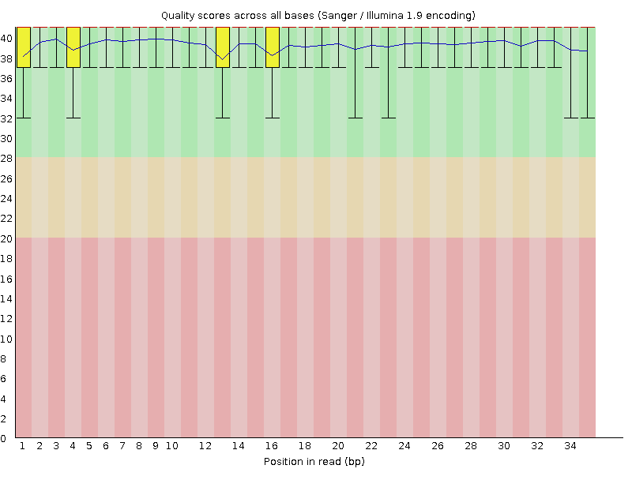
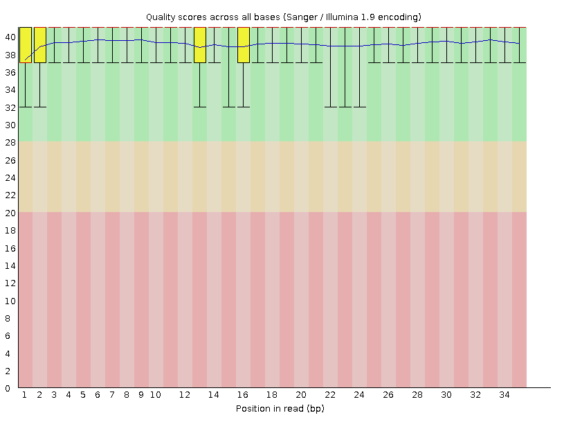
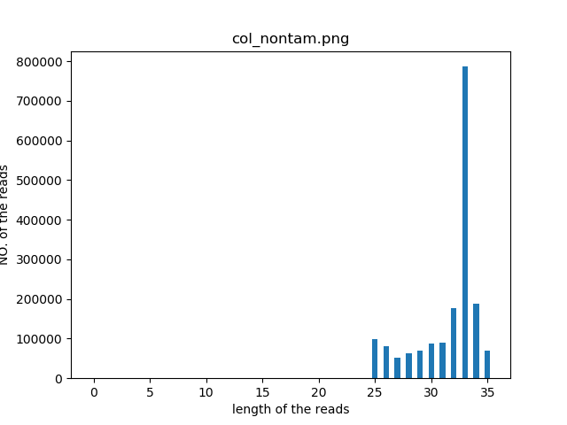
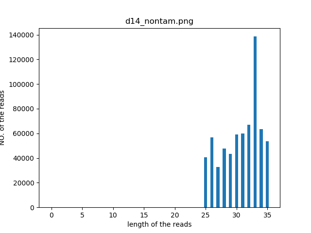

# 郭瑞欣 Results:

> 

## 实验设计

col vs d14

## Raw data process pipeline 
### **Quality**

col

   

d14

   

## **rRNA**

| Iterm    | col               | d14               | 
|----------|-------------------|-------------------| 
| Total    |  3371847          |  1806179          | 
| rRNA     |  1608676 (47.71%) |  1143681 (63.32%) | 
| non rRNA |  1763171 (52.29%) |  662498 (36.68%)  | 

## **Read length distribution**

col

   

d14

   

## **Mapping**

| Iterm                                     | col             | d14             |
|-------------------------------------------|--------|--------| 
| Uniquely mapped reads %                   | 19.49% | 45.46% | 
| % of reads mapped to multiple loci        | 0.00%  | 0.00%  | 
| % of reads mapped to too many loci        | 63.31% | 32.81% | 
| % of reads unmapped: too many mismatches  | 6.97%  | 6.87%  | 
| % of reads unmapped: too short            | 10.05% | 14.67% | 
| % of reads unmapped: other                | 0.18%  | 0.19%  | 
| % of chimeric reads                       | 0.00%  | 0.00%  |

| Iterm                                     | col             | d14             | 
|-------------------------------------------|-----------------|-----------------| 
| Started job on                            | Oct 14 15:46:08 | Oct 14 15:46:20 | 
| Started mapping on                        | Oct 14 15:46:10 | Oct 14 15:46:22 | 
| Finished on                               | Oct 14 15:46:19 | Oct 14 15:46:37 | 
| Mapping speed, Million of reads per hour  | 705.27          | 159.00          | 
| Number of input reads                     | 1763171         | 662498          | 
| Average input read length                 | 31              | 30              | 
| UNIQUE READS:                             |                 |                 | 
| Uniquely mapped reads number              | 343582          | 301192          | 
| Uniquely mapped reads %                   | 19.49%          | 45.46%          | 
| Average mapped length                     | 30.49           | 30.68           | 
| Number of splices: Total                  | 22904           | 21120           | 
| Number of splices: Annotated (sjdb)       | 22158           | 20788           | 
| Number of splices: GT/AG                  | 22348           | 20032           | 
| Number of splices: GC/AG                  | 230             | 175             | 
| Number of splices: AT/AC                  | 184             | 828             | 
| Number of splices: Non-canonical          | 142             | 85              | 
| Mismatch rate per base, %                 | 1.33%           | 0.91%           | 
| Deletion rate per base                    | 0.01%           | 0.01%           | 
| Deletion average length                   | 1.44            | 1.47            | 
| Insertion rate per base                   | 0.00%           | 0.00%           | 
| Insertion average length                  | 1.05            | 1.05            | 
| MULTI-MAPPING READS:                      |                 |                 | 
| Number of reads mapped to multiple loci   | 0               | 0               | 
| % of reads mapped to multiple loci        | 0.00%           | 0.00%           | 
| Number of reads mapped to too many loci   | 1116270         | 217379          | 
| % of reads mapped to too many loci        | 63.31%          | 32.81%          | 
| UNMAPPED READS:                           |                 |                 | 
| % of reads unmapped: too many mismatches  | 6.97%           | 6.87%           | 
| % of reads unmapped: too short            | 10.05%          | 14.67%          | 
| % of reads unmapped: other                | 0.18%           | 0.19%           | 
| CHIMERIC READS:                           |                 |                 | 
| Number of chimeric reads                  | 0               | 0               | 
| % of chimeric reads                       | 0.00%           | 0.00%           | 
 
 ### read to RNA DNA and Intron (Using readsNumCal_intron_v3)
| Iterm                                | col     | d14     | 
|--------------------------------------|---------|---------| 
| unique mapped reads of RNA           |  333104 |  293940 | 
| unique mapped reads of DNA           |  9407   |  6660   | 
| unique mapped reads of Intron        |  376    |  192    | 
| unique mapped ambiguous reads of RNA |  695    |  400    | 

## Ribocode

col

[col](./result_191014_guoruixin/metacolAligned.toTranscriptome.out.pdf)   

d14

[d14](./result_191014_guoruixin/metad14Aligned.toTranscriptome.out.pdf)   

