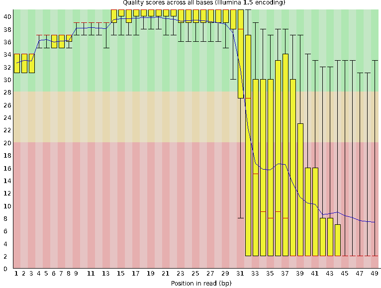
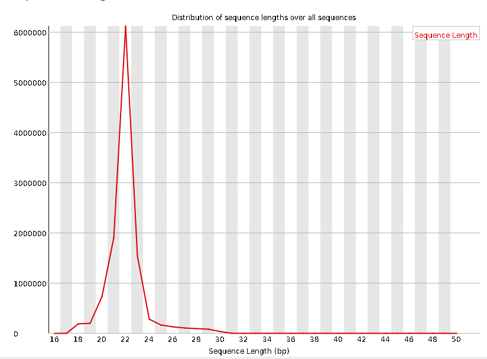

# Zhang Rongqing miRNA result

mature miRNA

[miRNA count](result_191226_zhangrongqing/miRNA.count.txt)

| Name| count|
|-| -|
bfl-let-7b|419931|
rno-miR-3596a|418642|
mle-bantam-3p|203043|
lgi-miR-67|180954|
spu-miR-278-3p|135718|
oha-miR-100-5p|125157|
gga-miR-184b-5p|116828|
bfl-miR-100-5p|105348|
prd-let-7-5p|95064|
lgi-miR-96b|87293|
prd-miR-100-5p|86096|
asu-miR-100a-5p|72021|
lgi-miR-96a|70454|
tca-miR-100-5p|63389|
isc-miR-100|53896|
dpu-miR-100|52739|

